class: first

# APP SIG

<br>

## M1 Urba.

<br>

## TP2

### Intégration, création et modification de l'info géo
### Organisation des données au sein d'un projet

<div style="width: 167px;position: absolute;bottom: -5px;left: 0px;">


</div>

<div style="margin: auto; text-align: center; position: relative; bottom: -100px; left: 20px;">
<p style="font-size: 20px;margin:auto; text-align: center">Matthieu Viry - LIG <em>(Laboratoire d'Informatique de Grenoble)</em></p>
<p style="font-size: 20px;margin:5px auto; text-align: center">🖂 <a href="maito:matthieu.viry@univ-grenoble-alpes.fr">matthieu.viry@univ-grenoble-alpes.fr</a></p>
</div>

---
## Rappels sur


<br><br>

* **Logiciel _Libre_**

* Version actuelle **3.x** _(on n'utilisera pas la version 2.x dans ce TP)_

* Supporte une très grande gamme de formats de données grâce à la bibliothèque **GDAL/OGR**.

* Interface utilisateur et performance de certains traitements largement améliorés depuis le passage à la version 3 **👍**

* Documentation riche, en français + nombreuses ressources "non-officielles"


---
## Rappels sur


<br>

Si installation sur vos machines persos :

- _avec Windows_ : idéalement utilisez ce qui est appelé **"Installeur réseau OsGeo4W"** sur la page [Téléchargez QGIS](https://www.qgis.org/fr/site/forusers/download.html#windows)

- _avec Linux_ : pensez au gestionnaire de paquets de votre distribution Linux - si la dernière version de QGIS n'y est pas, pensez à la solution [`Flatpack`](https://www.qgis.org/fr/site/forusers/alldownloads.html#flatpak)

<br>

_**Pourquoi ?**_  Car c'est important d'avoir un environnement QGIS qui fonctionne correctement (possibilité d'installer des *plugins* et d'utiliser les fonctionnalités optionnelles fournis par `GDAL`, `GRASS` et `SAGA`).

---
## Rappels sur


<br><br>

- Particulièrement extensible :

    * Intégration d'une **console Python** (automatisation d'actions répétitives, etc.)
    * Système de *plugins* avec un répertoire centralisé ([https://plugins.qgis.org/](https://plugins.qgis.org/))
    * Intégration possible de **GRASS** et **SAGA**
    * Intégration possible également du langage statistique **R**
    * Utilisable sous forme de bibliothèque pour créer appli. _standalone_ basée sur des mécanismes de QGIS

- Un nouvelle version stable tous les 2 mois  
*La liste des changements apportés par chaque version : [https://changelog.qgis.org/en/qgis/version/3.12/](https://changelog.qgis.org/en/qgis/version/3.12/)*


---

## Rappels sur


### Prendre des bonnes habitudes en paramètrant l'application

**`Préférences` > `Options...`**

.center[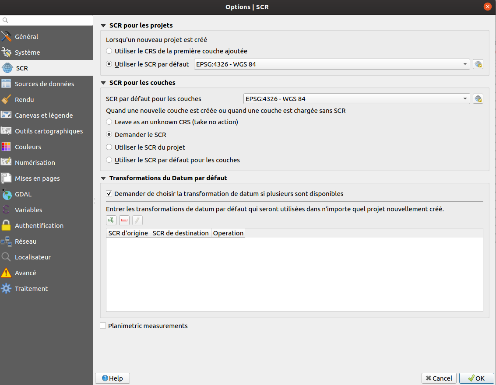]

---

.center[]

---
## Rappels sur


### Prendre des bonnes habitudes en définissant les propriétés par défaut du projet


**`Projet` > `Propriétés...`**

.center[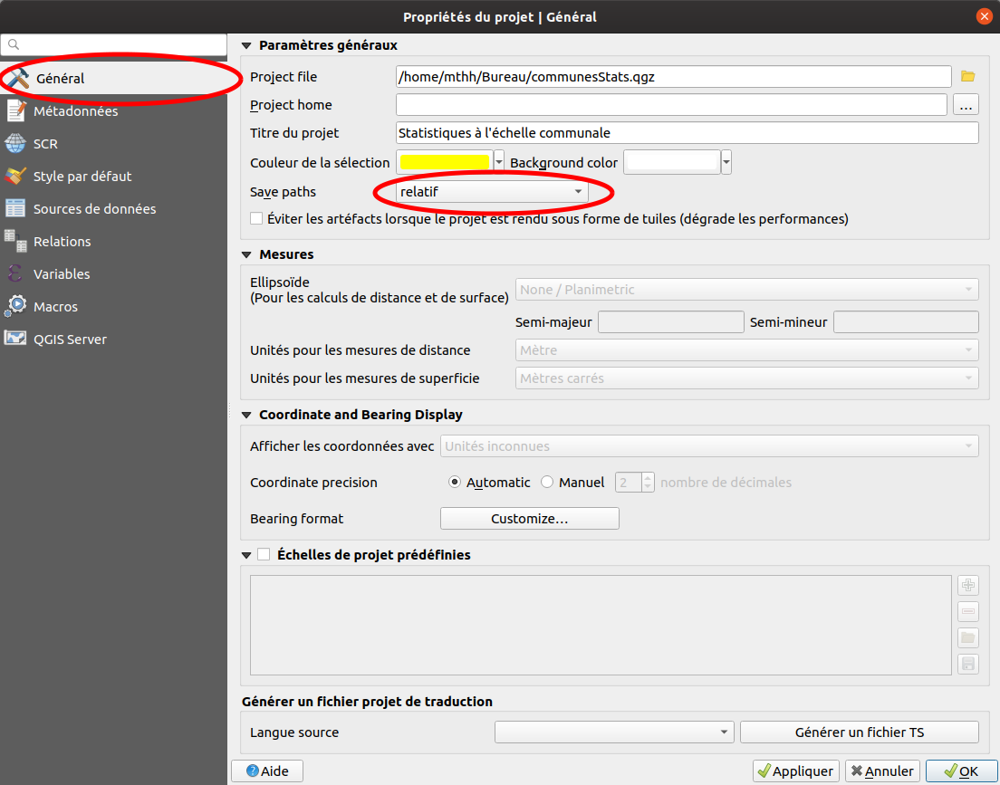]

---

.center[]

---

.center[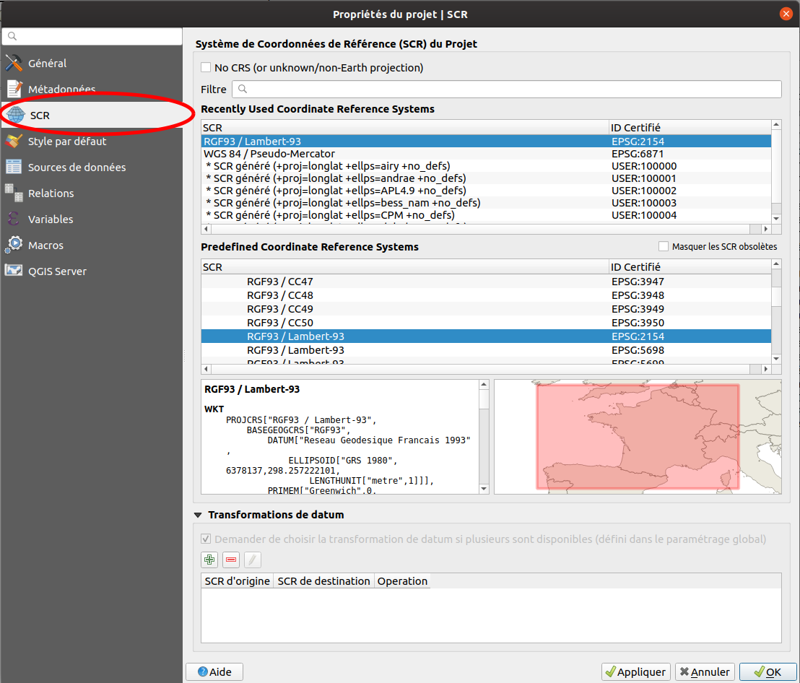]

---
## Rappels sur


### Ajouter des fournisseurs de tuiles au format XYZ

Dans le `Panneau Explorateur` : clic-droit sur `XYZ Tiles` puis `Nouvelle connexion...`.

.center[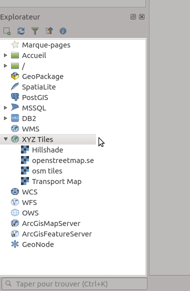]

---
## Rappels sur


### Ajouter des fournisseurs de tuiles au format XYZ

<br>

**URL utiles :**

OSM France : <strong><u>http://a.tile.openstreetmap.fr/osmfr/{z}/{x}/{y}.png</u></strong>  
_(affichage spécifique pour la France : couleurs légérement différentes, logo "La Poste", etc.)_

OpenTopoMap : <strong><u>https://a.tile.opentopomap.org/{z}/{x}/{y}.png</u></strong>  
_(carte topographique basée sur les données d'OpenStreetMap)_

Bing aerial : <strong><u>http://ecn.t3.tiles.virtualearth.net/tiles/a{q}.jpeg?g=1</u></strong>  
_(imagerie aérienne Bing)_


---
## Rappels sur types de géométries manipulés dans les SIG

<br><br>
Deux _grands types_ de formats de données manipulés dans les logiciels SIG :

**Vecteur** - .small[*(Multi)Point, (Multi)LineString, (Multi)Polygone, GeometryCollection*]

**Raster** - .small[Caractérisés notamment par *largeur*, *hauteur*, *taille du pixel*]

.img65.center[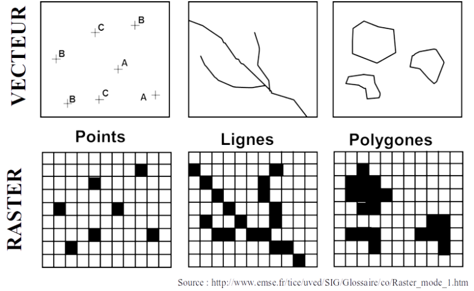]

---
## Rappels sur formats de données _"vecteur"_

<br>

* **Shapefile** :
    - Format multi-fichier
    - Nom de champ limités à 10 caractères
    - Permet de spécifier SCR (mais dans un fichier à part)

* **GeoJSON** _(Geographic JSON)_ :
    - _single-file_ et _human readable_ (extension au **JSON**)
    - beaucoup utilisé dans le domaine du Web
    - le SCR est géographique et utilise le système géodésique mondial **WGS 84** : coordonnées sous la forme longitude-latitude en degrés décimaux
    - [IETF - GeoJSON Specification - RFC 7946](https://tools.ietf.org/html/rfc7946)

---
## Rappels sur formats de données _"vecteur"_


<br>

* **GML** _(Geography Markup Language)_ :
    - Langage dérivé du **XML**
    - Format ouvert, standard de l'OGC développé pour garantir l'interopérabilité des données géospatiales (devenu en 2007 une norme internationale : **ISO 19136** correspond standard **OGC GML 3.2.1**)
    - Permet de décrire: objets géographiques, système de coordonnées de référence, géométries, attributs, topologie, temps et unités de mesure par exemple.
    - Utilisé pour modélisation spécifique à un domaine _(hydrologie, urbanisme, géologie, etc.)_
---
## Rappels sur formats de données _"raster"_

<br>

* **GeoTIFF** _(`.tif` ou `.tiff`)_ :
    - Standard du domaine public
    - Image TIFF + géoréférencement


* **Arc/Info ASCII Grid** _(`.asc`)_:
    - Format non-propriétaire, developpé par ESRI
    - Format ASCII (non-binaire)

.ml40[
```
ncols         4
nrows         6
xllcorner     0.0
yllcorner     0.0
cellsize      50.0
NODATA_value  -9999
-9999 -9999 5 2
-9999 20 100 36
3 8 35 10
32 42 50 6
88 75 27 9
13 5 1 -9999
```
]

---
## Sélection de données

<br>

---
## Sélection de données
### ... attributaire (1)

.btn-svg[] > **`Sélectionner des entités par valeurs...`**

.center.img70[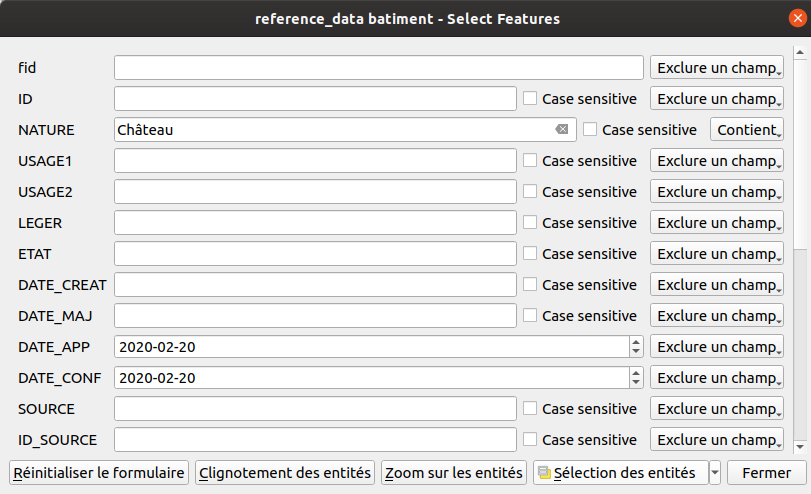]

.center[*⚠ attention lors de l'utilisation avec de gros jeux de données car QGIS parcours la table attributaire pour récupérer les valeurs avant l'ouverture de cette fenêtre ⚠*]

---
## Sélection de données
### ... attributaire (2)

.btn-svg[]
.btn-svg[] > **`Sélectionner les entités à l'aide d'une expression...`**


.center.img80[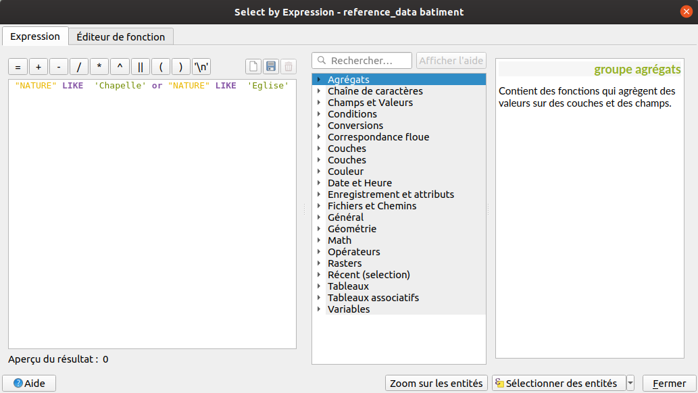]

---

**Va permettre des sélections plus complexes...**

.center.img90[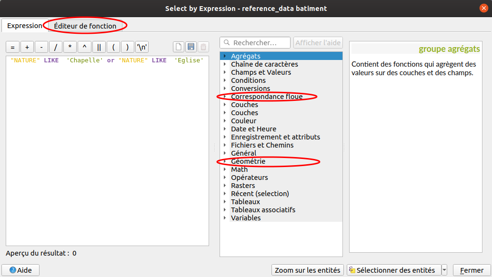]

---
## Sélection de données
### ... spatiale

**→ sélectionner des entités d'une couche _en fonction de leur positionnement par rapport_ aux entités d'une autre couche**.

Les entités sélectionnées sont celles qui satisfont un **prédicat spatial** : *touches*, *intersects*, *within*, *contains*, etc.

.center.img65[]
.small.source.center[Source : [WikiMedia Commons](https://commons.wikimedia.org/wiki/File:TopologicSpatialRelarions2.png) - User : [Krauss](https://commons.wikimedia.org/wiki/User:Krauss) - Licence : [CC BY-SA 3.0](https://creativecommons.org/licenses/by-sa/3.0/deed.en)]


---
## Sélection de données
### ... spatiale

**`Vecteur` > `Outils de recherche` > `Sélection par localisation...`**

.center[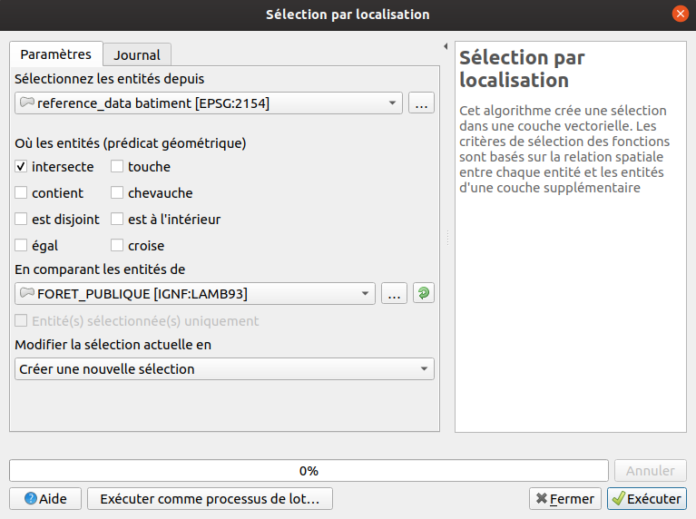]

---
## Jointures des données par attribut

<br>
* Dictionnaire **Larousse**:  
_<sub>3</sub>. Assemblage par une couture de deux pièces placées bord à bord._

<br>

* En SIG une **jointure attributaire** _(un **appariement**)_ va permettre de joindre deux tables attributaires décrivant des **entités communes**, sur la base de la correspondance entre les valeurs (identifiants) d'un champ commun.

<br>

* On l'utilise généralement entre une couche qui contient des informations géométriques et une autre source de données.
<br>

---
## Jointures des données par attribut

.center[]
.small.source.center[Source : [UVED, 2013, Licence Creative Commons](https://www.emse.fr/tice/uved/SIG/Glossaire/co/Jointure_attributaire.html)]

---
## Géoréférencement d'image

<br>

- L’opération consiste à attribuer des coordonnées géographiques à une image raster en utilisant des points de contrôles.

- L'image à géoréférencer peut venir de différentes source (photographie aérienne, carte papier, etc.).

- La qualité du résultat dépend de différentes facteurs (précision des points de contrôles, type de transformation choisi, etc.).

---
## Création d'entités vectorielles / digitalisation

<br>

<br>

- Choix du type de fichier à créer

- Choix du système de coordonnées de référence

- Choix du type de géométrie (*Point*, *Ligne*, *Polygone*, etc.)

- Choix des champs attributaires à créer


---

### .center[À suivre]


.center[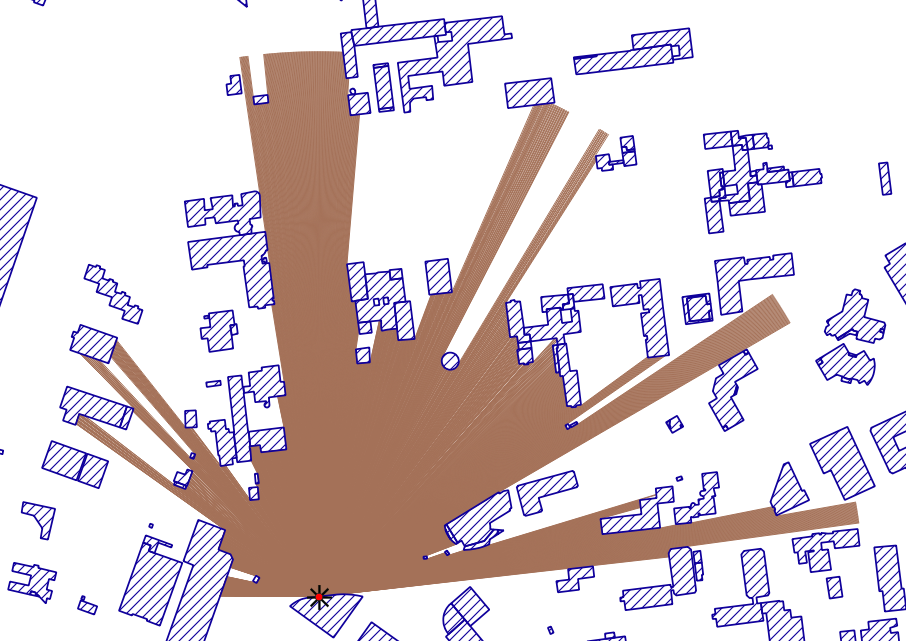]


---
## Gestion des couches créées
### *Couche temporaire en mémoire*

<br>

Pensez à utiliser la fonctionnalité de création de **_couche temporaire en mémoire_** lors de la création de couches intermédiaires au cours de vos traitements / sélections / etc.

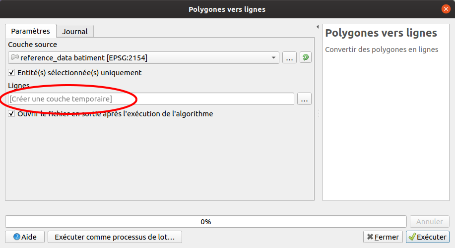

---
## Utiliser des couches *raster*

.center[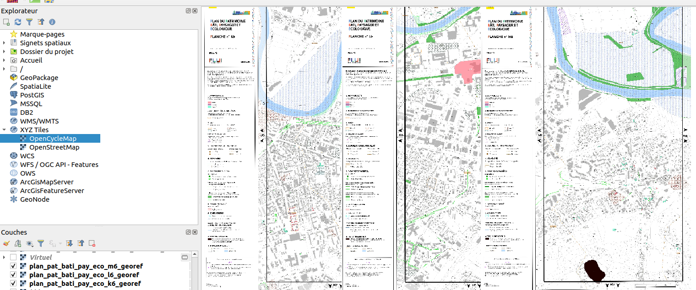]

---
## Utiliser des couches *raster*

.center[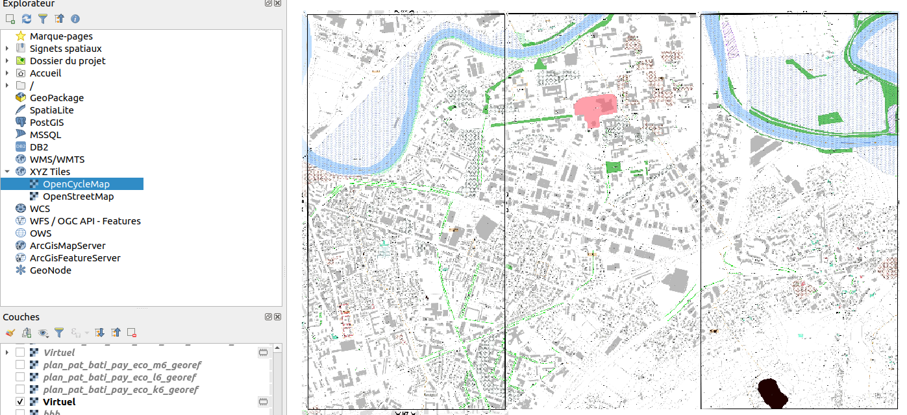]

---
## Utiliser des couches *raster*

.center[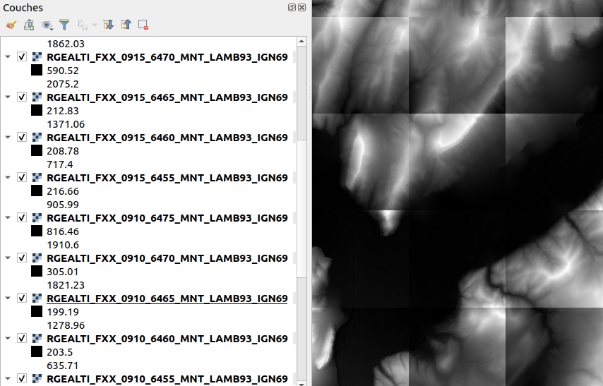]

---
## Utiliser des couches *raster*

.center[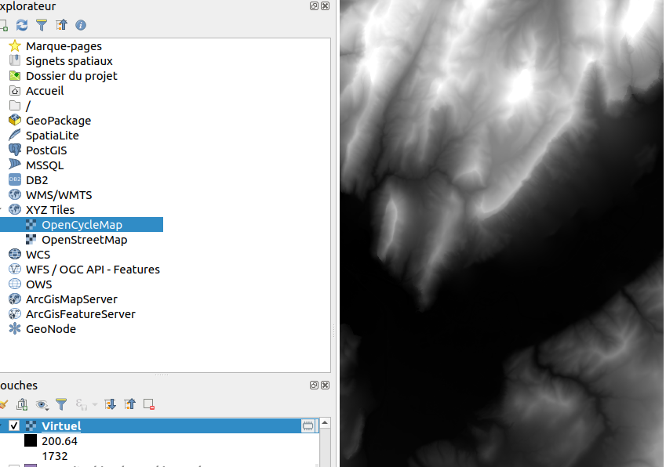]

---
## Création de _Virtual Raster_ ou fusion de raster ?

<br>

- La création d'un **raster virtuel** va permettre la création d'un jeu de données composé de plusieurs autres *raster* par la création d'un document XML indiquant comment combiner les *rasters* en question (positionnement, etc.).  
> *Cas d'utilisation typique* : mobiliser plusieurs *rasters* contigües pour les clipper avec une couche d'intérêt (qui aurait été à cheval sur plusieurs des images d'origines)  
→ évite la création de *rasters* intermédiaires qui auraient été ensuite supprimés.

<br>

- La **fusion** va créer un nouvelle image.


---
## _Virtual Raster_ avec le format VRT

<br>

Dans QGIS : **`Raster` > `Divers` > `Construire un raster virtuel...`**

Puis :

.img85.center[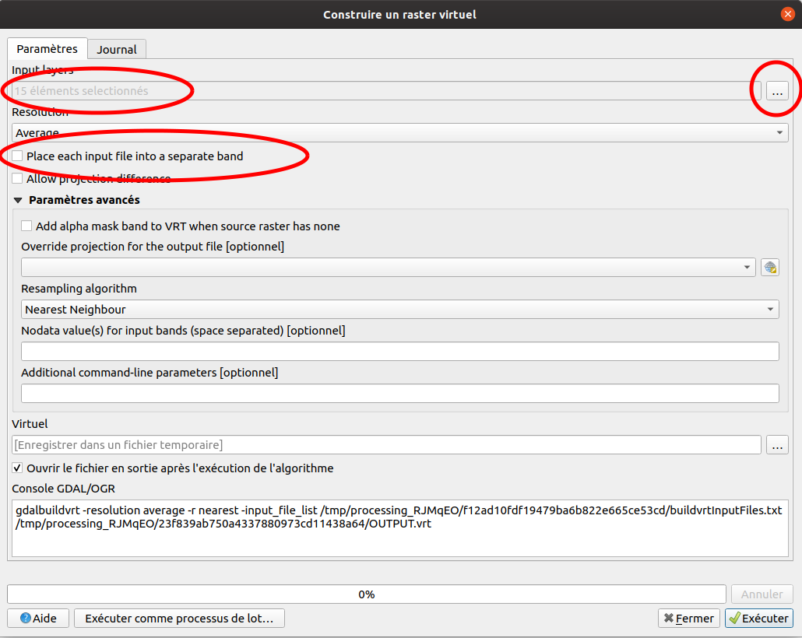]

---
## Fusion de plusieurs rasters

<br>

Dans QGIS : **`Raster` > `Divers` > `Fusionner...`**

Puis :

.img85.center[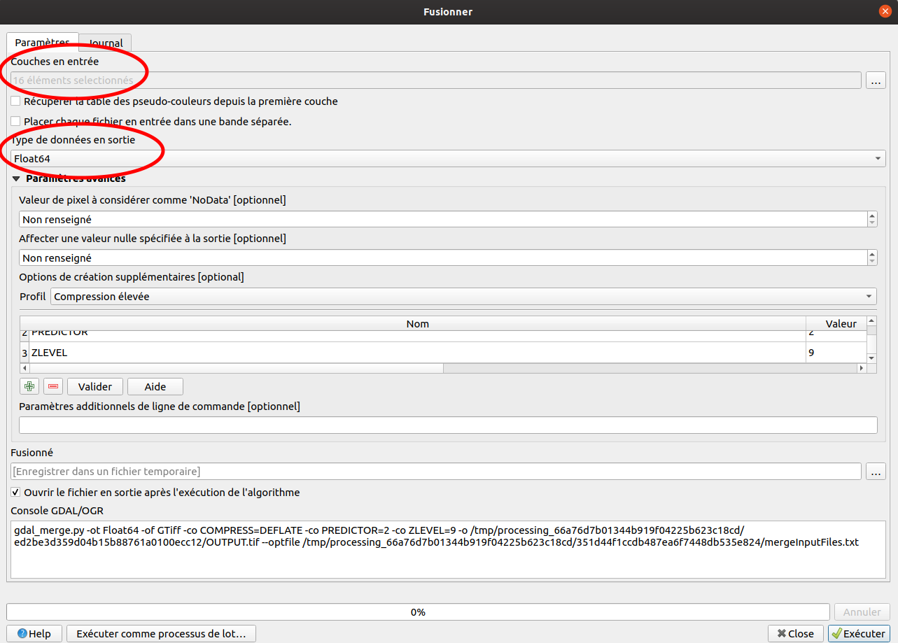]

---
## GeoPackage
### ... pourquoi ?

<br>

- Un format de données géospatiales **ouvert**, **non-propriétaire**, **défini par l'OGC** _(Open Geospatial Consortium)_

- Permet de stocker des données _raster_ et/ou _vecteur_ et de stocker plusieurs couches dans un seul conteneur

- Permet également d'y stocker des documents de méta-données dans une table spécifique

- Basé en interne sur **SQLite**

- Voir l'argumentaire développé sur les pages [switchfromshapefile.org](http://switchfromshapefile.org/) et [www.geopackage.org](http://www.geopackage.org/)

---
## GeoPackage
### ... pourquoi ?

<br>

En comparaison avec le format *geodatabase* (GDB) de ESRI ?

- Comme ArcGis et avec les geodatabase, QGIS va pouvoir sauvegarder le style des couches dans le geopackage

- À partir de QGIS 3.8 il est également possible de stocker l'ensemble du projet dans un geopackage

---

<br>
<div class="alert alert-danger" role="alert">
  <a name="shapefileisbad"></a>

  <h2 class="alert-heading">Shapefile is a bad format</h2>

  <p>Why is Shapefile so bad? Here are several reasons why the Shapefile is a
  bad format and you should avoid its usage:</p>

  <ul>
      <li><a href="http://switchfromshapefile.org/#nocrs">No coordinate reference system definition</a>.</li>
      <li><a href="http://switchfromshapefile.org/#multifile">It's a multifile format</a>.</li>
      <li><a href="http://switchfromshapefile.org/#10characters">Attribute names are limited to 10
              characters</a>.</li>
      <li><a href="http://switchfromshapefile.org/#255attributes">Only 255 attributes</a>.</li>
      <li><a href="http://switchfromshapefile.org/#datatypes">Limited data types</a> (float, integer, date and text with max 254
              char.).</li>
      <li><a href="http://switchfromshapefile.org/#characterset">Unknown character set</a>.</li>
      <li><a href="http://switchfromshapefile.org/#sizelimit">It's limited to 2GB of file size</a>.</li>
      <li><a href="http://switchfromshapefile.org/#simplefeature">No topology in the data</a> (No
              way to describe topological relations in the format).</li>
      <li><a href="http://switchfromshapefile.org/#mixedgeometry">Single geometry type per file</a> (No way to save mixed geometry features).</li>
      <li><a href="http://switchfromshapefile.org/#hierarchy">More complicated data structures are impossible
              to save</a>. It's a "flat table" format.</li>
      <li><a href="http://switchfromshapefile.org/#projection">Projections definition</a>. They are
              incompatible or missing.</li>
  </ul>
</div>

.center.small.source[Source : [http://switchfromshapefile.org/#shapefileisbad](http://switchfromshapefile.org/#shapefileisbad)]


---
## GeoPackage
### Création (lors de la sauvegarde d'une première couche)

Clic droit sur la couche à sauvegarder puis **`Exporter` > `Sauvegarder les entités sous...`**

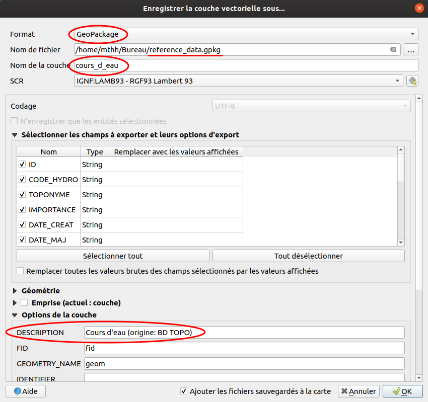

---


---
## GeoPackage
### Ajout d'une nouvelle couche à un geopackage existant

Clic droit sur la couche à sauvegarder puis **`Exporter` > `Sauvegarder les entités sous...`**

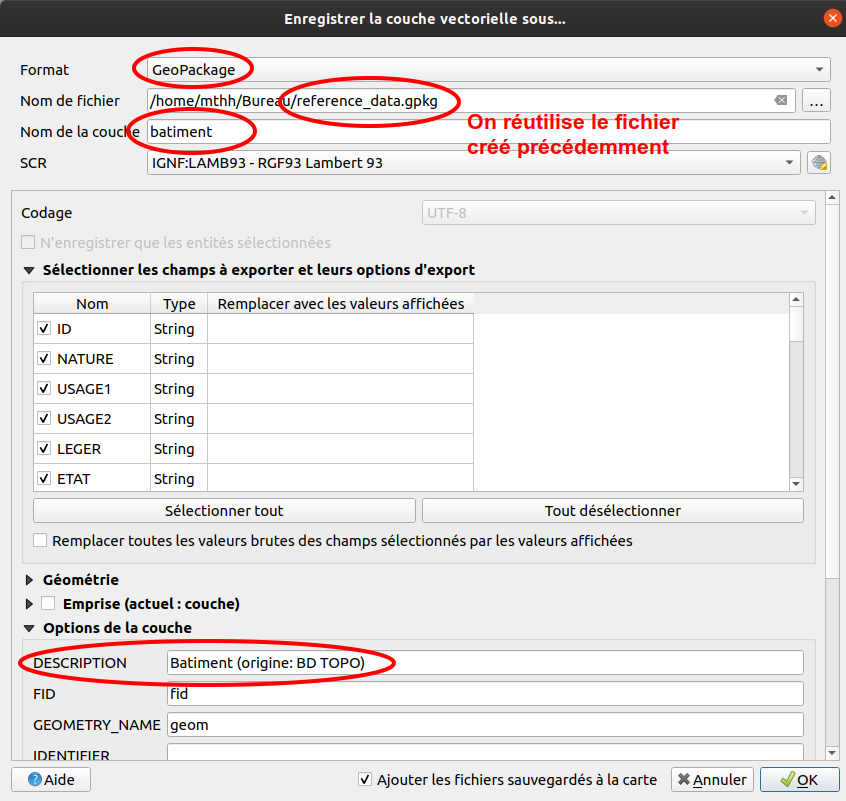

---


---
## GeoPackage
### Création d'une <u>couche vide</u> dans un geopackage existant

**`Couche` > `Créer une couche` > `Nouvelle couche GeoPackage...`**

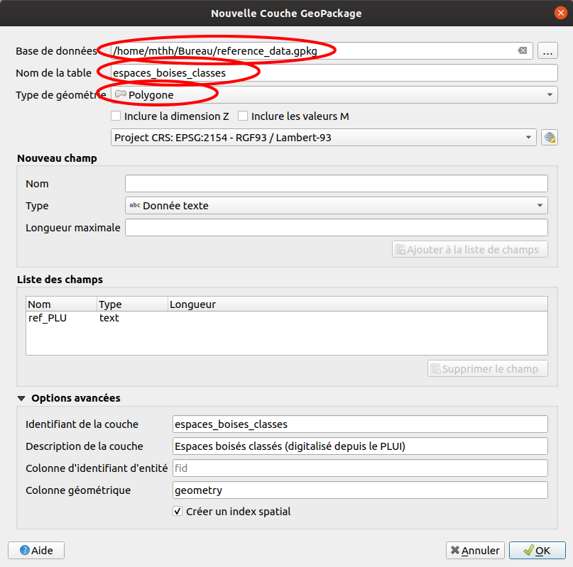

---


---
## Ressources (1)

<br>

- [Slides _Working with Geopackage in QGIS_ de Pirmin Kalberer, Swiss QGIS User Meeting, 2016](https://www.qgis.ch/de/ressourcen/anwendertreffen/2016/working-with-geopackages-in-qgis)

<br>

- [Page _"Switch from Shapefile"_](http://switchfromshapefile.org/)


---

D'autres sources de données :

* Arrêts bus et tramways, Parking Relais (P+R), etc. : [http://data.metropolegrenoble.fr/](http://data.metropolegrenoble.fr/)

* Espaces protégés, ZNIEFF, ZICO, Natura 2000 : [https://inpn.mnhn.fr/telechargement/cartes-et-information-geographique](https://inpn.mnhn.fr/telechargement/cartes-et-information-geographique)


---

.center[]
