class: first

# APP SIG

 

## M1 Urba.

 

## TP3

### Géotraitements possibles pour les SIG
 

Matthieu Viry - LIG <em>(Laboratoire d'Informatique de Grenoble)</em>

🖂 <a href="maito:matthieu.viry@univ-grenoble-alpes.fr">matthieu.viry@univ-grenoble-alpes.fr</a>

---

## Géotraitements (ou *traitements spatiaux*)

 

- Ce sont __*"les méthodes d'aggrégation, d'extraction, de combinaison et de transformation des données"*__. .source[(Aschan-Leygonie et al., 2019, p. 187)]

- Appliqués à des données <u>vecteur</u>, __*"la géométrie des objets est modifiée (par exemple les limites des entités changent), ainsi que la table attributaire, dans sa structure et/ou dans la valeur des attributs"*__. .source[(Aschan-Leygonie et al., 2019, p. 188)]

- Appliqués à des données <u>raster</u>, __*"les traitements spatiaux ont pour effet par exemple de modifier l'étendue ou la résolution du raster ainsi que la valeur des attributs des cellules"*__. .source[(Aschan-Leygonie et al., 2019, p. 188)]

???

Ces traitements sont au coeur des SIG. Il est nécessaire de les comprendre, de les maitriser et de savoir les combiner pour obtenir le résultat souhaité et notamment pour répondre à des questions d'analyse spatiale.

---

## Géotraitements
### Extraire

- Par sélection spatiale (vu dans le TP précédent)

**`Vecteur` > `Outils de recherche` > `Sélection par localisation...`**

.center.img80[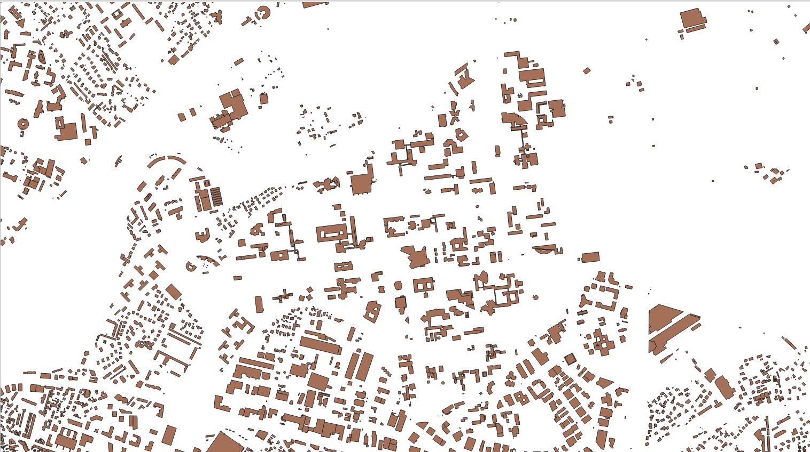]

---

## Géotraitements
### Extraire

.center[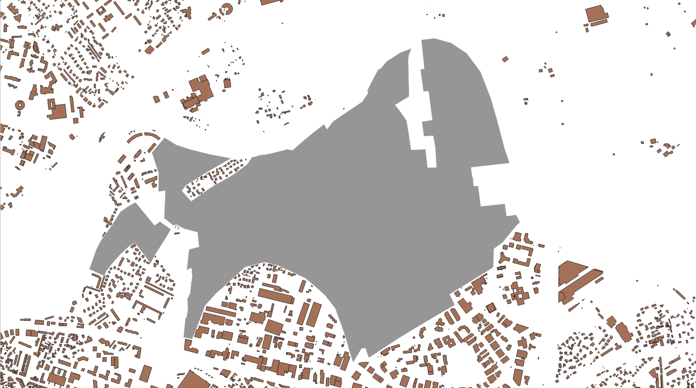]

---

## Géotraitements
### Extraire

.center[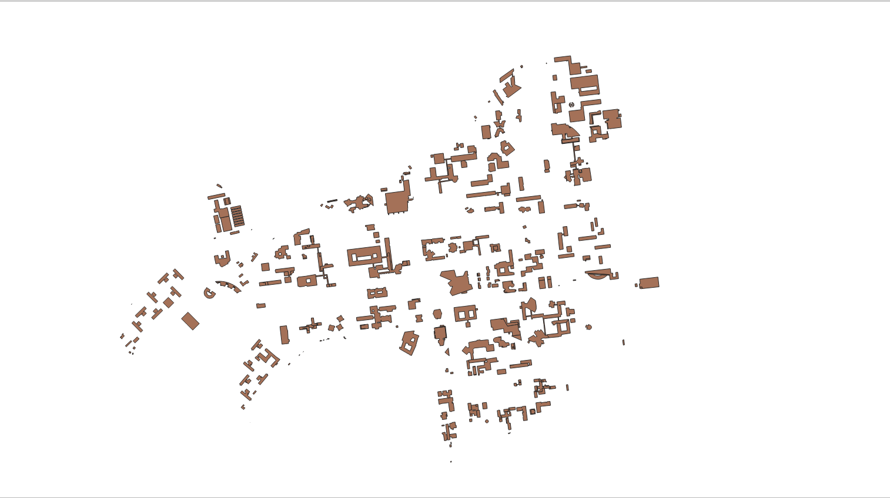]

---

## Géotraitements
### Extraire

.center[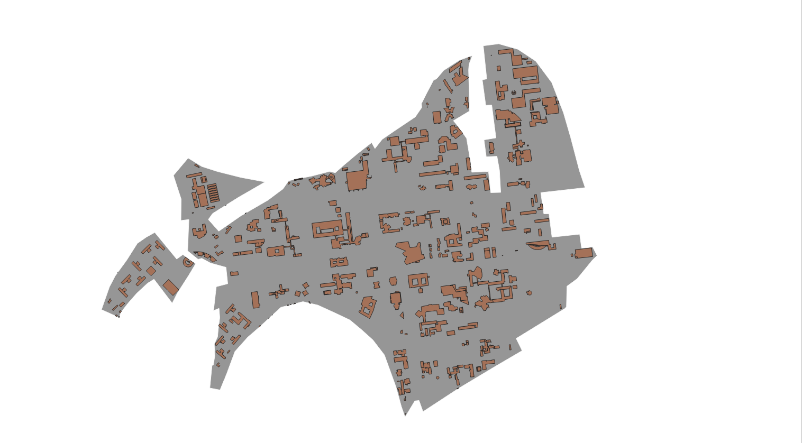]

---

## Géotraitements
### Extraction / combinaison de jeux de données - Intersection

.center[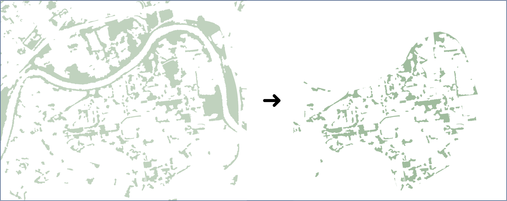]

.center[*Nous ne voulons pas seulement sélectionner les entités d'intérêt mais bien ne conserver que les portions de celles-ci qui sont inclues dans la zone d'étude*]

---

## Géotraitements
### Extraction / combinaison de jeux de données - Intersection

.center[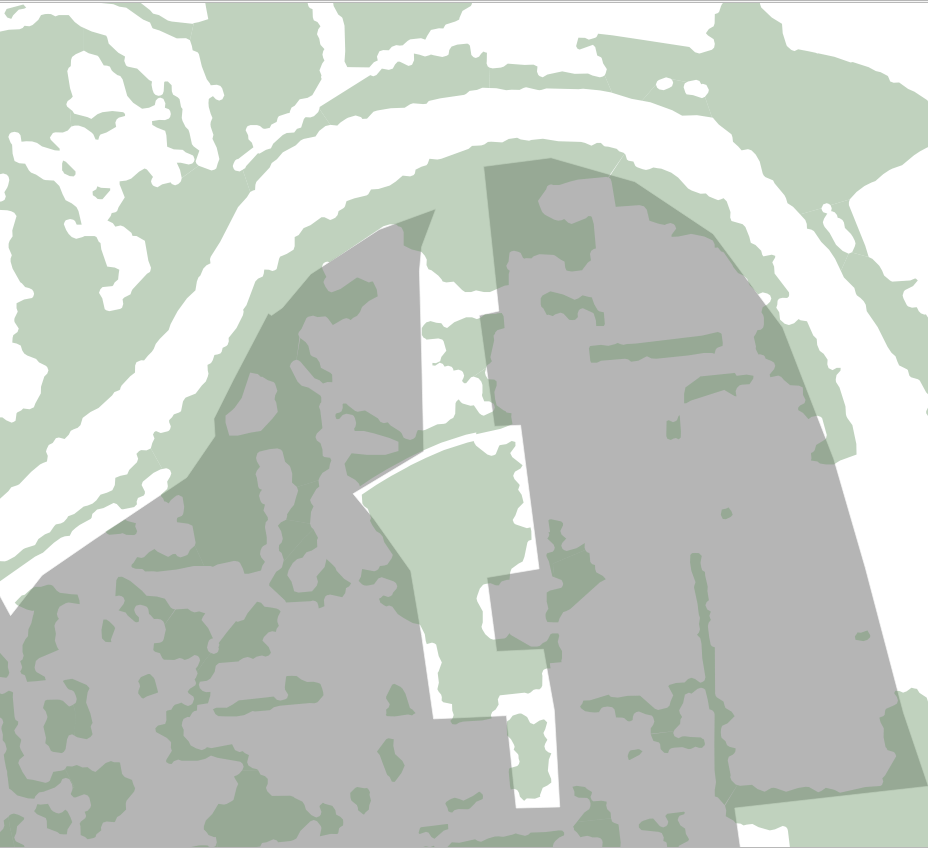]

.center[*Nous ne voulons pas seulement sélectionner les entités d'intérêt mais bien ne conserver que les portions de celles-ci qui sont inclues dans la zone d'étude*]

---

## Géotraitements
### Extraction / combinaison de jeux de données - Intersection

.center[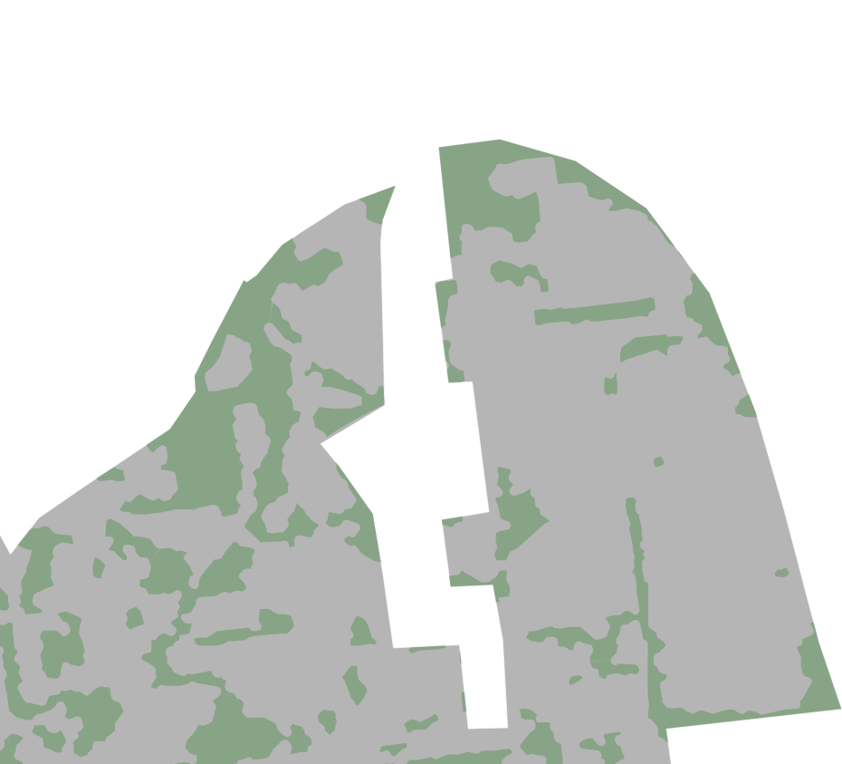]

.center[*Nous ne voulons pas seulement sélectionner les entités d'intérêt mais bien ne conserver que les portions de celles-ci qui sont inclues dans la zone d'étude*]

---
## Géotraitements
### Extraction / combinaison de jeux de données - Intersection

**`Vecteur` > `Outils de géotraitement` > `Intersection...`**

<u>Couche source</u> : `'ZONE_DE_VEGETATION'`

<u>Couche de superposition</u> : `'zone_campus'`

*➔ Les géométries des entités de la couche `'ZONE_DE_VEGETATION'` vont être découpées (intersectées) avec la couche `'zone_campus'`*

.center.img45[]

---
## Géotraitements
### Extraction / combinaison de jeux de données - Différence

**`Vecteur` > `Outils de géotraitement` > `Différence...`**

<u>Couche source</u> : `'zone_campus'`

<u>Couche de superposition</u> : `'ZONE_DE_VEGETATION_campus'`

.center.img55[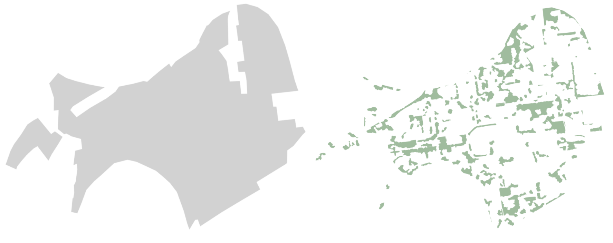]

*➔ Découpage de `'zone_campus'` en fonction de `'ZONE_DE_VEGETATION_campus'` pour obtenir la différence entre les deux couches :*
*__les portions de `'zone_campus'` qui ne se superposent pas avec `'ZONE_DE_VEGETATION_campus'`__*

---

## Géotraitements
### Extraction / combinaison de jeux de données - Différence

.center.img35[]

*➔ Découpage de `'zone_campus'` en fonction de `'ZONE_DE_VEGETATION_campus'` pour obtenir la différence entre les deux couches :*
*__les portions de `'zone_campus'` qui ne se superposent pas avec `'ZONE_DE_VEGETATION_campus'`__*

.center.img55[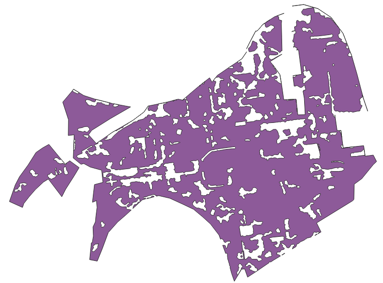]

---
## Géotraitements
### Combinaison de jeux de données - Union/fusion de couches

  

**`Vecteur` > `Outils de gestion des données` > `Fusionner des couches vecteurs...`**

  

-**Cette opération va consister à créer un jeu de données qui rassemble l'ensemble des entités des jeux de données pris en entré**

---
## Géotraitements
### Combinaison de jeux de données - Union/fusion de couches

 

- Exemple 1: Union entre les routes du jeu de données BD TOPO du département 38 et celles du département 69 pour un étude qui porterait sur les deux départements *(en effet ces données sont livrées par département)*.

➔ La table attributaire des deux couches à combiner présente la même structure.

➔ On obtient en sortie une seule couche de données, plus facile à traiter par la suite.

---
## Géotraitements
### Combinaison de jeux de données - Union/fusion de couches

 

- Exemple 2: Union entre les batiments du jeu de données BD TOPO de la zone du campus et des parkings à vélos sous forme de constructions fermées (et absents de la BD TOPO)

➔ La table attributaire des deux couches à combiner ne présente pas la même structure !

➔ Attention à ce que la fusion ait un intérêt thématique

➔ Attention au type de géométrie des couches à fusionner ! *(elles doivent avoir le même type)*

---
## Géotraitements
### Combinaison de jeux de données - Union/fusion de couches

.center.img75[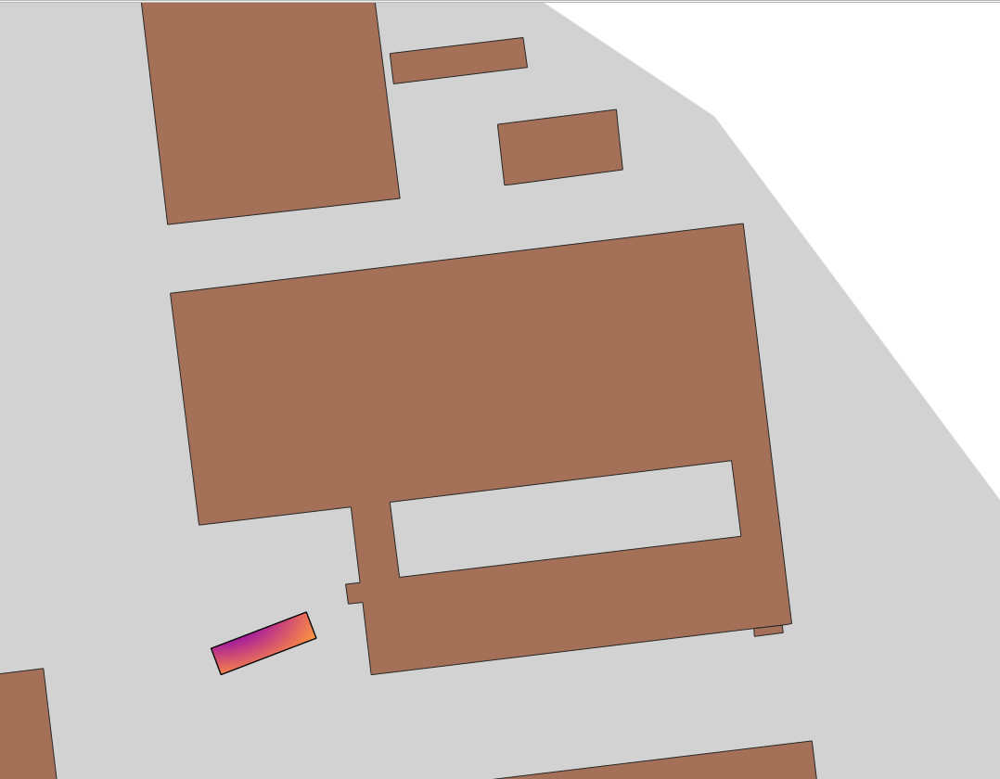]

---
## Géotraitements
### Combinaison de jeux de données - Union/fusion de couches

.center.img75[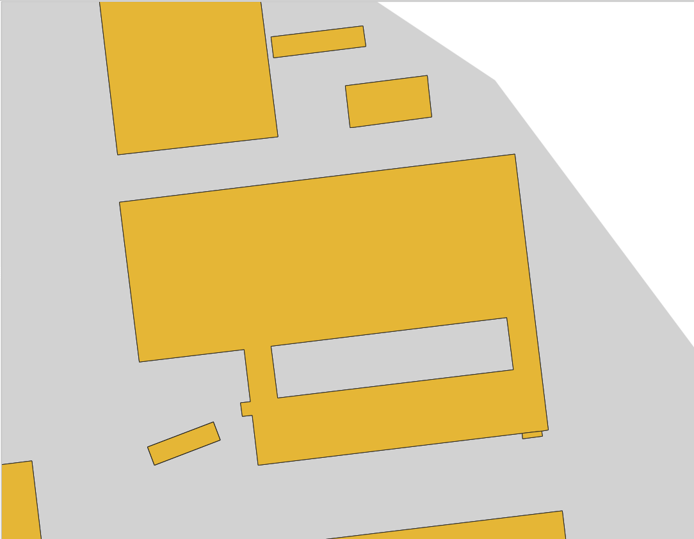]

---
## Géotraitements
### Zone tampon *(buffer)*

- La création d'une zone tampon consiste à créer *"une surface entourant un objet en fonction d'une distance seuil par rapport aux limites de l'objet lui-même"*. .source[(Aschan-Leygonie et al., 2019)]

 

- Cette opération peut être appliquée sur les différents types de géométries vectorielles : Point, Lignes, Polygone.

 

- Un paramètre important à prendre en compte concerne le souhait de **fusionner ou non** les résultats de ce traitement *(à définir en fonction de l'utilisation souhaitée)* - Option *"Regrouper le résultat"* dans QGIS3.

---
## Géotraitements
### Zone tampon *(buffer)*

**Regroupé**

.center.img75[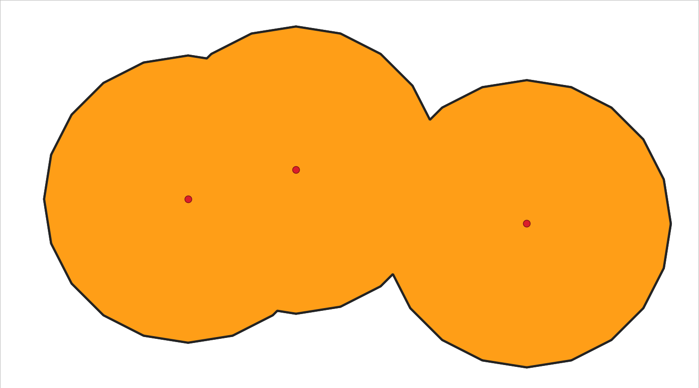]

.center[*Exemple d'utilisation : Définir une zone interdite à 750m des différents points de ce type.*]

---
## Géotraitements
### Zone tampon *(buffer)*

**Non-regroupé** *(option par défaut)*

.center.img75[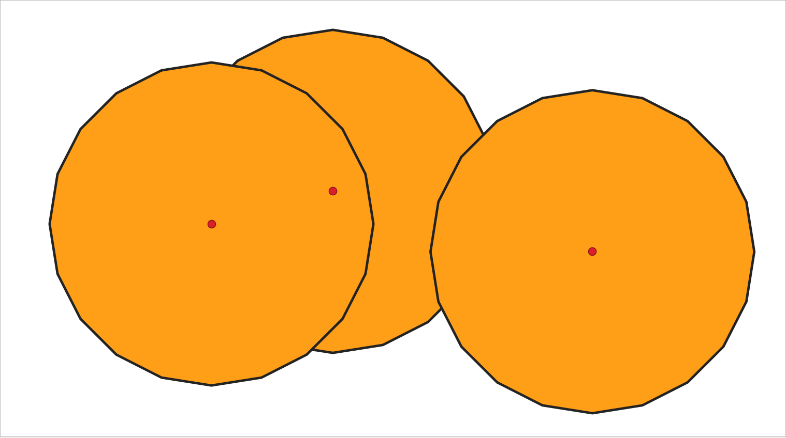]

.center[*Exemple d'utilisation : Pour __chaque point__, faire la somme de population présente dans un rayon de 750m.*]

---
## Géotraitements
### Zone tampon *(buffer)*

 

Dans QGIS il est possible de créer des *buffers* ayant différentes propriétés:

* taille variable pour chaque entité en fonction de la valeur d'un champ
* création de plusieurs anneaux à une distance constante
* *buffer* conique le long d'une ligne
* *buffer* en forme de coin en définissant un angle et une direction

.center.img35[]

---
## Géotraitements
### Création d'enveloppe *(convexe, concave, bounding-box)*

**_Convexe_**

.center.img40[]
.source[Source: [https://portailsig.org/content/sur-la-creation-des-enveloppes-concaves-concave-hull-et-les-divers-moyens-d-y-parvenir-forme.html](https://portailsig.org/content/sur-la-creation-des-enveloppes-concaves-concave-hull-et-les-divers-moyens-d-y-parvenir-forme.html)]

---
## Géotraitements
### Création d'enveloppe *(convexe, concave, bounding-box)*

**_Concave_**

.center.img40[]
.source[Source: [https://portailsig.org/content/sur-la-creation-des-enveloppes-concaves-concave-hull-et-les-divers-moyens-d-y-parvenir-forme.html](https://portailsig.org/content/sur-la-creation-des-enveloppes-concaves-concave-hull-et-les-divers-moyens-d-y-parvenir-forme.html)]

---
## Géotraitements
### Création d'enveloppe *(convexe, concave, bounding-box)*

**_Minimum Bounding Box_**

.center[]
.small.source.center[Source : [WikiMedia Commons](https://commons.wikimedia.org/wiki/File:Minimum_bounding_rectangle.svg) - User : [Rocchini](https://commons.wikimedia.org/wiki/User:Rocchini) - Licence : [CC BY-SA 3.0](https://creativecommons.org/licenses/by-sa/3.0/deed.en)]

---
## Géotraitements
### Aggréger des entités

  

**`Vecteur` > `Outils de géotraitement` > `Regrouper...`**

.center[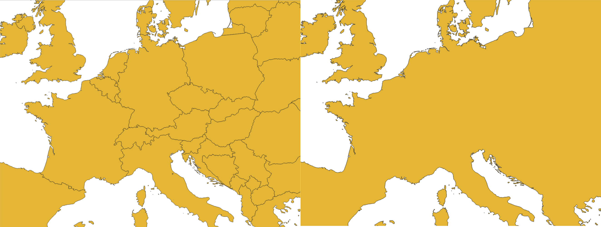]

---
## Géotraitements
### Aggréger des entités

- Cette aggrégation peut se faire en fonction de la valeur d'un champ

- Exemple : "regrouper" toutes les communes françaises du jeu de données GEOFLA en fonction de la valeur du champ "CODE_REG"

.center[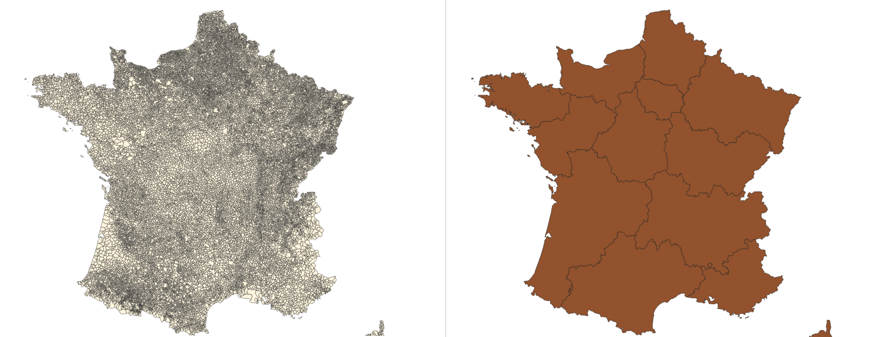]

---
## Géotraitements
### D'autres transformations de l'information géographique...

 

- Création du **centroïde** d'une entité polygonale..

 

- Création de lignes entre les points *(selon une correspondance attributaire ou non)* de deux jeux de données..

 

- **Simplification** du tracé d'une ligne ou d'un polygone *(diminution du nombre de sommets de la géométrie)*

 

- **Densification** du tracé d'une ligne ou d'un polygone *(augmentation du nombre de sommets de la géométrie)*

 

---
## Combiner des géotraitements
### ... pour répondre à des problèmes complexes (1)

.center[]

---
## Combiner des géotraitements
### ... pour répondre à des problèmes complexes (2)

.center[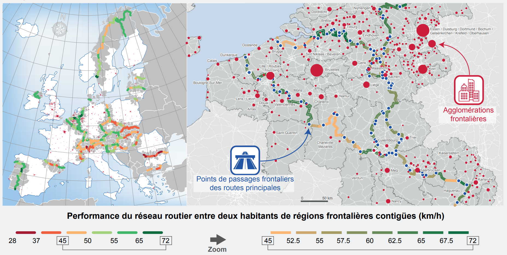]

---
## Combiner des géotraitements
### ... pour répondre à des problèmes complexes (3)

.center[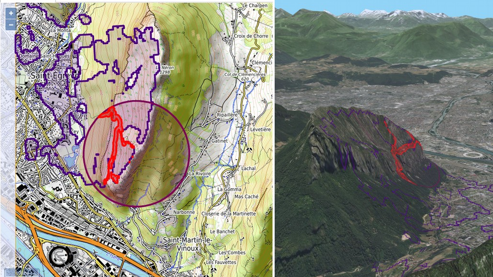]

???

- Voit un plan d'eau

- À proximité sentier de randonnées (<= 25m)

- À moins de 800m autour du point (5.7048, 45.2225)

---
## Références

 

- **Les systèmes d'information géographique**, Christina Aschan-Leygonie, Claire Cunty, Paule-Annick Davoine, 2019, Armand Colin, 272 pages.

 

- [SIGEA - Analyse Spatiale](https://data.sigea.educagri.fr/download/sigea/supports/QGIS/distance/perfectionnement/M04_Analyses_spatiales_gen_web/res/M03_Analyses_spatiales_papier.pdf)

 

- [Documentation QGIS - Géométries vectorielles](https://docs.qgis.org/3.4/fr/docs/user_manual/processing_algs/qgis/vectorgeometry.html)

 

- [QGIS Training manual - Module 7 : Analyse vectorielle](https://docs.qgis.org/3.4/fr/docs/training_manual/vector_analysis/index.html)

---
## Jointures des données par attribut

 
* Dictionnaire **Larousse**:  
_3. Assemblage par une couture de deux pièces placées bord à bord._

 

* En SIG une **jointure attributaire** _(un **appariement**)_ va permettre de joindre deux tables attributaires décrivant des **entités communes**, sur la base de la correspondance entre les valeurs (identifiants) d'un champ commun.

 

* On l'utilise généralement entre une couche qui contient des informations géométriques et une autre source de données.

---
## Jointures des données par attribut

.center[]
.small.source.center[Source : [UVED, 2013, Licence Creative Commons](https://www.emse.fr/tice/uved/SIG/Glossaire/co/Jointure_attributaire.html)]

* Exemple : Fond de carte GEOFLA IGN (*communes décrites par champ d'identifiant unique "CODE_COM"*) et données INSEE.

---

...

???
## Combiner des géotraitements
### ... pour répondre à des problèmes complexes (1)

1. Création (si nécessaire) de la couche de point à utiliser

2. `Boite à outils géotraitement` > `Géométrie vectorielle` > `Créer des tampons en coin`

3. Choisir l'angle, la distance, etc.

## Combiner des géotraitements
### ... pour répondre à des problèmes complexes (1)

4. `Vecteur` > `Outils de géométrie` > `Densify by count`
