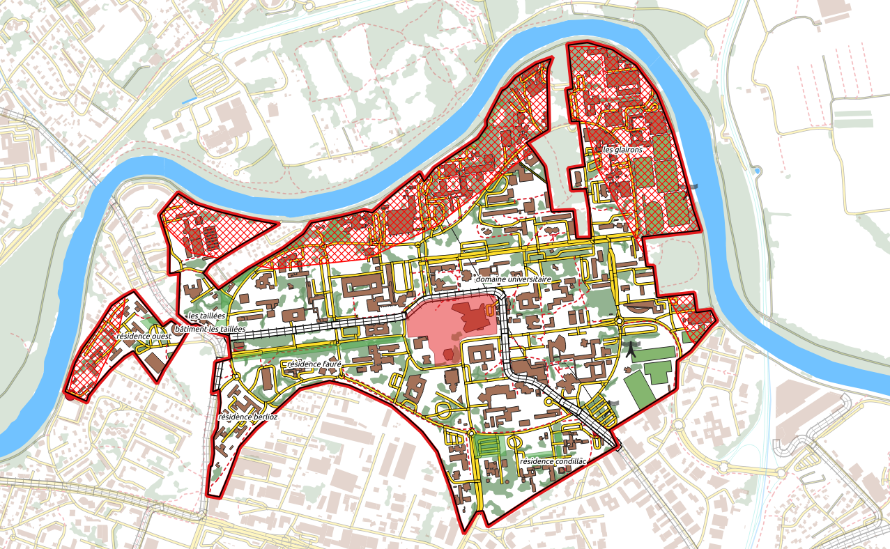
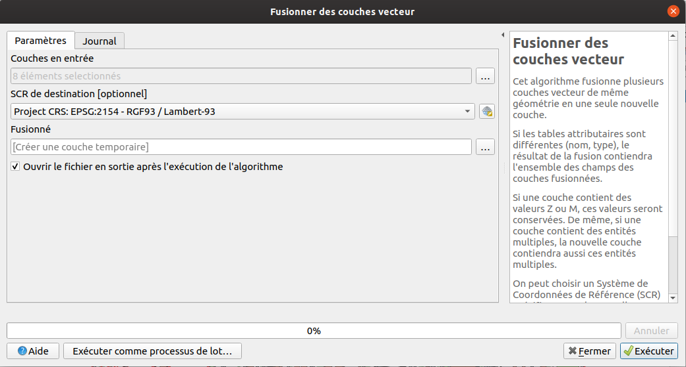
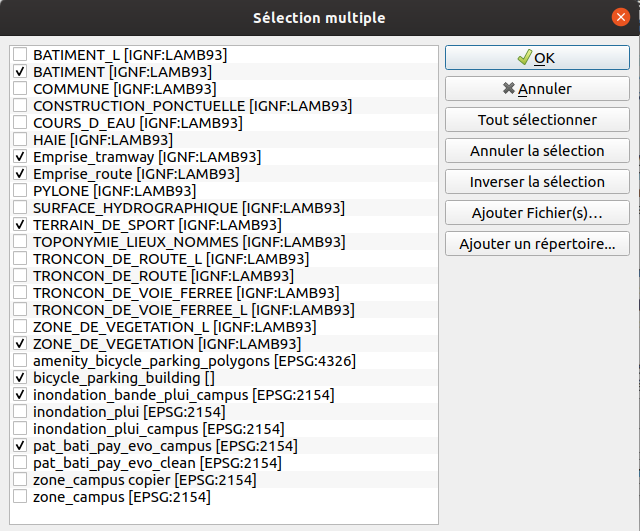
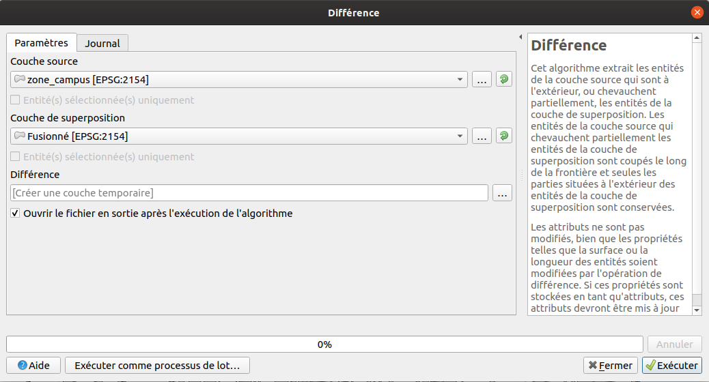
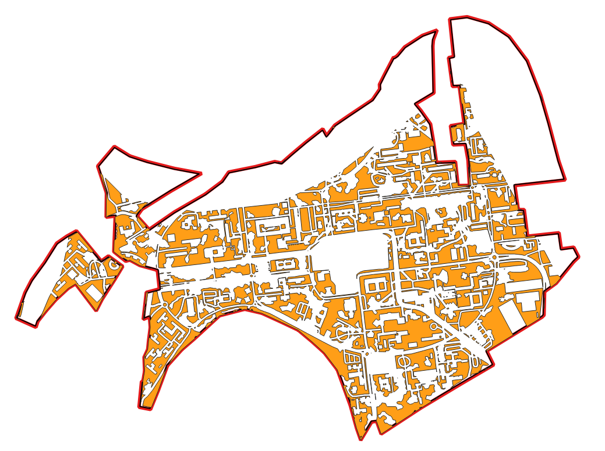
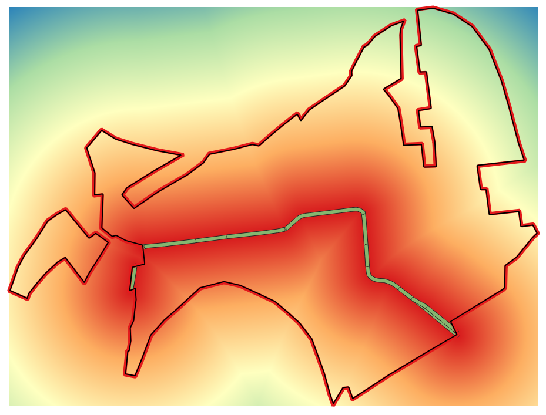
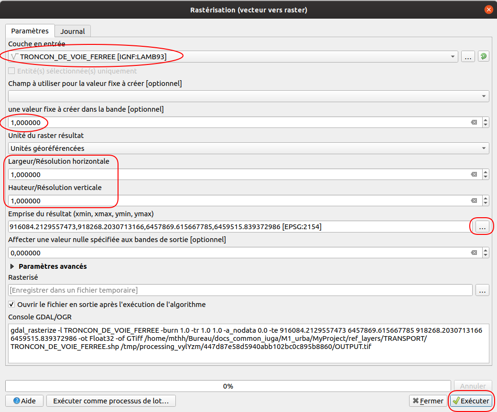
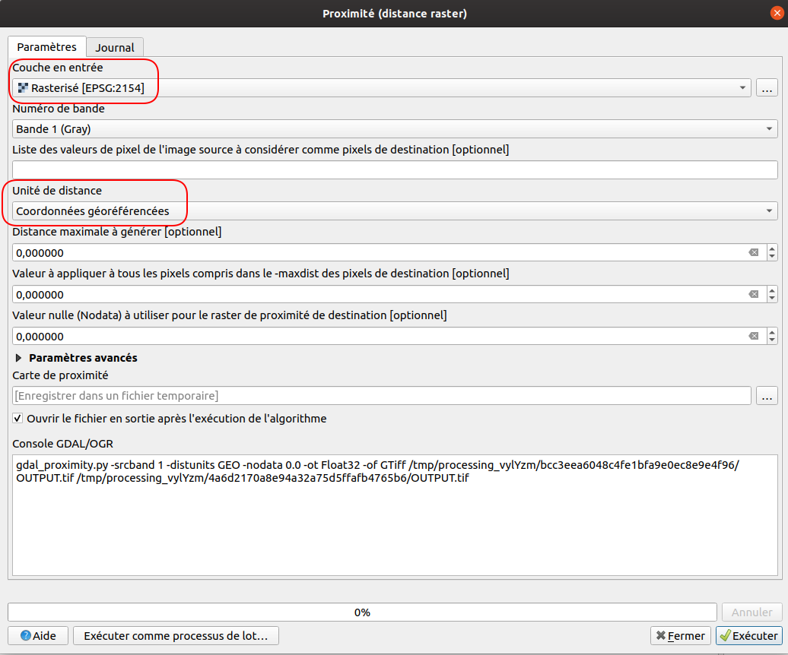
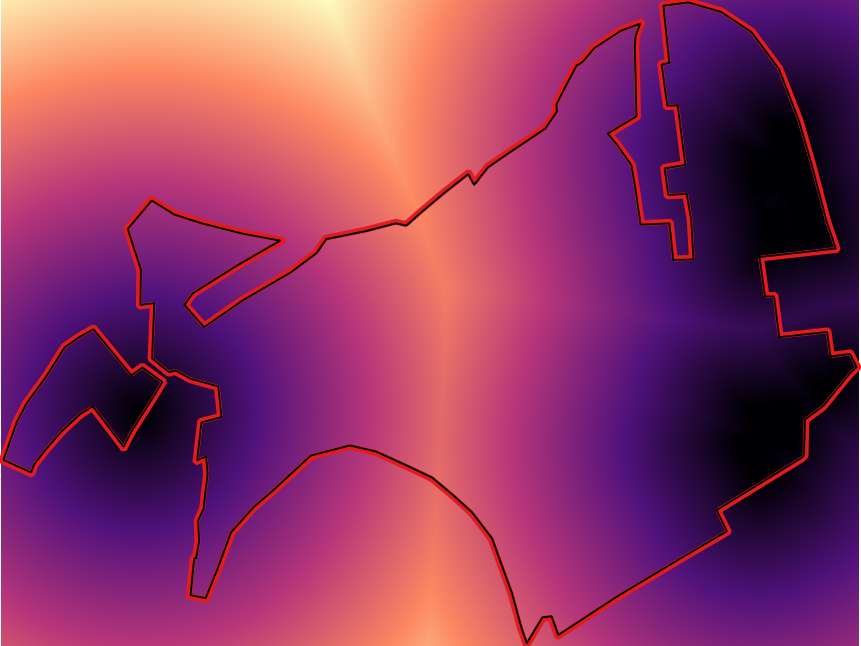
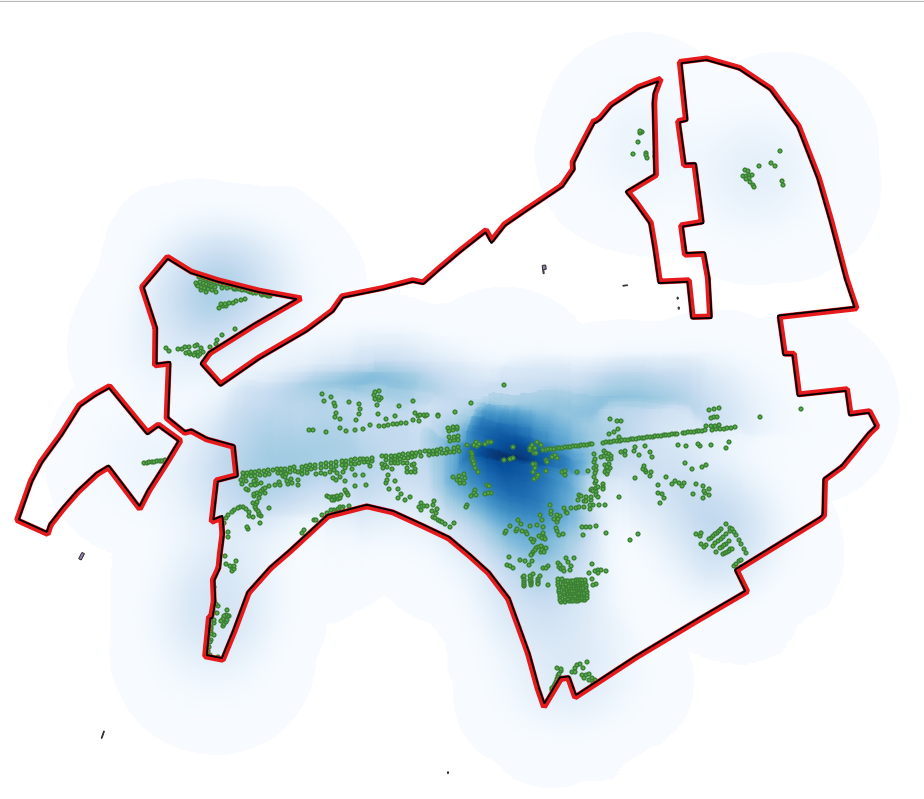

class: first

# APP SIG

 

## M1 Urba.

 

## TP4

 

Matthieu Viry - LIG <em>(Laboratoire d'Informatique de Grenoble)</em>

🖂 <a href="maito:matthieu.viry@univ-grenoble-alpes.fr">matthieu.viry@univ-grenoble-alpes.fr</a>

---
# Plan

 

- Nouvelles modalités / Point sur l'avancement du TP

- Combinaison des contraintes

- Choix et modélisation de critères subjectifs de localisation

- Pour la prochaine séance...

---
class: section-change

# Modalités
# -
# Rappels

---
## Nouvelles modalités de réalisation du TP

 

- Le travail peut désormais être individuel ou continuer d'être réalisé en groupe, à discuter entre vous.

 

- Un espace de discussion a été ouvert sur la plateforme `discord` *(l'url du serveur vous a été communiquée par email - il n'est pas nécessaire de se créer de compte si vous nous souhaitez pas donner votre adresse email)*. N'hésitez pas à l'utiliser pour me poser vos questions ou pour échanger entre vous.

 

- Rendu final : envoi de la (ou des) carte(s) justifiant la localisation du bâtiment + séance de présentation en visio

---
## Rappels sur l'avancement du TP (1/4)

 

.small[
À l'issue des dernières séances vous devez maintenant disposer :

- De la **limite de la zone d'étude**

- D'une **liste de contraintes** à prendre en compte pour permettre l'implantation du bâtiment :
  * En rapport avec les *risques naturels* : bandes de précautions et zone d'autorisation sous prescriptions au titre du risque inondation,
  * En rapport avec le *patrimoine bâti, paysager et écologique* : zones de patrimoine bati et zones / linéaires de patrimoine végétal (à minima celles qui relèvent du régime des espaces boisés classés)
  * En rapport avec les *éléments déjà présents sur le terrain* : bâtiments existant, ligne de tramway, routes, etc.

- Des **couches SIG** qui correspondent à l'ensemble de ces **contraintes**

- D'un **projet QGIS** qui mobilise ces différentes couches *(des styles appropriés ont été données aux différentes couches afin de faciliter la lecture de la carte et afin de vour permettre d'avoir un environnement de travail agréable)*
]

---
## Rappels sur l'avancement du TP (2/4)

 

.center[]

---
## Rappels sur l'avancement du TP (3/4)

  

**→ Les étudiants qui n'ont pas pu récupérer leurs données en raison de la fermeture de l'université peuvent récupérer des données déjà préparées**. Me contacter pour obtenir le lien de téléchargement. Toutefois vous êtes également libre de ne pas utiliser ces données et de répéter les opérations vues lors des premiers TP :)

**→ Veillez à utiliser vos propres données si vous n'êtes pas dans le cas de figure précédent.**

???
Il s'agit d'un geopackage contenant les couches suivantes : limite de la zone d'étude, zonages intéressants au titre du risque inondation, zonages intéressants au titre du patrimoine bâti, paysager et écologique, emprise spatiale des bâtiments, tronçons de route, tronçons de voies férrées, terrains de sport, zones de végétations et pylônes électriques.

---
## Rappels sur l'avancement du TP (4/4)

 

.small[
À l'issue des dernières séances, où maintenant si celà n'a pas été fait, vous devez disposer d'une liste de **critères subjectifs** qui vont permettre de choisir la localisation du bâtiment. Faites preuve d'imagination : ces critères doivent vous permettre de déterminer au mieux la localisation du bâtiment en fonction des spécificités de la commande. Ils peuvent être déterminant dans le choix de votre projet par le commanditaire.

Exemple de critères subjectifs :

- Favoriser l'éloignement avec la ligne de tramway *(pour éviter le bruit et les vibrations)*

- Être à proximité d'un terrain de sport *(dans le cas où la possibilité d'installer un terrain de basket attenant au bâtiment n'a pas été retenue par exemple !)*

Ces critères peuvent aussi être l'occasion d'exprimer une contraintes moins forte que celles définies précédemment, par exemple :

- Supprimer/déplacer le moins de sentiers piétons possible
]

---
class: section-change

# Combinaison des contraintes

---
## Combinaison des contraintes (1/7)

 

Nous disposons des différentes zones à éviter pour la construction du bâtiment.

**Comment obtenir la zone (au format vecteur) qui correspond à la portion de la zone d'étude qui est constructible ?**

1. En **fusionnant** les couches correspondant aux contraintes *(pensez d'abord à créer les couches qui correspondent à l'emprise spatiale des routes et des voies férrées - la couche des routes contient un champ "largeur" !)*

2. En calculant la **différence** entre la zone d'étude et la couche issue de la fusion.
---
## Combinaison des contraintes (2/7)

1 - **Fusion** (`Vecteur` > `Outils de gestion des données` > `Fusionner des couches vecteur`)

.center.img90[]

---
## Combinaison des contraintes (3/7)

1 - **Fusion** - Choix des couches à fusionner

.center.img80[]

---
## Combinaison des contraintes (4/7)

2 - **Différence** - Choix des couches (`Vecteur` > `Outils de géotraitement` > `Différence`)

.center.img90[]

---
## Combinaison des contraintes (5/7)

2 - **Différence** - Exemple de résultat

.center.img85[]

---
## Combinaison des contraintes (6/7)

 

 Quelques difficultés que vous risquez de rencontrer :

- comment **utiliser le champ "largeur" de la couche des routes** pour la création de la zone tampon ? Comment faire lorsque la valeur n'est pas renseignée ?

- comment fusionner les différentes couches lorsqu'un **message d'erreur** rapporte que le **type de certains champs est incompatible** ?

- comment faire la différence entre la zone d'étude et la zone fusionnée si la zone fusionnée contient des **géométries invalides** ?

 

**→ Essayez de surmonter ces difficultés mais n'hésitez toutefois pas à demander sur l'espace de discussion du TP !**

---
## Combinaison des contraintes (7/7)

 

→ La **principale limite** que nous pouvons rencontrer est liée à l'approche binaire qui est utilisée et qui considère donc que toutes les contraintes ont le même poids, i.e.: *"il ne faut pas construire ici"*.

Si cette approche est suffisante pour la majorité de nos contraintes, elle n'est pas tout à fait réaliste pour les données relatives au risque inondation : certaines zones sont à éviter strictement alors que d'autres sont simplement soumise à autorisation.

Cette approche montre également ses limites si nous considérons que les zones de végétation ne sont pas zones des inconstructibles mais seulement des zones qu'il serait préférable d'éviter.

Nous verrons plus tard comment utiliser ces informations pour pondérer notre choix de localisation.

---
class: section-change

# Modéliser des critères d'ordre subjectif

---
## Modéliser des critères d'ordre subjectif

 

Ces critères nécessitent de s'intéresser à localisation d'éléments existant (localisation des *voies de tramway* et des *terrains de sport* pour les exemples utilisés précédemment). Ils nécessitent également de calculer une valeur, en tout point de l'espace, permettant de répondre à la question posée (*à quelle distance suis-je de la ligne de tramway ? à quelle distance suis-je d'un terrain de sport ?*)

 

Afin de calculer ces valeurs, nous allons utiliser une approche *raster*. Pensez à utiliser la même <u>unité</u> (*"unités géoréférencées"*), les mêmes <u>résolutions horizontales/verticales</u> (*par exemple* `1` *mètre*), et la même <u>emprise</u> de résultat (*par exemple l'emprise de la zone d'étude*) lors de la création des différentes couches *raster* qui vont suivre.

---
## Modéliser des critères d'ordre subjectif
### 1 - Éloignement du tramway

Étapes :

1. **Rastérisation de la couche représentant la localisation de la ligne de tramway** (`Raster` > `Conversion` > `Rastérisation ...`)

2. **Création d'un raster représentant la distance à la ligne de tramway rastérisée** (`Raster` > `Analyse` > `Proximité (distance raster) ...`)

Exemple de résultat :

.center.img35[]

---
## Modéliser des critères d'ordre subjectif
### 1 - Éloignement du tramway

Étape 1 : **Rastérisation de la couche représentant la localisation de la ligne de tramway**

.center.img75[]

---
## Modéliser des critères d'ordre subjectif
### 1 - Éloignement du tramway

Étape 2 : **Création d'un raster représentant la distance à la ligne de tramway rastérisée**

.center.img75[]

---
## Modéliser des critères d'ordre subjectif
### 1 - Éloignement du tramway

.small[Résultat *(après changement du style par défaut)*]

.center.img80[]

---
## Modéliser des critères d'ordre subjectif
### 2 - Proximité à un terrain de sport

.small[Résultat *(après changement du style par défaut)*]

.center.img80[]

---
## Modéliser des critères d'ordre subjectif
### 3 - La densité d'arbres isolés

En utilisant la *méthode d'estimation par noyau* pour calculer une valeur de densité en tout point de l'espace (ici dans un rayon de 250m)

[Détails dans la documentation de QGIS](https://docs.qgis.org/testing/en/docs/user_manual/processing_algs/qgis/interpolation.html#qgisheatmapkerneldensityestimation) / Voir également la page [Wikipedia](https://fr.wikipedia.org/wiki/Estimation_par_noyau)

.small[Résultat *(après changement du style par défaut)*]

.center.img50[]

---
## Modéliser des critères d'ordre subjectif

  

**→ Mettez en oeuvre les opérations appropriées pour traiter chacun des critères subjectifs que vous avez choisis !** D'autre traitement que "proximité" et "densité" peuvent vous être utiles. N'hésitez pas à demander de l'aide si nécessaire !

 

**Savez-vous comment il est possible de combiner les différents critères subjectifs que nous venons de voir ? Et si nous devons prendre en compte les contraintes que nous avons mobilisés précedemment ?**

---
class: section-change

# Pour la prochaine séance

---
## Pour la prochaine séance

 

- **D'ici la semaine prochaine, lisez l'article suivant:** [Analyse spatiale multicritère et identification des sols propices à la production du maïs à Ouessè au Bénin](https://journals.openedition.org/vertigo/19885).

 

- **Lisez également les deux premières parties** *(jusqu'à la page 20 - la suite concerne plus particulièrement ArcGIS)* **de l'article qui suit:** [SIG et aide à la décision: une nouvelle approche basée sur la logique floue](SIG_et_aide_a_la_decision_une_nouvelle_a.pdf).
