class: first

# APP SIG

<br>

## M1 Urba.

<br>

## TP5 - Analyse multi-critère en mode raster

<br>

<div style="width: 167px;position: absolute;bottom: -5px;left: 0px;">


</div>

<div style="margin: auto; text-align: center; position: relative; bottom: -100px; left: 20px;">
<p style="font-size: 20px;margin:auto; text-align: center">Matthieu Viry - LIG <em>(Laboratoire d'Informatique de Grenoble)</em></p>
<p style="font-size: 20px;margin:5px auto; text-align: center">🖂 <a href="maito:matthieu.viry@univ-grenoble-alpes.fr">matthieu.viry@univ-grenoble-alpes.fr</a></p>
</div>

---
# Plan - Analyse multi-critère en mode raster

<br>

- Définition

- Mise en pratique dans QGIS
  * rastérisation de contraintes binaires et de la zone d'étude
  * passage de critères d'installation en raster
  * discrétisation des rasters en classes si nécessaire
  * combinaison des contraintes et des critères d'installation

---
class: section-change

# Analyse multi-critère en mode raster

---
## Analyse multi-critère : définition (1)


"**L’analyse multicritère**, ou évaluation multicritère, est une méthode basée sur une **modélisation mathématique des approches décisionnelles**.  

Elle permet la **comparaison des différentes solutions selon plusieurs critères** eux-mêmes évalués et **hiérarchisés en fonction de leur importance relative** dans le processus de décision ou d’analyse.  

Par exemple, l’analyse multicritère va permettre d’établir des priorités de choix entre la réalisation d’un équipement sportif, d’une bibliothèque ou d’une salle de musique, en tenant compte de critères liés au budget, aux besoins des usagers, à la disponibilité des terrains, aux coûts de fonctionnement..."  
.source.right[Source : Aschan-Leygonie *et al.*, 2019 (p. 248).]

.center[_**Lisez attentivement les 2 figures qui suivent. Quelles similarités voyez-vous avec notre cas d'étude ? Comment transformer les données dont vous disposez afin de réaliser un traitement similaire ?**_]

---
## Analyse multi-critère : définition (2)


.center.img42[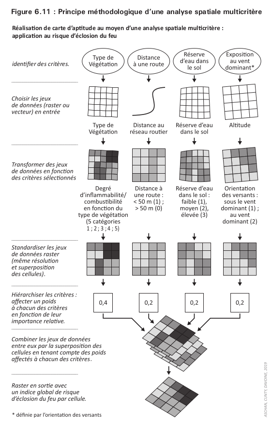]

.source.center[Source : Aschan-Leygonie *et al.*, 2019 (p. 252).]


---
## Analyse multi-critère : définition (3)


.center.img50[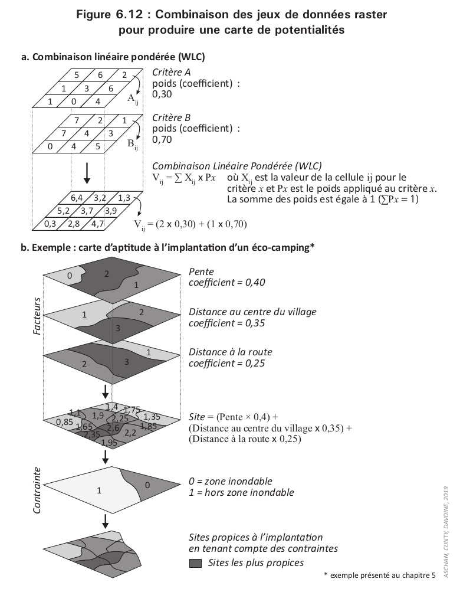]

.source.center[Source : Aschan-Leygonie *et al.*, 2019.]


---
## Analyse multi-critère : mise en application dans QGIS (1)

<br>

À la suite de la séance précédente nous disposons :

- d'une couche, au format vecteur, représentant la zone d'étude

- de couches représentant des contraintes (binaires) au format vecteur *(par exemple : emprise actuelle des bâtiments, des voies de communications et des terrains de sports + zone non-constructible au regard du PLU + bande de précaution du risque inondation)*

- de couches représentant des critères (appelées "facteur" dans les images précédentes) subjectifs d'installation du bâtiment (par exemple *l'éloignement à la ligne de tramway* et la *proximité à un terrain de sport*) ainsi que des facteurs d'installation au regard du PLU (*zone d'autorisation sous prescriptions* vs *zone sans demande d'autorisation*)


---

## Analyse multi-critère : mise en application dans QGIS (2)

.small[
Nous cherchons à **combiner** ces couches afin d'obtenir la **zone la plus favorable** à l'implantation de notre bâtiment.

Il est donc nécessaire au préalable :

1. de **rastériser chaque couche correspondant à une contrainte "binaire"** (en utilisant la valeur 1 pour remplir la carte et 0 pour les zones à éviter : bâtiments, voies de circulation, etc.) et la couche correspondant à la zone d'étude,

2. de **rastériser chaque couche correspondant à une contrainte non-binaire** (zone constructible sous demande d'autorisation, etc.)

3. de **disposer des autres couches _raster_ qui correspondent aux critères subjectifs** (éloignement du tramway, proximité aux terrains de sport, densité d'arbres dans un rayon donnée, etc.) et de reclasser cette information,

4. d'**attribuer un coefficient** (cf. figure précédente) à chacun de ces critères / facteurs de façon à ce que la somme des coefficients soit égale à 1 (par exemple 0.4 pour l'éloignement du tramway, 0.4 pour le type de zonage au regard des inondations et 0.2 pour la proximité au terrain de sport)
]

---

## Analyse multi-critère : mise en application dans QGIS (3)

Une fois ces opérations réalisées il sera possible de calculer une couche représentant le potentiel d'implantation du site en tout point de la zone d'étude, en utilisant une formule de la forme :
```
"contrainte_binaire" * (
  ("éloignement_tramway" * 0.4)
  + ("type_zone_inondation" * 0.4)
  + ("proximité_terrain_sport" * 0.2)
)
```

.center.img35[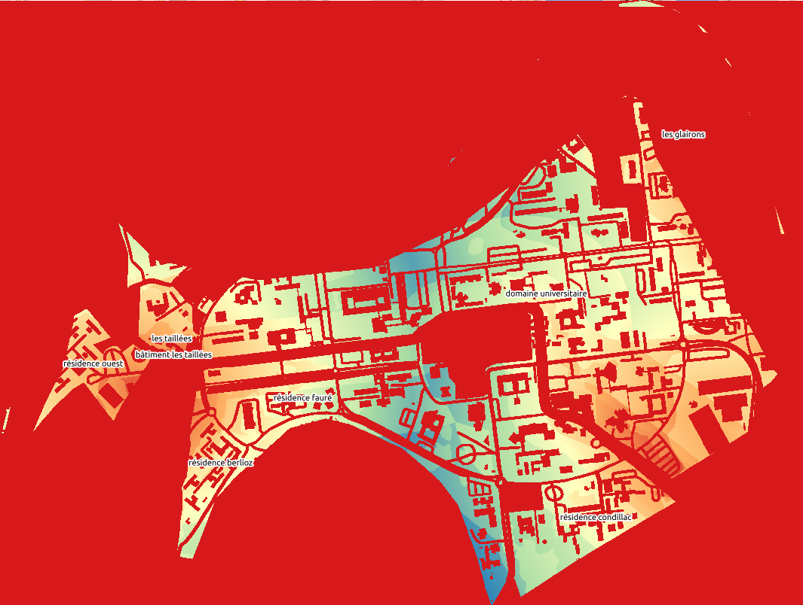]


<blockquote> ⚠ Aidez-vous également de la page <a href="https://www.qgistutorials.com/en/docs/3/multi_criteria_overlay.html"><b>QGIS Tutorial and Tips - Multi Criteria Overlay Analysis</b></a> si nécessaire ! </blockquote>

---
## 1. Conversion vecteur -> raster (1)
### Couches de contrainte binaire

Dans QGIS :  
**`Raster` > `Conversion` > `Rastérisation (vecteur vers raster)...`**


⚠ Ici on veut attribuer :
  - la valeur **0** pour indiquer une surface **non-constructible**,
  - la valeur **1** pour une surface **constructible**.

⚠ <b>On utilisera toujours la même <u>emprise spatiale</u></b> (celle de la zone d'étude) <b>et toujours la même <u>résolution</u></b> (ici **1** mètre - *unités géoréférencées* - est approprié).

⚠ Ne pas oublier de sauvegarder le résultat (lors de la réalisation du traitement ou plus tard si utilisation d'une couche temporaire en mémoire).

---
## 1. Conversion vecteur -> raster (2)
### Couches de contrainte binaire

.center.img85[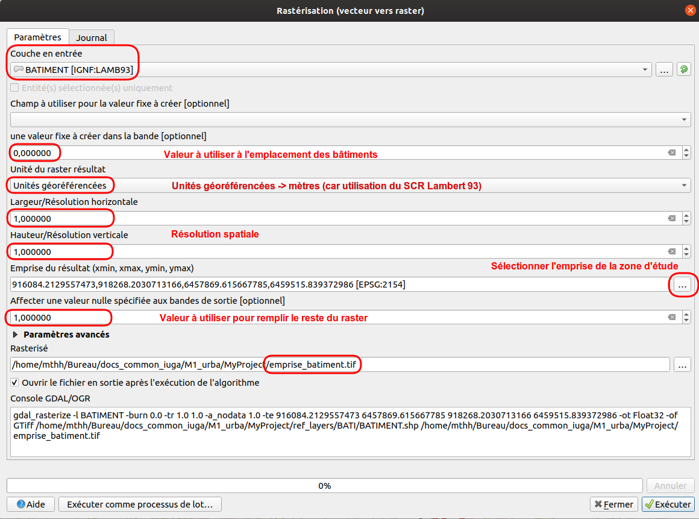]

---

## 1. Conversion vecteur -> raster (3)
### Emprise de la zone d'étude

**Il est également nécessaire de rastériser la couche correspondant à l'emprise de la zone d'étude**.

Attention aux valeurs à utiliser : on veut toujours utiliser le **0** pour désigner une surface sur la quelle ne pas construire *(i.e l'extérieur de la zone d'étude)* et **1** pour la zone pouvant être construire *(la zone d'étude à proprement parlé)*, il est donc nécessaire d'inverser les valeur **0** et **1** utilisées précédemment dans les champs *"valeur fixe à créer dans la bande"* et *"affecter une valeur nulle spécifiée aux bande de sortie"* de l'outil "Rastériser".

---
## 1. Combinaison des couches qui correspondent au contraintes binaires (1)

Une fois que l'on dispose des différentes couches de contraintes et de l'emprise de la zone d'étude au format raster, il est possible de combiner ces couches
en utilisant la **calculatrice raster** de QGIS.

Dans QGIS :  
**`Raster` > `Raster calculator ...`**

Puisque chacune des couches raster utilise la valeur 0 pour indiquer une zone non-constructible et 1 pour indiquer une zone constructible, il est possible d'utiliser [l'opérateur booléen](https://huit.re/6udWWfxj) **AND** pour les combiner et obtenir en sortie une nouvelle couche de 0 et de 1, représentant la fusion de ces informations.

.center.img30[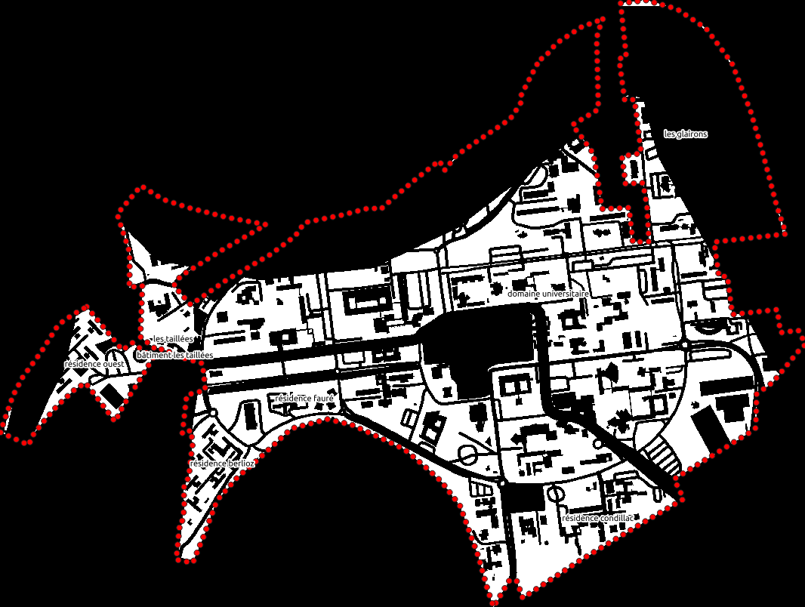]

---
## 1. Combinaison des couches qui correspondent au contraintes binaires (2)

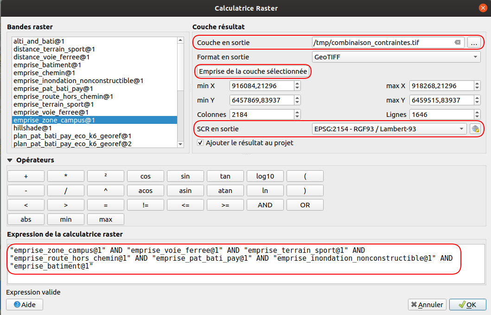

---
## 1. Combinaison des couches qui correspondent au contraintes binaires (3)

**Résultat:**

.center.img80[]

---
## 2. Rasteriser les couches qui correspondent à des critères (non-binaires) (1)

Il est possible, lors de la **rastérisation** de ne pas seulement écrire une valeur fixe dans le raster,
mais d'écrire une valeur qui dépend d'un attribut de la couche à rastériser. C'est ce que nous allons faire pour les zones inondables par exemple :
celles-ci se divisent en 3 catégories : la première interdit la construction *(bande précaution)* et a été intégrée dans les contraintes, les deux autres permettent la construction à des niveaux différents *(zone d'autorisation sous prescriptions)*.

Nous allons donc affecter un score de 100 aux surfaces qui ne sont pas inondables *(le meilleur score)*, et un score de 50 ou de 10 en fonction du type de zone d'autorisation sous prescriptions.

---
## 2. Rasteriser les couches qui correspondent à des critères (non-binaires) (2)

On souhaite passer d'une couche vecteur contenant deux types de zones *(zone d'autorisation sous prescriptions)* et des trous *(rien de spécial au niveau des inondations)* à une couche raster décrivant également ces informations (il est nécessaire que le type de zone soit stocké en attribut sous forme d'un nombre entier).

.center.img65[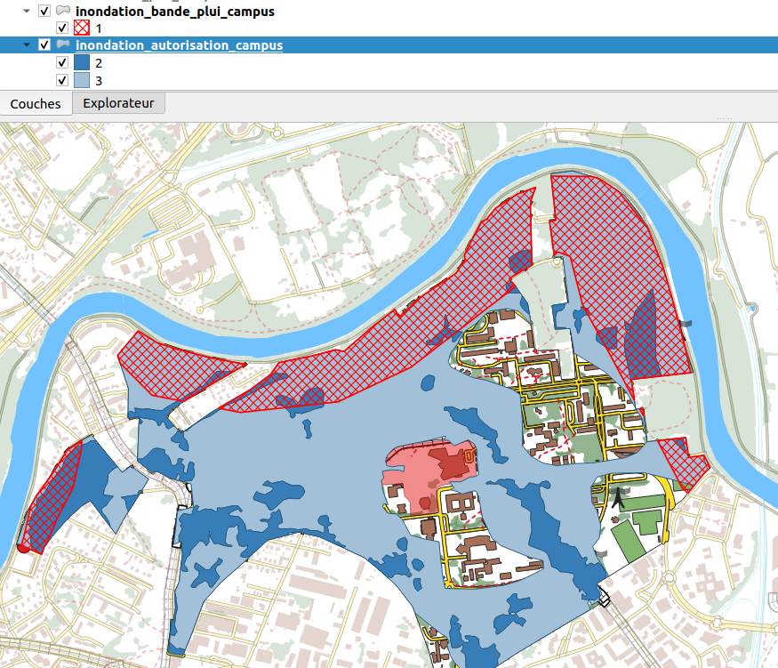]

---
## 2. Rasteriser les couches qui correspondent à des critères (non-binaires) (3)

Dans QGIS :  
**`Raster` > `Conversion` > `Rastérisation (vecteur vers raster)...`**

.center.img85[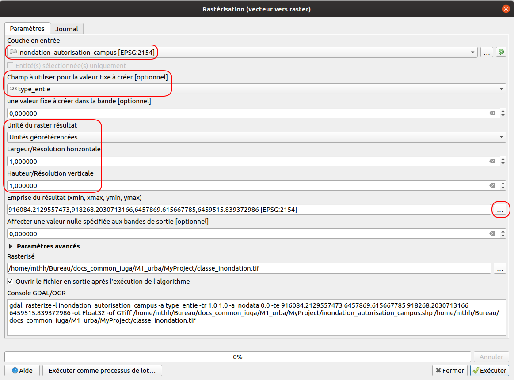]

---

## 2. Rasteriser les couches qui correspondent à des critères (non-binaires) (4)

Le résultat reflète la transformation effectuée (ne pas hésiter à changer la symbologie):

.center.img80[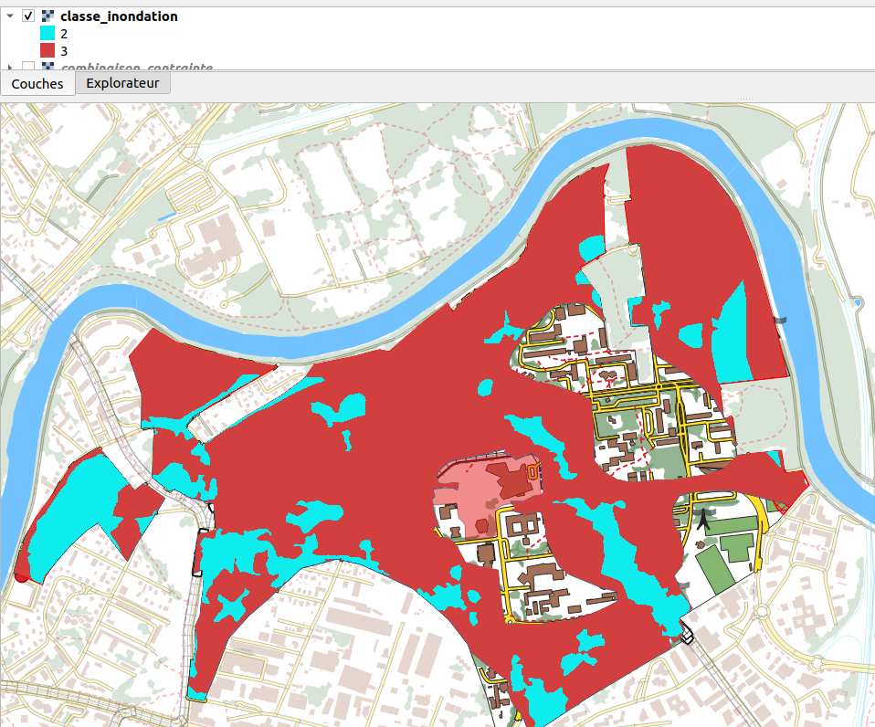]

---

## 2. Rasteriser les couches qui correspondent à des critères (non-binaires) (5)

<br><br>

On souhaite ensuite désormais **affecter un score aux différentes zones**. Cette opération est possible en utilisant la **calcultatrice raster**.
Nous allons utiliser les scores suivants :
- 100 (meilleur score) si la zone ne présente pas de risque inondation
- 50 pour les *zones d'autorisation sous prescriptions* de type Bi1
- 10 pour les *zones d'autorisation sous prescriptions* de type Bi2

<br>

*Note : la "bande de précaution" a été intégrée précédemment dans les contraintes binaires.*
---

## 2. Rasteriser les couches qui correspondent à des critères (non-binaires) (6)

.center.img85[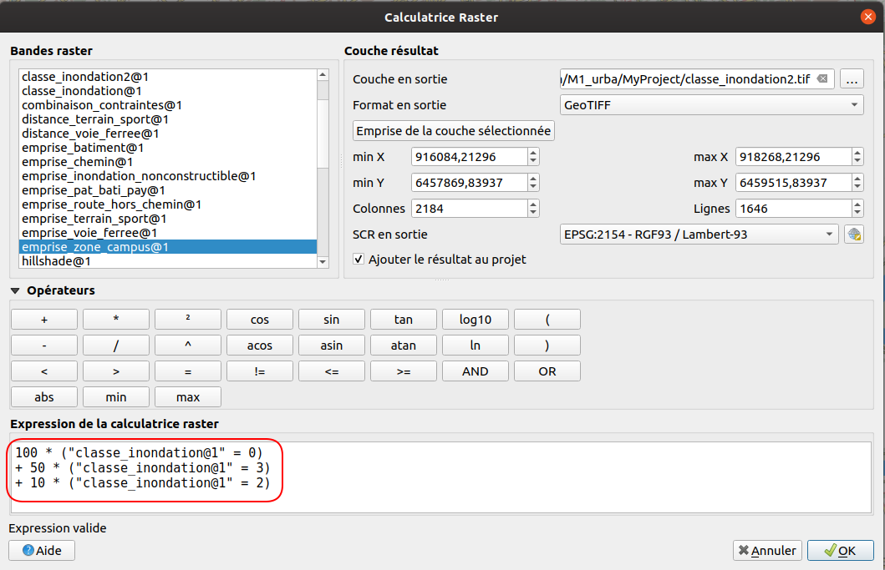]

---

## 2. Rasteriser les couches qui correspondent à des critères (non-binaires) (7)

.center.img80[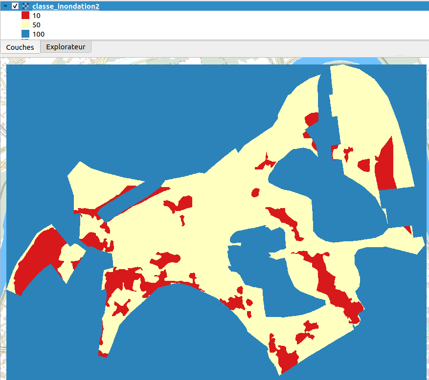]

---
## 3. Reclasser les couches raster correspondant à des critères (déjà au format rasters)

Lors du calcul des critères d'*éloignement à la ligne de tramway* et de *proximité à un terrain* de sport nous avons créé un raster qui comporte, dans chaque cellule une valeur différente, correspondant à la distance à l'équipement concerné depuis la cellule du raster en question. Afin de simplifier l'analyse qui va suivre, nous allons dicrétiser cette information et la classer, par exemple, en 3 classes auxquelles nous allons affecter des scores plus ou moins bon, comme pour le critère précédent.

Par exemple, pour l'éloignement au tramway, et au regard du bruit et des vibrations que nous souhaitons évités :
- localisation à plus de 250m : **100** (meilleur score)
- localisation entre 250m et 100m : **50**
- localisation entre 100m et 75m : **10** (mauvais score)
- localisation à moins de 75m : **0** (plus mauvais score, n'apporte pas de point au titre de ce critère, mais n'empeche pas la construction pour autant)

---
## 3. Reclasser les couches raster correspondant à des critères (déjà au format rasters)

Concrêtement, on cherche à transformer l'information de la manière suivante :

.img85.center[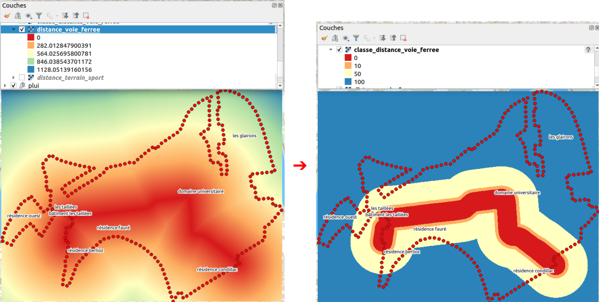]

Chaque cellule du raster ne contient plus la distance à l'équipement mais le score correspondant à la classe dans la quelle se trouvait cette distance.

---
## 3. Reclasser les couches raster correspondant à des critères (déjà au format rasters)

Exemple de la **distance à la ligne de tramway** (attribution d'un <u>score élevé</u> si la distance avec l'équipement est <u>élevée</u>)

.center.img85[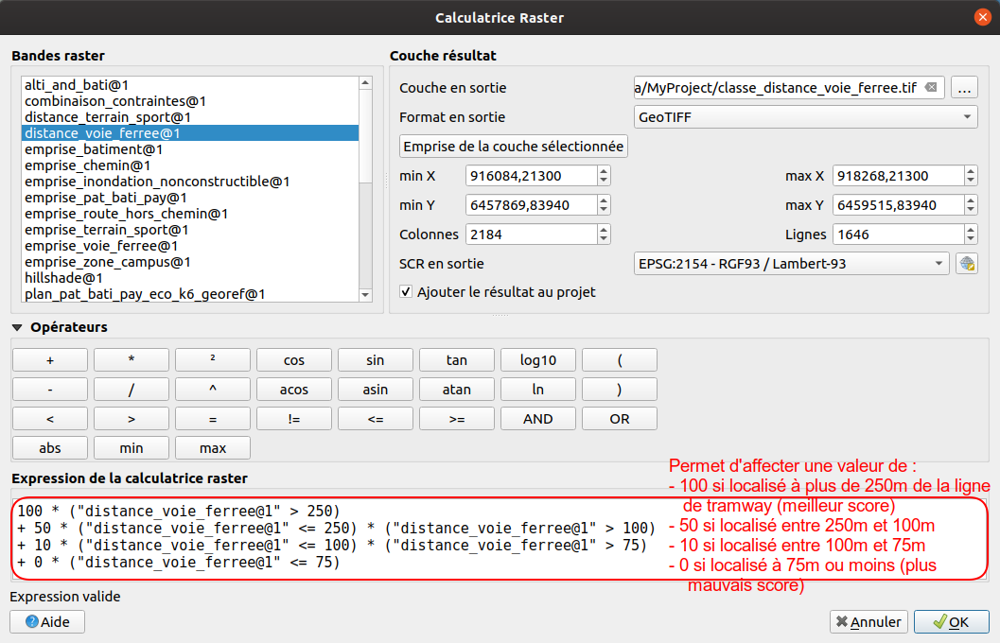]

---
## 3. Reclasser les couches raster correspondant à des critères (déjà au format rasters)

Exemple de la **distance à un terrain de sport** (attribution d'un <u>score élevé</u> si la distance avec l'équipement est <u>faible</u>)

.center.img85[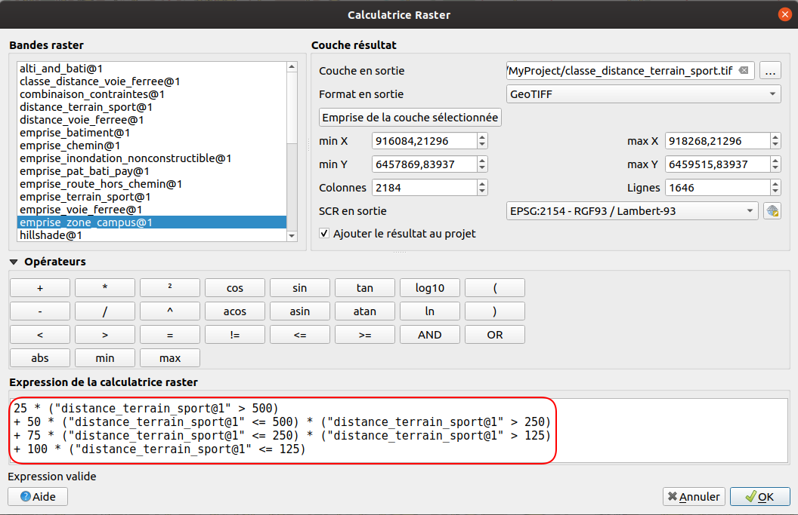]

---
## 4. Combiner les contraintes et les critères subjectifs (1)

Afin de déterminer les zones présentant le plus fort potentiel d'installation au regard de mes critère, je vais **attribuer un coefficient** à chacun d'entre eux de façon à ce que la somme des coefficients soit égale à 1 :

- éloignement du tramway : 0.4
- type de zonage au regard des inondations : 0.4
- proximité au terrain de sport : 0.2

Ce calcul se réalise lui aussi dans la **calculatrice raster** de QGIS et mobilise également la couche raster correspondant au croisement des **contraintes binaires** et de la **zone d'étude**.

.center.img85[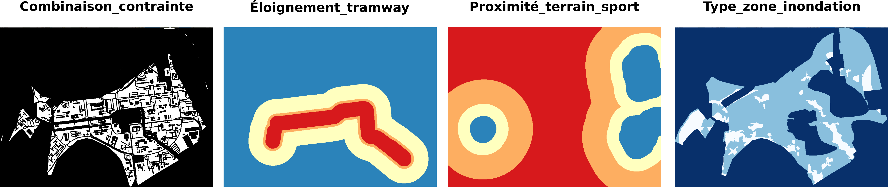]

---
## 4. Combiner les contraintes et les critères subjectifs (2)

<br>

.center.img85[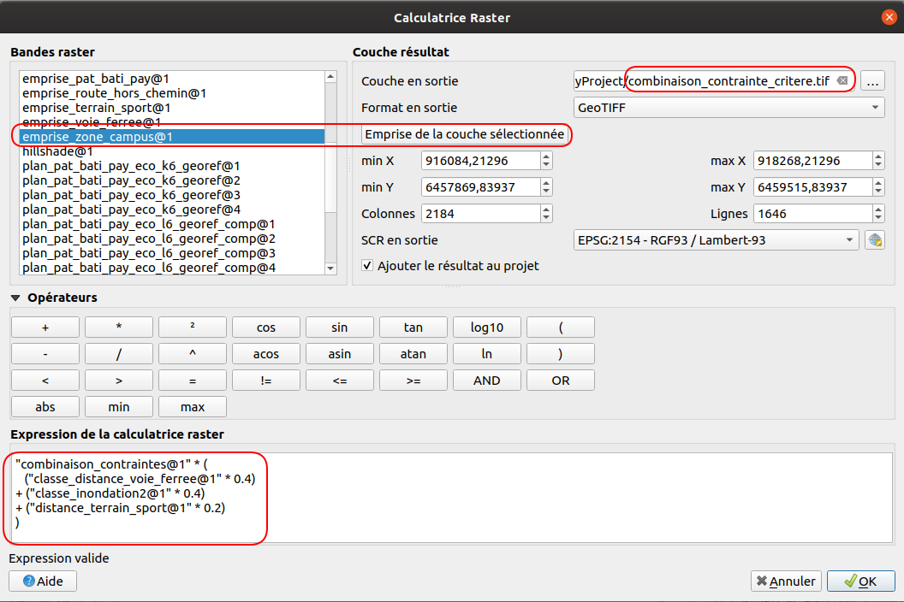]

---
## 4. Combiner les contraintes et les critères subjectifs (3)

**Example de résultat après modification de symbologie de la couche:**

.center.img65[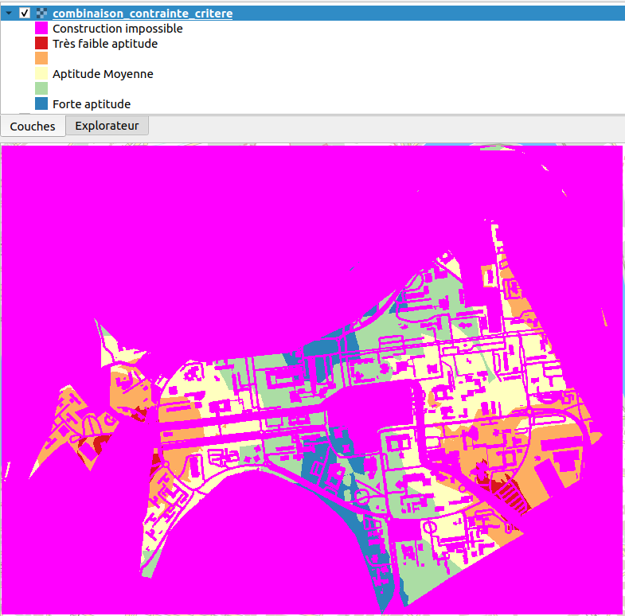]

---
class: section-change

# À vous de jouer !

---
## À vous de jouer ! - Recommandations

<br>

**⚠ Attention à ne pas seulement utiliser les critères utilisés ici en exemple, plusieurs aspects ont été laissé de coté : présence de chemins piétons, présence d'espaces verts (hors bois-classés), etc.**


**⚠ Pensez à donner des noms explicites à vos couches** (pas *Rastérisé* par exemple) **de façon à pouvoir les re-mobiliser facilement pour relancer l'analyse.**


**⚠ Pensez à sauvegarder votre projet QGIS et à documenter** (au moins de manière succinte) **dans un document ce que vous essayer d'effectuer** (liste des contraintes, liste des critères, coefficient affecté à chaque critère, etc.).

**N'hésitez pas à chercher sur le Web ni à poser des questions** (préparez une description du problème que vous rencontré : traitement que vous essayez de réaliser, couches et paramètres d'entré, message d'erreur le cas échéant ou une description de la raison pour laquelle le résultat ne correspond pas à vos attente)
---
class: section-change

# Références

---
## Références

- **Les systèmes d'information géographique**, Christina Aschan-Leygonie, Claire Cunty, Paule-Annick Davoine, 2019, Armand Colin, 272 pages.

<br>

- [QGIS Tutorial and Tips - Multi Criteria Overlay Analysis](https://www.qgistutorials.com/en/docs/3/multi_criteria_overlay.html)

<br>

- [Documentation QGIS - Analyse Raster](https://docs.qgis.org/3.10/fr/docs/user_manual/processing_algs/qgis/rasteranalysis.html)

<br>

- [QGIS Training manual - Module 8 : Raster](https://docs.qgis.org/3.10/fr/docs/training_manual/rasters/index.html)
