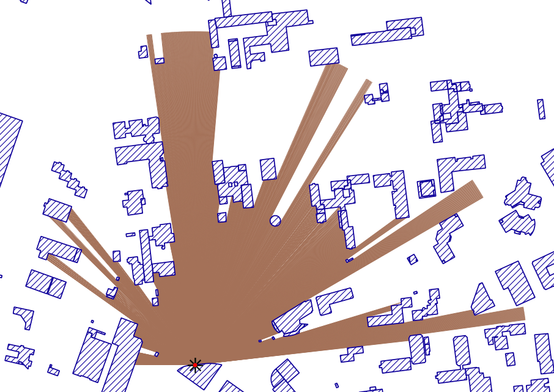

## Créer **une zone correspondant au champ de vision** (approche 2d) **depuis un point**

1. **Création** (si nécessaire) de la **couche de point à utiliser** (1 seul point pour l'instant)

2. **Création d'un tampon en coin** : `Boite à outils géotraitement` > `Géométrie vectorielle` > `Créer des tampons en coin` (choisir l'angle, la distance, etc.). *NOTE* : Fonctionne également avec une zone tampon circulaire traditionnelle, le "tampon en coin" est ici utilisé pour modéliser le champ de vision d'un observateur humain, mais si l'on considère une caméra ou simplement que l'observateur peut tourner la tête alors le "tampon en coin" n'apporte rien de particulier.

3. **Densifier la géométrie obtenue** si nécessaire : `Vecteur` > `Outils de géométrie` > `Densify by count`

4. **Extraire les sommets** du polygone

5. **Sélectionner** seulement les sommets situés à la distance choisie à l'origine

7. **Créer des lignes** *(hub)* entre le point de référence et les sommets extraits précédemment

8. Effectuer la **différence** entre ces lignes et la couche des bâtiments

9. Convertir le résultat obtenu en géométrie *single-part* : **`Vecteur > Outils de géométrie > De morceaux multiples à morceaux uniques`**

10. **Sélectionner** seulement des tronçons qui touchent le point de référence.

11. **Rasterizer** le résultat pour obtenir la zone qui correspond

12. **Convertir** à nouveau **le raster en vecteur** (Polygone) pour obtenir la zone correspondante
