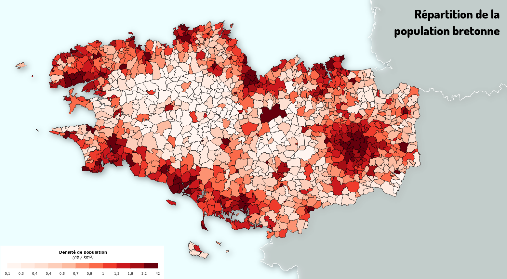
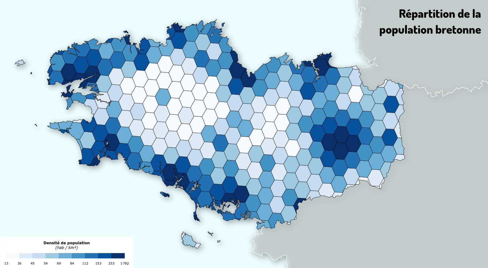
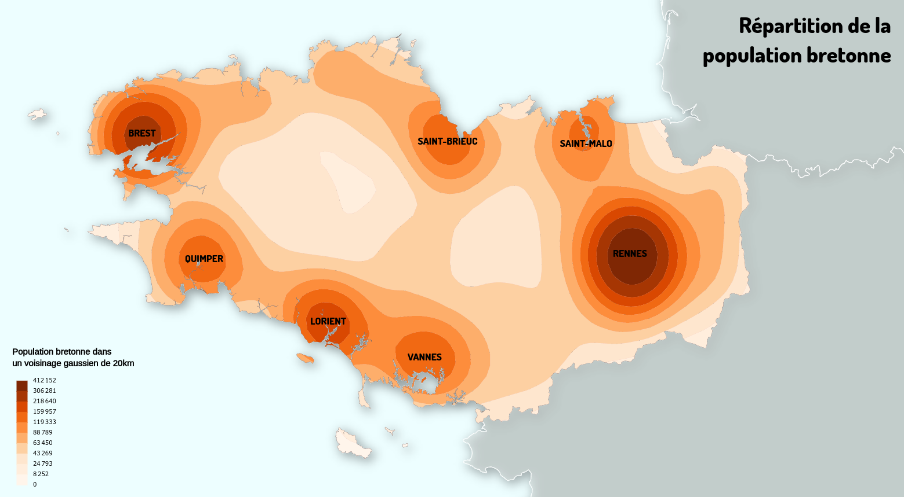
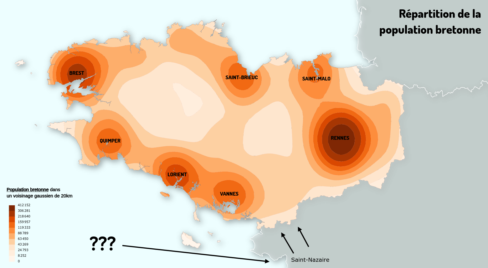

<!-- ---
### Cartographier des densités ... à partir d'une implantation zonale

 

- **Densité = Rapport entre un nombre d'_items_ et une surface**
Densité de population (hb / km²), densité de bancs, etc.

 

- **Variable quantitative relative / Ratio**
**➜ À-plat de couleur / Carte choroplèthe avec progression colorée**

---
#### Cartographie "directe"

.center[]

---
#### Carroyage

.center[]

---
#### Carroyage

---
#### Lissage spatiale

.center[]

---
#### Lissage spatiale

.center[]

---
#### Lissage spatiale

---
### Cartographier des densités ... à partir d'une implantation ponctuelle

---
### Implantation ponctuelle

   

Parfois la représentation directe de l'information ponctuelle peut s'avérer difficile à lire ET ne pas rendre directement visible le phénomène spatial étudié.

Il peut être nécessaire d'aggréger l'information en utilisant un maillage, qu'il soit existant (maillage territorial par exemple) ou qu'il s'agisse d'un carroyage créé pour l'occasion.

---
### "Analyse d'un semi de points"

---
### Lissage spatiale

--- -->
