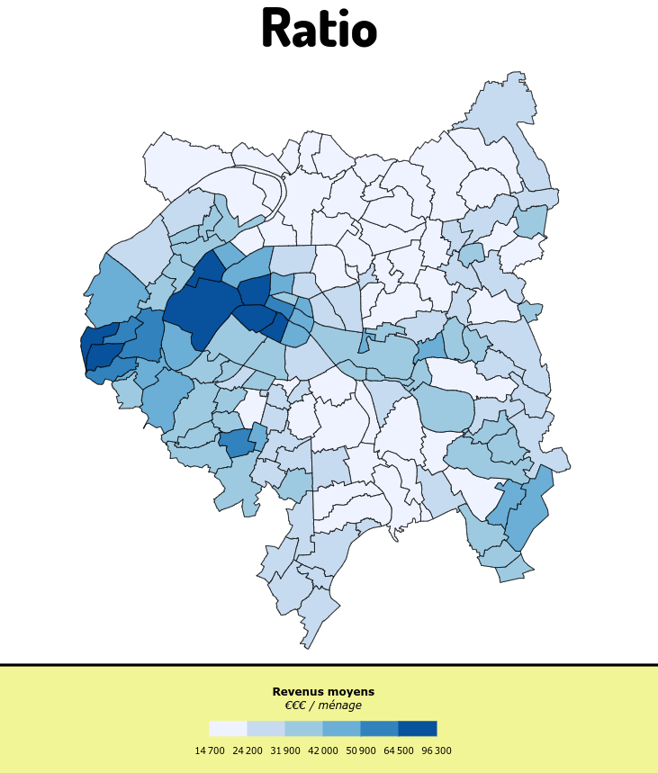
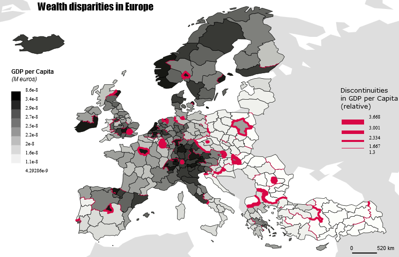
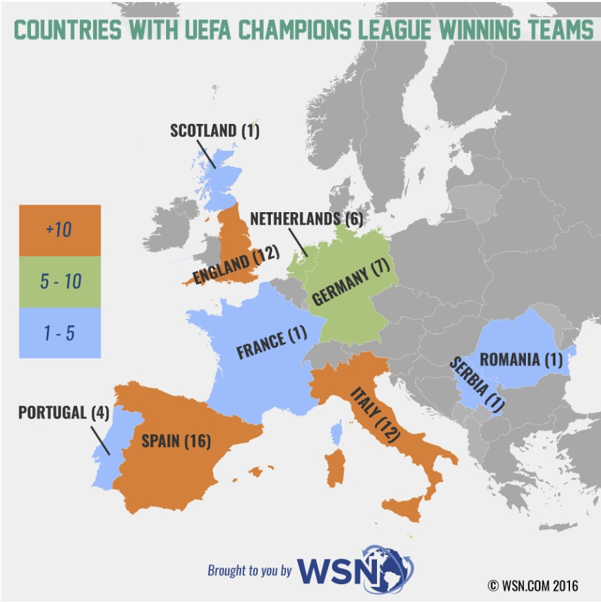
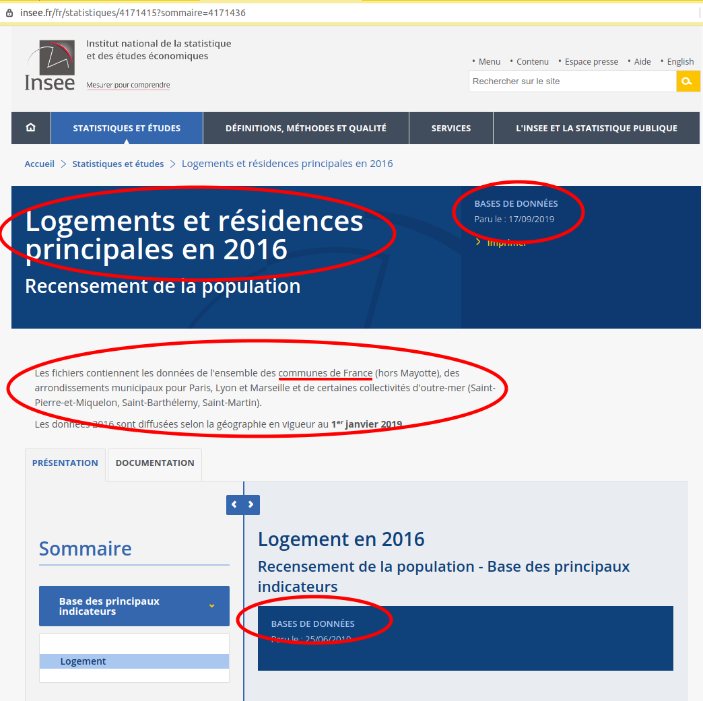

class: first

# Outils de Communication territoriale

 

## M1 IDT2

 

### Partie 1 : Cartographie thématique / statistique
### et mise en scéne de la carte

Matthieu Viry - LIG <em>(Laboratoire d'Informatique de Grenoble)</em>

🖂 <a href="maito:matthieu.viry@univ-grenoble-alpes.fr">matthieu.viry@univ-grenoble-alpes.fr</a>

---
class: section-change

# Séance 2

 

## Rappels & exercices

     

.center.source[(support élaboré avec l'[UMS RIATE](http://riate.cnrs.fr) dans le cadre des formations à [MAGRIT](http://magrit.cnrs.fr))]

---
class: center, middle

## Combiner les représentations pour guider la lecture de la carte

---

.center.img65[]

---

.center.img65[]

???

Les cartes de discontinuités mettent en avant les limites (ou "frontières") entre les entités étudiées, en leur affectant une épaisseur relative au différentiel de valeur existant entre elles.

Deux méthodes permettent de calculer ce différentiel, on parlera ainsi soit de **discontinuité absolue** (écart absolu entre les valeurs de la variable étudiée c'est à dire max(A,B) - min(A,B)) ou de discontinuité relative (rapport max(A,B) / min(A,B)). La visualisation de lignes de discontinuités permet de mettre en exergue les ruptures spatiales des phénomènes socio-économiques étudiés, qui selon la formule de Brunet et Dolphus (1990) montre que « l’espace géographique est fondamentalement discontinu ».

Cette représentation est particulièrement pertinente lorsqu'elle peut être combinée à une représentation par aplats de couleurs (Cf. cartes de ratio).

---

---

## Exercice 2

.center.img70[]

???

* **Représentation** - Les données statistiques (quantitatives) représentées à la façon d’une typologie (qualitative).
* Source – non mentionnée
* **Données** – Pas forcément à jour (2016 ?) / période considérée (depuis quand ?) / quels sont les pays qui participent à la compétition ?
* **Légende** – pas claire

---
## Exercice 2

  

**Objectif thématique** :

- Refaire la carte des pays victorieux en UEFA _Champions League_.

 

**Objectifs techniques** :

- Critiquer une carte et proposer des alternatives
- Trouver un fond de carte adapté
- Joindre le jeu de données au fond de carte

.center.img20[]

---
## Exercice 2

 

**Source de données pour les fonds de carte à l'échelle du globe:**

- http://naturalearthdata.com/  
_(trouver le bon fond de carte : niveau de détails, présence des 50 pays concernés par le jeu de données, etc.)_

 

**Données des victoires par pays:**

- [https://mthh.github.io/carto-magrit/data_uefa.csv](https://mthh.github.io/carto-magrit/data_uefa.csv)  
.source[(Source: [https://fr.wikipedia.org/wiki/Ligue_des_champions_de_l%27UEFA](https://fr.wikipedia.org/wiki/Ligue_des_champions_de_l%27UEFA))]

.center.small[]

---
class: align-left

## Exercice 2

 

**Fonds de carte à l'échelle du globe:** http://naturalearthdata.com/

**Victoires / pays:** [https://mthh.github.io/carto-magrit/data_uefa.csv](https://mthh.github.io/carto-magrit/data_uefa.csv)

----

[1] **Critique de la carte**  
[2] **Trouver un fond de carte adapté** _(granularité spatiale, généralisation cartographique, etc.)_  
[3] **Importer géométries et données dans Magrit**  
[4] **Ajuster l’étendue géographique**  
[5] **Choisir la représentation**  
[6] **Mise en page**  

 

----

.center[Temps de réalisation : **🚀 15 min 🚀**]

---

## Exercice 3

  

**Objectif thématique** :

- Faire une carte statistique sur le thème des **logements vacants** sur le territoire de Grenoble Alpes Métropole

 

**Objectifs techniques** :

- Trouver fond de carte & données adaptés
- Sélectionner les variables d'intérêt et l'emprise de représentation des données
- Proposer une ou plusieurs des représentations adaptées
- Mettre en page la carte pour en faciliter sa lecture

---
class: align-left
## Exercice 3

 

**Données sur les logements**

➜ INSEE : [https://www.insee.fr/fr/statistiques/4171415?sommaire=4171436](https://www.insee.fr/fr/statistiques/4171415?sommaire=4171436)

➜ **Extrait** : [https://mthh.github.io/carto-magrit/data_logement.zip](https://mthh.github.io/carto-magrit/data_logement.zip)

.center.img75[]

---
class: align-left

## Exercice 3

 

----

[1] **Critique de la carte**  
[2] **Trouver le fond de carte adapté**  
[3] **Sélectionner les données à représenter**  
[4] **Importer géométries et données dans Magrit**  
[5] **Ajuster l’étendue géographique**  
[6] **Choisir la représentation**  
[7] **Mise en page et habillage de la carte**  

 

----

.center[Temps de réalisation : **🚀 35 min 🚀**]
