class: first

# Des données à la cartographie

 

### M1 GAED-GEOMAS / M1 GAED-GEOPOESICE

 
 

### Partie 1 : Cartographie thématique et mise en scène de la carte

Matthieu Viry - LIG <em>(Laboratoire d'Informatique de Grenoble)</em>

🖂 <a href="maito:matthieu.viry@univ-grenoble-alpes.fr">matthieu.viry@univ-grenoble-alpes.fr</a>

---
class: t1

## Contenu du cours

- .bb[[Qu'est-ce qu'une carte ? ](#4)]

  * Histoire et définition

- .bb[[Les composantes de l'information géographique](#24)]

  * ... et les formats manipulés dans cette séance de TP/cours

- .bb[[Sémiologie graphique](#40)]

  * Variables visuelles

  * Discrétisation

- .bb[[Mise en scène cartographique](#73)]

  * De la carte à l'infographie...

- .bb[[Synthèse et application](#113)]

.center.source[(support élaboré avec l'[UMS RIATE](http://riate.cnrs.fr) dans le cadre des formations à [MAGRIT](http://magrit.cnrs.fr))]

---

## Objectifs

   

**🚀 Se familiariser avec les règles de sémiologie graphique**

 
**🚀 Connaître les règles de construction d'une carte**

 
**🚀 Savoir faire une carte esthétique et adaptée au message / au public**

---
class: section-change

# Partie 1

# Qu'est-ce qu'une carte ?

---
## Les cartes existent depuis longtemps...
#### Cadastre de Belinda

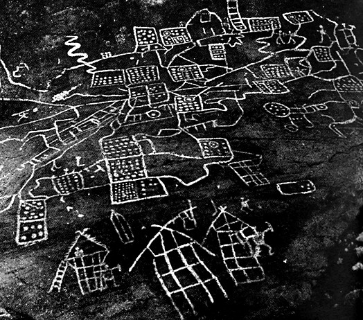

.small[*"Quatre périodes au moins de gravure se superposent, et cette mystérieuse topographie apparaît sur la deuxième couche, voisinant avec des représentations de cervidés. S'il s'agit bien d'un premier vocabulaire topographique, nous ne savons pas le lire."* (Source : [BNF](http://expositions.bnf.fr/cartes/grand/213.htm))]

???
Ces images gravées sur la roche dans le célèbre site de Val Camonina, en Italie du Nord, seraient-elles les traces du premier cadastre ?

---
## Les cartes existent depuis longtemps
#### Eratosthènes (-200)

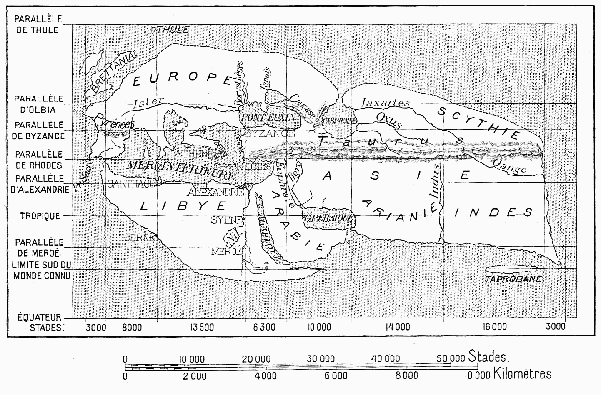

???

Il est connu pour avoir mesuré géométriquement la circonférence de la Terre en comparant les angles des ombres formées par des rayons lumineux du Soleil à deux lieux différents espacés d'une distance connue.

Ératosthène avait remarqué qu'au solstice d'été, le 21 juin, le soleil arrivait directement à la verticale dans un puits de la ville de Syène, située sur le tropique du Cancer : le puits était donc parfaitement éclairé. Or, au même moment, à Alexandrie, un obélisque formait une ombre : le soleil n'était donc pas à la verticale en ce lieu. Il en déduit par un calcul géométrique, la circonférence de la terre.

On lui attribue le terme géographie. Il laissa une carte générale de l'écoumène qui fut longtemps l'unique base de la géographie (cf. reproduction au tableau)

---
## Les cartes existent depuis longtemps
#### Ptolémée (-100) : naviguer, savoir se déplacer..

.center.img85[]
.center.source[Reproduction d'une carte de Ptolémée - Nicolaus Germanus - Source : [Wikimedia Commons](https://commons.wikimedia.org/wiki/File:Claudius_Ptolemy-_The_World.jpg)]

???

C'est un astronome et astrologue grec qui vécut à Alexandrie (Égypte). Il est également l’un des précurseurs de la géographie. Sa vie est mal connue.

---
## Les cartes existent depuis longtemps
#### Les portulans (à partir de 1200)

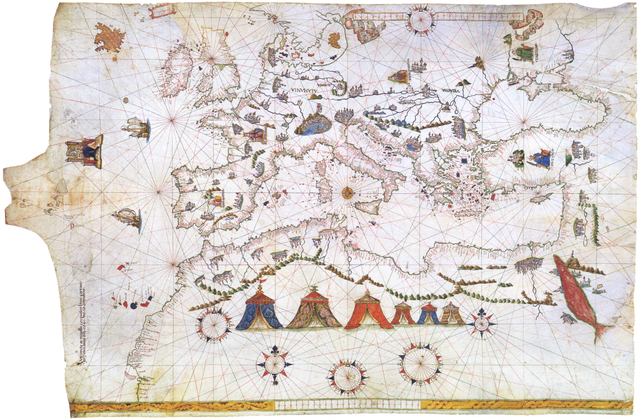

Source: <a href="https://commons.wikimedia.org/wiki/File:Maggiolo_-_Portolankarte_-_1541.png?uselang=fr">Wikimedia Commons</a>

???
Un portulan, ou carte-portulan, (de l'italien portolano, livre d’instructions nautiques) est une sorte de carte de navigation, utilisée du xiiie siècle au xviiie siècle, servant essentiellement à repérer les ports et connaître les dangers qui peuvent les entourer : courants, hauts-fonds...

Les portulans se distinguent par deux caractères graphiques spécifiques : **les lignes de vents** ou de rhumb qui colorent et quadrillent les surfaces marines, **l'alignement perpendiculaire au trait de côte des noms de lieux** (havres et ports colorés différemment selon leur importance). Des roses des vents permettent en outre de repérer la route et de déterminer le cap à suivre.

---
## Les cartes existent depuis longtemps
#### Les cartes de Cassini (1760 - 1815)

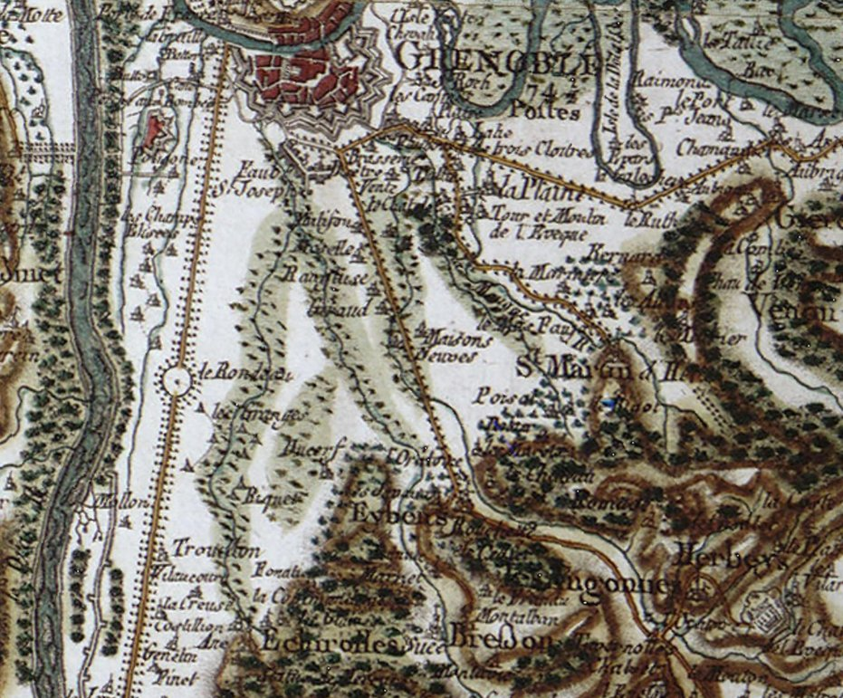

Source: <a href="https://www.geoportail.gouv.fr/carte?c=5.733755266610379,45.16648306236553&z=14&l0=GEOGRAPHICALGRIDSYSTEMS.CASSINI::GEOPORTAIL:OGC:WMTS(1)&permalink=yes">Geoportail</a>

???
La carte de Cassini ou carte de l'Académie est **la première carte topographique et géométrique établie à l'échelle du royaume de France dans son ensemble**. Il serait plus approprié de parler de carte des Cassini, car elle a été dressée par la famille Cassini, principalement César-François Cassini (Cassini III) et son fils Jean-Dominique Cassini (Cassini IV) au xviiie siècle.

Cette carte constitue pour l'époque une véritable innovation et une avancée technique décisive. **Elle est la première carte à s'appuyer sur une triangulation géodésique dont l'établissement a pris plus de soixante ans**. Les quatre générations de Cassini se sont succédé pour réaliser ce travail. La carte ne localise pas précisément les habitations ou les limites des marais et forêts, mais le niveau de précision du réseau routier représenté est tel qu'en superposant des photos satellite orthorectifiées aux feuilles de la carte de la France, on obtient de spectaculaires résultats.

---
## _"La géographie, ça sert, d'abord, à faire la guerre"_ (Y. Lacoste)

.center[

.source[<em>Unlike the 1984 US Geological Survey map of Chicago’s lakefront, the 1982 Soviet map shows individual buildings in the city and structures on Navy Pier.</em>]
  
.source[Source: KENT LEE/EAST VIEW GEOSPATIAL; USGS;   in [WIRED - Inside the Secret World of Russia’s Cold War Mapmakers](https://www.wired.com/2015/07/secret-cold-war-maps/)]
]

---
## Apparition de la visualisation de données

   

**William Playfair** (1786)

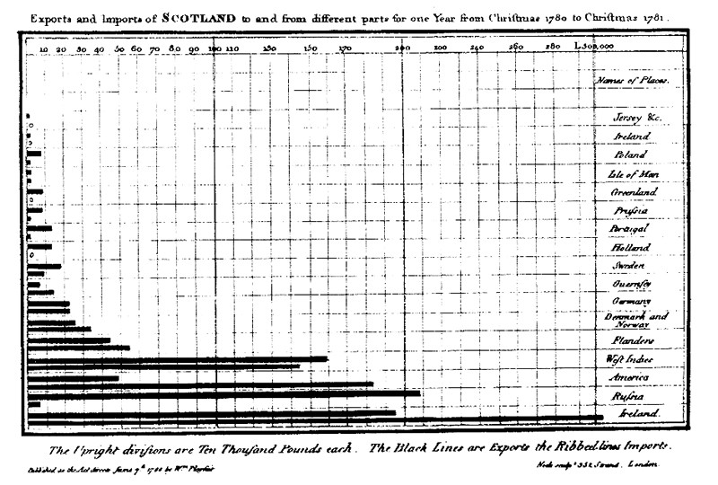
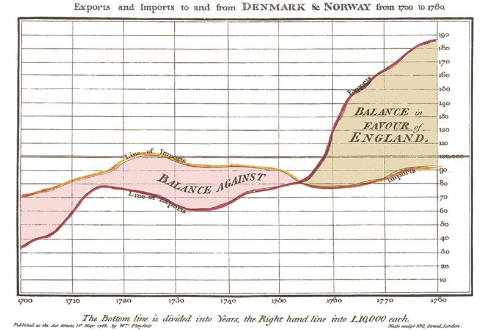

???

En 1786, l’écossais William Playfair invente trois types de conception graphique : la série statistique sous forme de courbes, le graphique à barres et le graphique à secteurs.

---
## Apparition de la visualisation de données

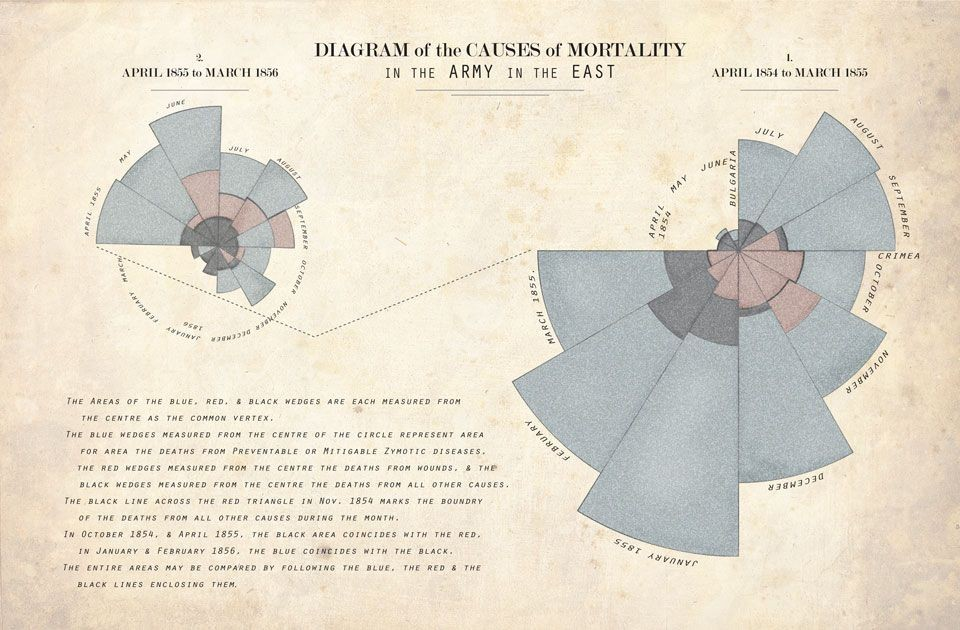

**Florence Nightingale** (1858)

???

En 1858, Florence Nightingale, infirmière britannique, rend compte à la reine Victoria des causes de mortalité de ses soldats engagés en guerre de Crimée, à l'aide de ce graphique.

---
## Apparition des cartes *spéciales* ou *figuratives*

[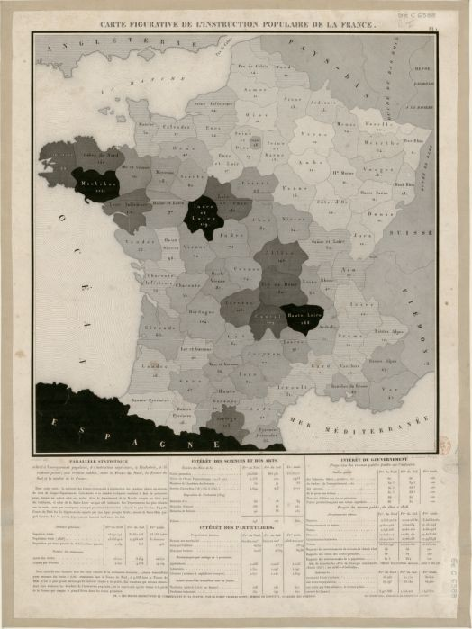]

<strong>Charles Dupin (1826)</strong>

???

En 1826, le français Charles Dupin réalise la première carte thématique (dite carte spéciale ou carte figurative). Elle porte sur l’instruction populaire dans les départements français. En noir, l’obscurantisme, l’ignorance. En blanc, la lumière, le savoir.

---
## Apparition des cartes *spéciales* ou *figuratives*

.center.img75[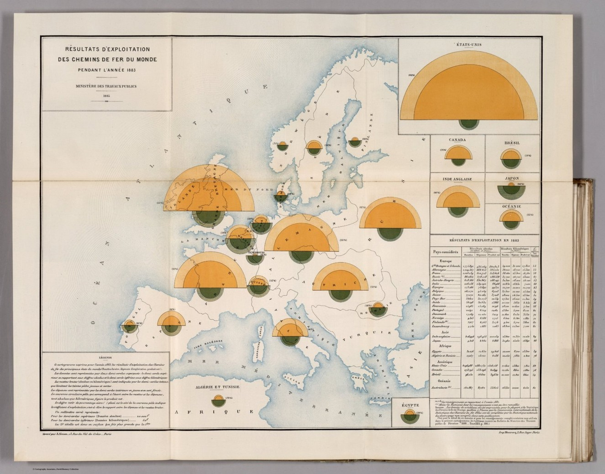]

.center[**Emile Cheysson** (1886)]

???

Emile Cheysson est un ingénieur des ponts et chaussés. Il a produit plusieurs "Albums de statistique graphique" qui sont considérés comme des exemples de visualisation de données.

---

## Essor de la cartographie thématique

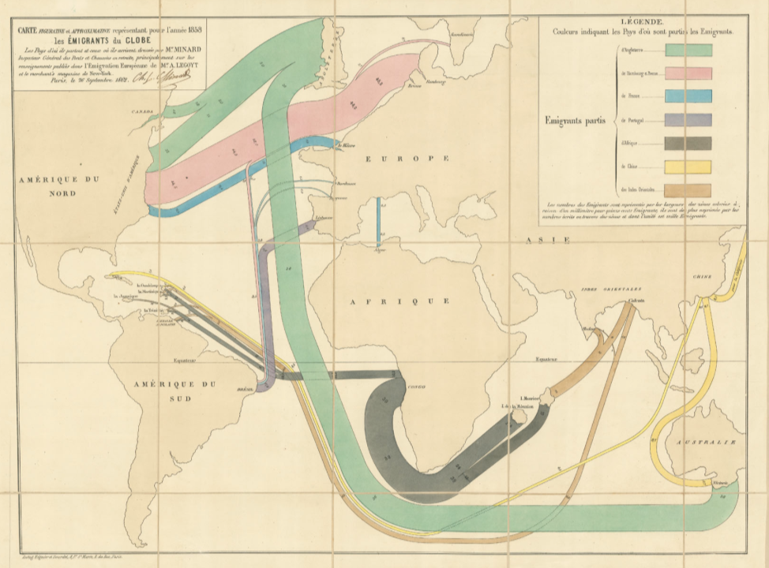

---

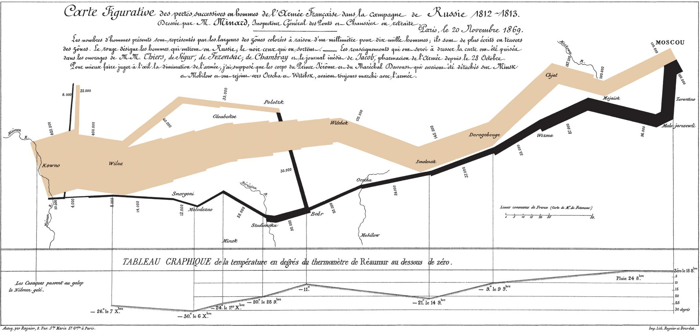

<strong>Charles Joseph Minard (1812)</strong>

???

Minard fait œuvre de pionnier dans l’utilisation des graphiques appliqués au génie civil et aux statistiques. Il atteint la célébrité pour sa Carte figurative des pertes successives en hommes de l'armée française dans la campagne de Russie 1812-1813, une représentation graphique publiée en 1869 relative à la désastreuse campagne de Russie entreprise par Napoléon en 1812. Ce célèbre graphique présente plusieurs variables dans une simple image en deux dimensions :

- localisation et itinéraire de l’armée indiquant les points de séparation et de regroupement des unités ;
- pertes humaines de l’armée (particulièrement sensibles lors de la traversée de la Bérézina) ;
- variations de la température de l’air au cours de la retraite.

---
## Depuis les années 60...

  

→ Développement des SIG dès le milieu des années 60 et essor dans les années 80-90.

→ Application SIG utilisant internet depuis les années 90

→ Changement des pratiques de _cartographie_ avec le Web, les dispositifs mobiles (*smartphones, etc.*), la recrudescence de sources d'informations et de données disponibles, etc.

 

---

.source.small.center[Source: [https://eng.uber.com/keplergl/](https://eng.uber.com/keplergl/)]

???
Lib. developpée par Uber que vous devriez utiliser dans les TP suivants.

Kepler.gl is a data-agnostic, high-performance web-based application for visual exploration of large-scale geolocation data sets. Built on top of Mapbox GL and deck.gl, kepler.gl can render millions of points representing thousands of trips and perform spatial aggregations on the fly.

---

## .center[Cartes topographiques *vs* cartes thématiques]

.left-column-45.align-right.small[
<u>Carte topographique</u>  
Cartes sur lesquelles figurent essentiellement les **résultats des observations directes** : aspect descriptif de la physionomie du terrain, planimétrie et altimétrie, forme, dimensions et identification des éléments concrets, des **objets géographiques fixes et durables existant à la surface du sol, à un moment donné**.
 
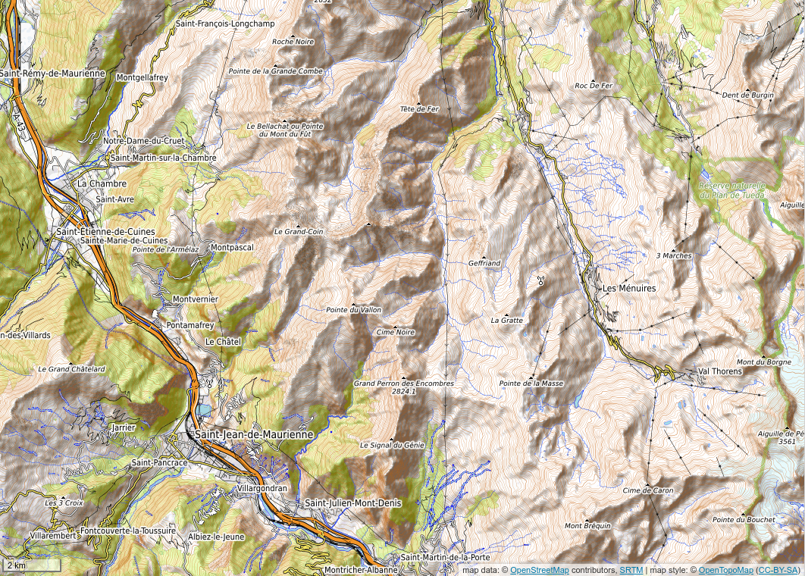
]

.right-column-45.align-left.small[
<u>Carte thématique</u>  
Carte représentant sur un fond repère topographique, hydrographique, chorographique ou géographique, des **phénomènes localisables de toutes natures, qualitatifs ou quantitatifs**.

Leur représentation s’effectue selon les règles de la **sémiologie graphique**.
 
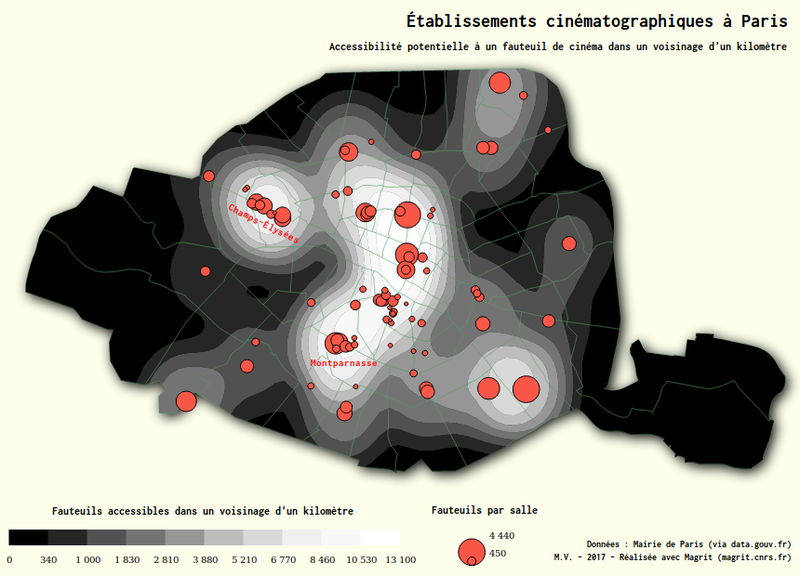
]

---
## À quoi servent les cartes ?

  

.left-column-45[
### .center[Analyser]

* .small[Pourquoi ici plutôt qu'ailleurs ?]

* .small[Pourquoi ici plus qu'ailleurs ?]
]

.right-column-45[
### .center[Communiquer]

* .small[Montrer, démontrer]

* .small[Expliquer, convaincre, ...]
]

---

.center[*"... un point de vue sur le réel"*]

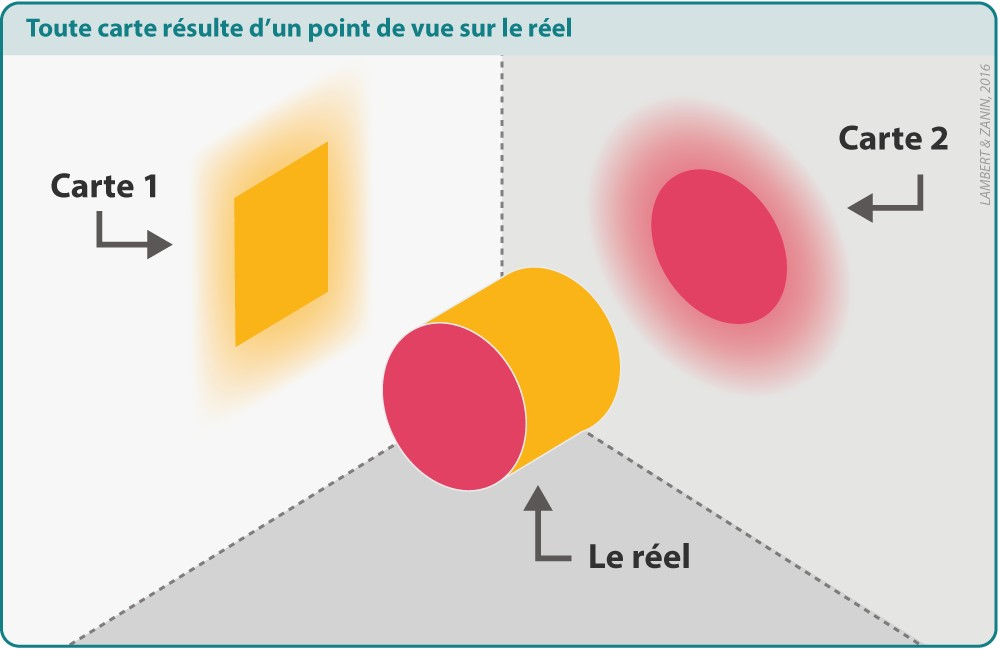

---
## Alors, qu'est-ce que la cartographie ? Définitions...

 

Définition : Une <u><b>carte</b></u> est une image simplifiée et codifiée de l’espace géographique, qui représente ses caractéristiques et/ou son organisation. Elle résulte de l’acte créateur et des choix de son auteur.

 

Définition : La <u><b>cartographie</b></u> est la discipline **artistique**, **scientifique** et **technique**, ayant pour objet la construction de cartes.

 

Définition : Le <u><b>cartographe</b></u> est l’individu qui maîtrise les méthodes, techniques et concepts de mise en image de l’information géographique.

 

.source[Lambert N. et Zanin C., Manuel de cartographie, Armand Colin, 2016]

---

### Discipline artistique, scientifique et technique ?

 

- _artistique_ → Ésthétique, recherche graphique

 

- _scientifique_ → Rigueur, de la recherche, de la théorie, mobilisation d'un savoir géographique

 

- _technique_  → Savoir-faire opérationel pointu : acquisition et traitement des données, outils informatiques

 

.center[**→ Une multitude de façon d'être cartographe**]

     

???

Parler cartographie reproductible / dev. web pour cartographie / cartographie d'édition

---
class: section-change

# Partie 2

# Les composantes de l'information géographique

---
## Les composantes de l'info. géo.

  

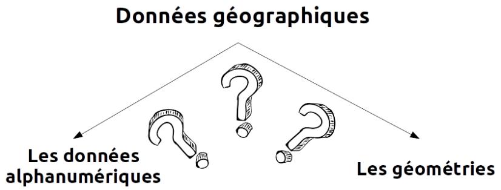

???

Ou données attributaires ...

---

### Les géométries

 

Elles définissent la **forme** et la **localisation** de l'objet à cartographier sur la surface terrestre.

Les positions des géométries sont toujours exprimées en **latitude / longitude** ou en **coordonnées cartographiques** _(i.e. dans un système de coordonnées de référence)_.

On parle aussi de **fond de carte géoréférencé.**

.img35.center[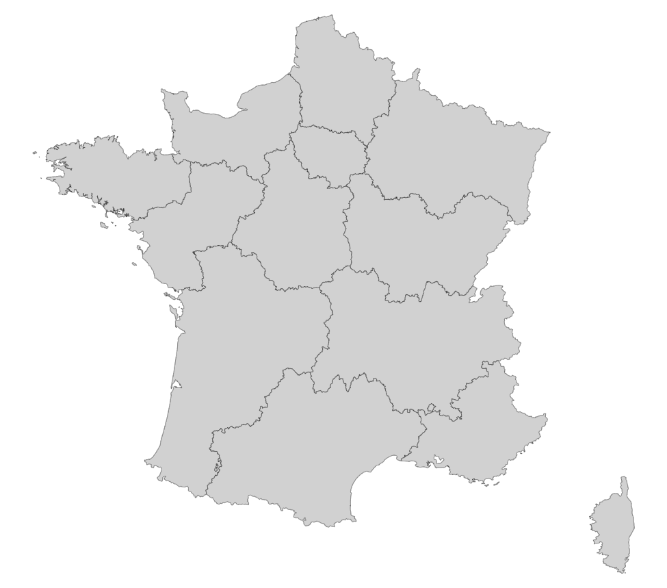]

---

### Les géométries

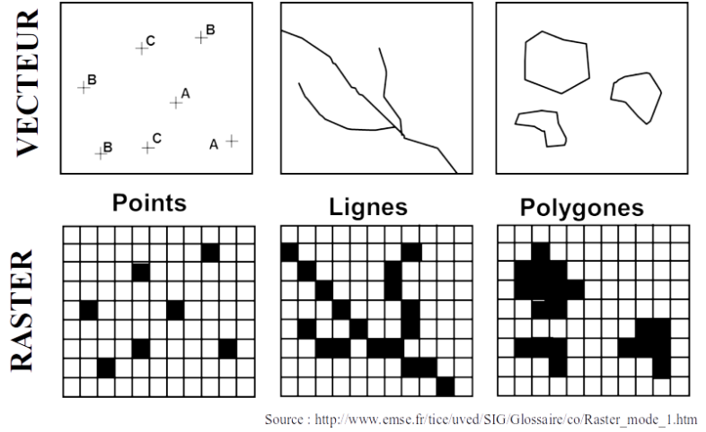

---
### Les géométries vectorielles

  

- Des points géoréférencés

- Un ensemble de points pouvant constituer des lignes ou des surfaces

- Ne pixellise jamais, chaque objet a un identifiant unique

 

.center[**→ C'est ce type de géométrie que nous allons mobiliser pour faire de la cartographie thémtique dans ce TP**]

---
### Les géométries : formats de données

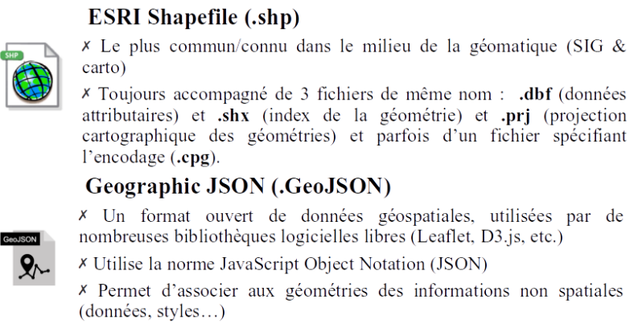

---
### Les géométries : formats de données

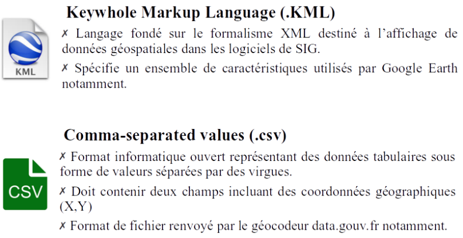

---
### Les géométries : fond de carte

Le fond de carte est le contenant de l’information spatiale à représenter. Il contient l’ensemble des géométries utiles pour le projet cartographique.

Pour être efficace et adaptée au projet cartographique, la recherche d’un “bon” fond de carte doit considérer a minima trois éléments d’importance :
- **L’espace d’étude**
- **Le/les objets géographiques qu’il contient**
- **Le niveau de détail des géométries _(généralisation cartographique)_.**

---
### Les données (attributaires / alpha-numériques)

 

**Les données alphanumériques contiennent des informations, numériques ou toponymiques, que l'on rattache aux objets géographiques.**

---
### Les données (attributaires / alpha-numériques)

Par example dans les fonds de cartes de référence IGN :

- Identifiant géographique
- Nom des communes
- Statut de la commune
- Superficie
- Population

.center[
**... il va être nécessaire de les enrichir**

**Comment collecter ces données ? Comment les organiser pour un projet cartographique ?**
]

---
###  Les données (attributaires / alpha-numériques)

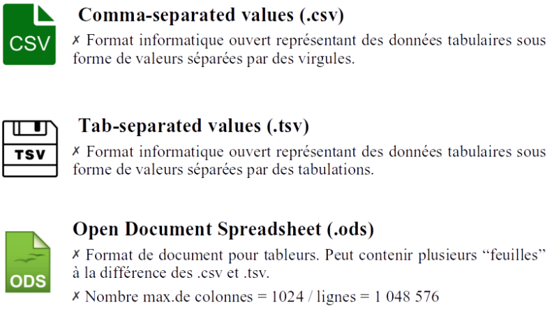

---
###  Les données (attributaires / alpha-numériques)

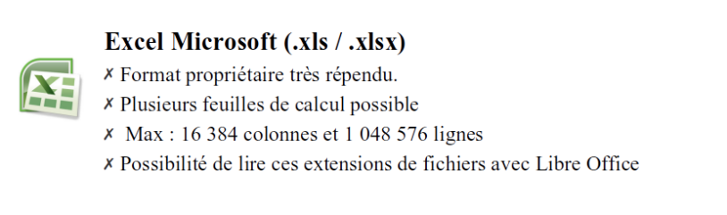
---

### Les données (attributaires / alpha-numériques)

 

**Exemples de sources de données pour cartographie statistique:**

- France : INSEE, [data.gouv.fr](https://data.gouv.fr)

 

- Open data à échelle plus locale ([http://data.metropolegrenoble.fr/](http://data.metropolegrenoble.fr/), [https://opendata.cityofnewyork.us/data/](https://opendata.cityofnewyork.us/data/), etc.)

 

- Sites institutionnels correspondant aux échelles d'études : EuroStat pour l'Europe, Banque Mondiale pour le Monde, etc.

---
### Joindre les données et les géométries

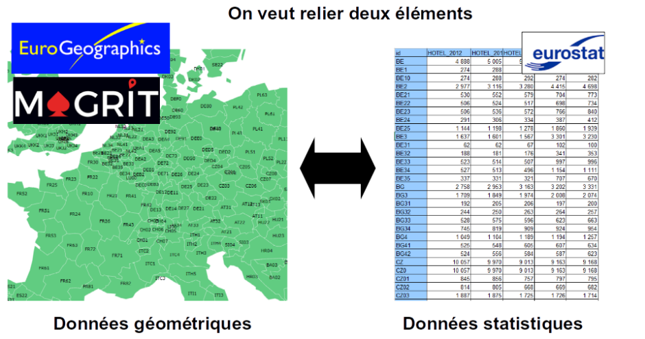

---
### Joindre les données et les géométries

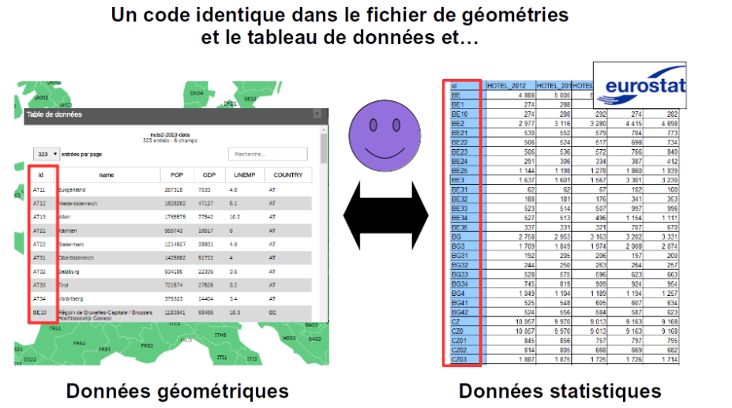

---
### Joindre les données et les géométries

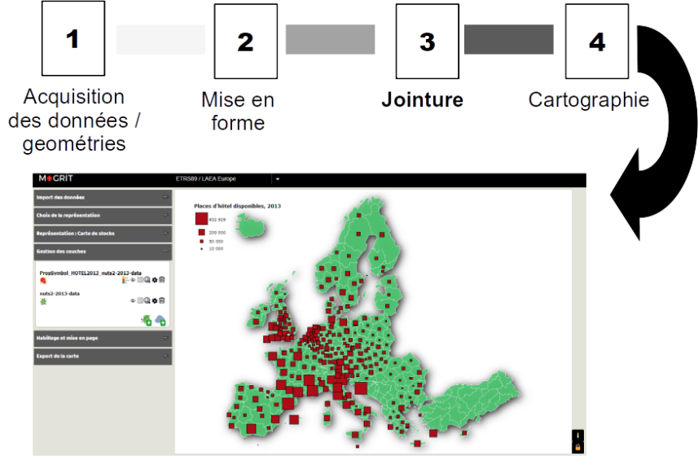

---
class: section-change

# Partie 3

# Les principes de la sémiologie graphique

---

### Jacques Bertin et la sémiologie graphique

La **sémiologie graphique** est, de façon générale, l'**ensemble des règles** qui régissent la construction d'un **système de signes** ou **langage** permettant la traduction graphique d'une information.

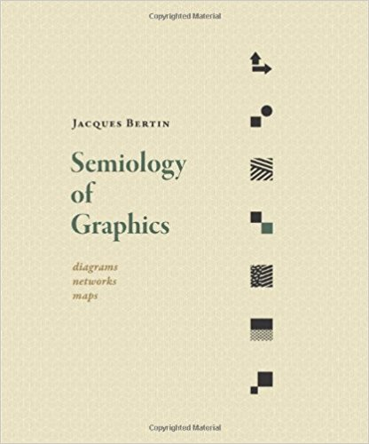

Depuis la parution de *la Sémiologie graphique* de Jacques Bertin en 1967, elle désigne surtout un ensemble standardisé des règles et de pratiques inhérentes à la représentation cartographique au-delà des travaux réalisés par J. Bertin.

---
### Une approche pragmatique

  

Les **variables visuelles** (ou variables retiniennes) sont les moyens graphiques pour retranscrire visuellement une information.

 

*__"La graphique utilise les propriétés de l'image visuelle pour faire apparaître les relations de différence, d'ordre et de proportionnalité entre les données”__*
(Jacques BERTIN)

.center[_**→ simplifier la vie du lecteur de cartes**_]

---
### Une approche pragmatique

 

“La graphique utilise les propriétés de l'image visuelle pour faire apparaitre les relations de **différence**, d'ordre et de proportionnalité entre les données”
(Jacques BERTIN)

 

.center[
**Données qualitatives**

**(CATEGORIES)**

**A, B, C, D, F, Z**
]

---
### Une approche pragmatique

 

“La graphique utilise les propriétés de l'image visuelle pour faire apparaitre les relations de **différence**, d'ordre et de proportionnalité entre les données”
(Jacques BERTIN)

 

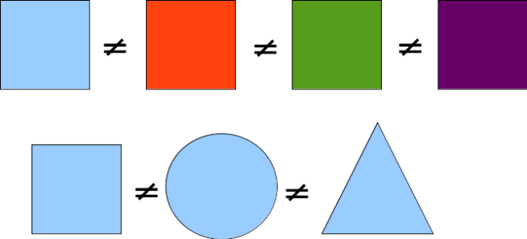

???

Attitude perceptive : Différenciation / Association

Variable visuelle : Couleur, Forme

---
### Une approche pragmatique

 

“La graphique utilise les propriétés de l'image visuelle pour faire apparaitre les relations de différence, d'**ordre** et de proportionnalité entre les données”
(Jacques BERTIN)

 

.center[
**Données quantitatives relatives**

**(RATIOS)**

**1, 2, 34, 56.3, 17, 125.1**
]

---
### Une approche pragmatique

 

“La graphique utilise les propriétés de l'image visuelle pour faire apparaitre les relations de différence, d'**ordre** et de proportionnalité entre les données”
(Jacques BERTIN)

 

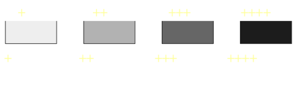

???

Attitude perceptive : Hiérarchisation relative

Variable visuelle : Valeur

---
### Une approche pragmatique

 

“La graphique utilise les propriétés de l'image visuelle pour faire apparaitre les relations de différence, d'ordre et de **proportionnalité** entre les données”
(Jacques BERTIN)

 

.center[
**Données quantitatives absolues**

**(STOCKS)**

**1, 2, 34, 56, 17, 125**
]

---
### Une approche pragmatique

 

“La graphique utilise les propriétés de l'image visuelle pour faire apparaitre les relations de différence, d'ordre et de **proportionnalité** entre les données”
(Jacques BERTIN)

 

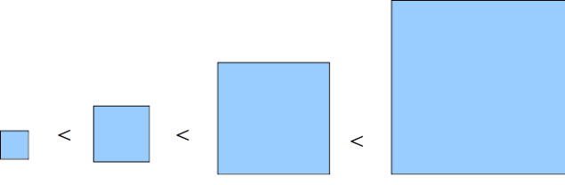

???

Attitude perceptive : Hiérarchisation absolue

Variable visuelle : Taille

---

   

## .center[Comment se matérialisent les variables visuelles selon l'implantation ?]

---

### La VALEUR

### La VALEUR (associée à la couleur)

???

Utilisée pour des relations d'ordre ...

---
### La TAILLE

### Mais aussi la hauteur ou le volume...

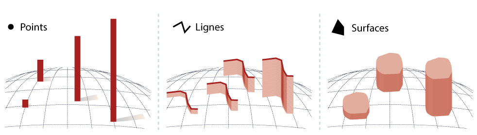

???

Utilisée pour des relations de proportionnalité

---

### La FORME

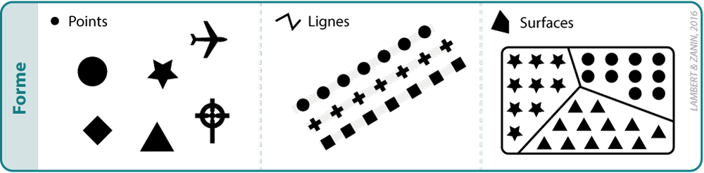

### La COULEUR

???

Utilisée pour des relations d'association / différenciation

---

### La TEXTURE/STRUCTURE

### Le GRAIN

???

Utilisée pour des relations d'association / différenciation

---
### L'ORIENTATION

 

.center[
**→ En tout, 7 variables visuelles (_forme_, _taille_, _couleur_, _valeur_, _grain_, _texture_, et _orientation_)**

*Note : certains auteurs en ajoutent parfois d’autres (opacité, variables visuelles animées, etc.)*
]

---
### Les propriétés des variables visuelles

.img50.center[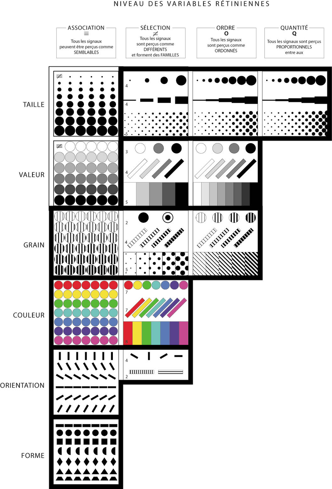]

Source: Bertin J. (1967, p. 96)

---
### Les propriétés des variables visuelles

.center[→ Les choix des variables visuelles dépend du type d’objet géographique (point, ligne, surface) et de la nature des données (stock, ratio, catégorie).]

---
### Le langage cartographique

  

.center[
La compréhension de l'image cartographique repose sur des **règles de construction de la symbolique** : la **sémiologie**.

  

**⚠ C'est le respect de ces règles qui permet de transmettre de manière <u>correcte</u> et <u>accessible</u> l'information à un lecteur	⚠**
]

???

Nécessaire d’être à même d'expliquer les choix opérés (discrétisation, variable visuelle employée etc.)

---
### Le langage cartographique

 

.center[Une bonne représentation cartographique concilie ainsi **rigueur scientifique** et **efficacité visuelle** !]

  

* **Implantation de l'information** .small[*(ponctuelle, linéaire, surfacique)*]

 

* **Nature de l'information** .small[*(différentiel, ordonné, qualitatif)*]

 

* **Variables visuelles** .small[*(forme, taille, valeur, grain, couleur, orientation)*]

---

#### Exprimer des catégories .right[➡ COULEUR]

.center.img70[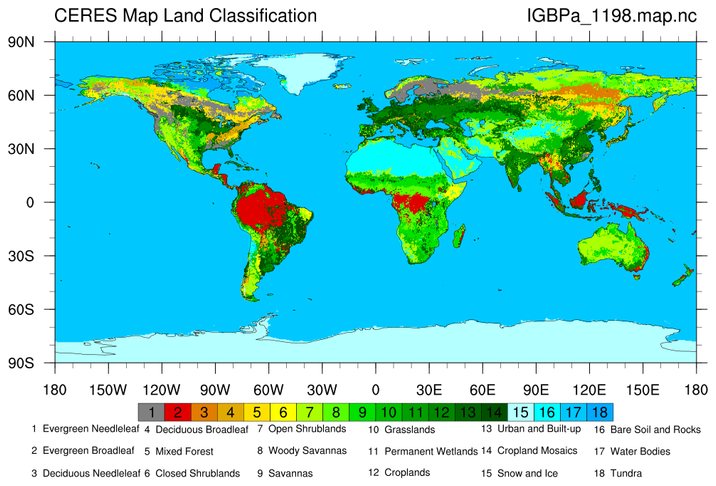]

.center.source[Source: [https://www.ncl.ucar.edu/Applications/classification.shtml](https://www.ncl.ucar.edu/Applications/classification.shtml)]

???
On utilise des variables de différenciation !

---

#### Exprimer des catégories .right[➡ FORME]

.center.img70[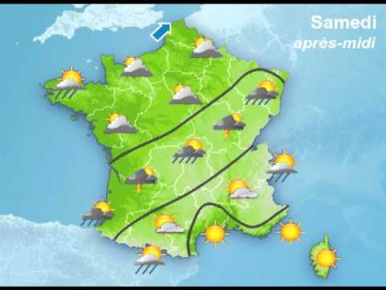]

---

#### Exprimer des quantités .right[➡ TAILLE]

.img70.center[]

???
On utilise des variables de proportionnalité !

---

#### Exprimer des quantités .right[➡ TAILLE]

.img75.center[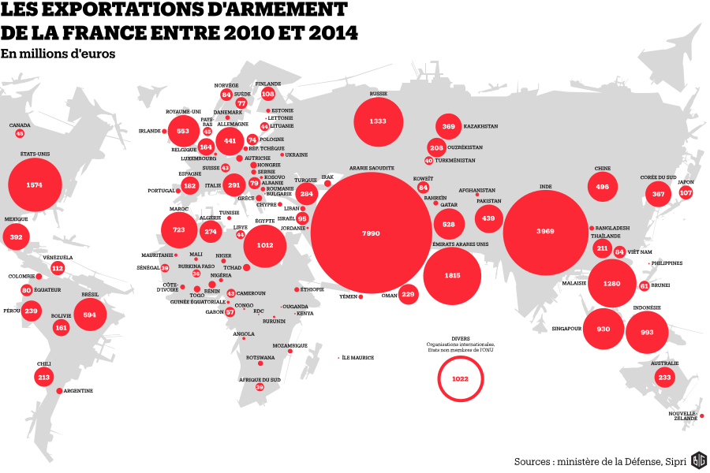]

---

#### Exprimer des quantités .right[➡ TAILLE]

.img75.center[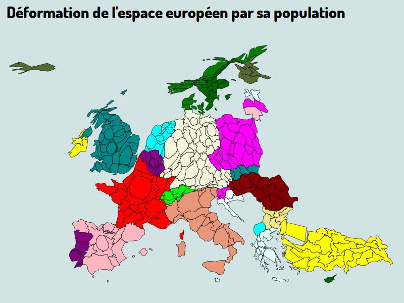]

---

#### Exprimer des quantités .right[➡ TAILLE]

.img80.center[]

---

#### Exprimer l'ordre .right[➡ VALEUR]

.img75.center[]

???
On utilise des variables d'ordre !

---

#### Exprimer l'ordre .right[➡ VALEUR ET COULEUR]

.img75.center[]

---
### Exprimer l'ordre....en discrétisant les valeurs

.img75.center[]

---

### Discrétisation

.center[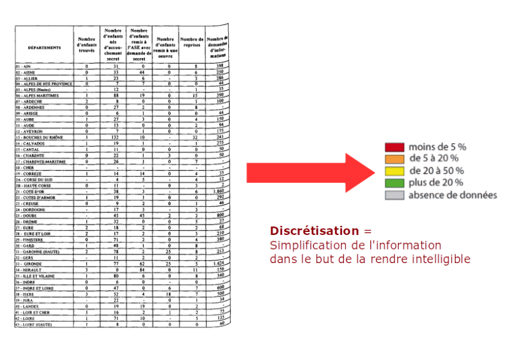]

---

### Discrétisation

**➡ Dessiner un histogramme permet de caractériser la distribution des données à représenter**

*➡ Voir notamment [http://mappemonde.mgm.fr/119geov1/](http://mappemonde.mgm.fr/119geov1/) pour l'importance du choix d'une discrétisation adaptée en cartographie.*

.left-column[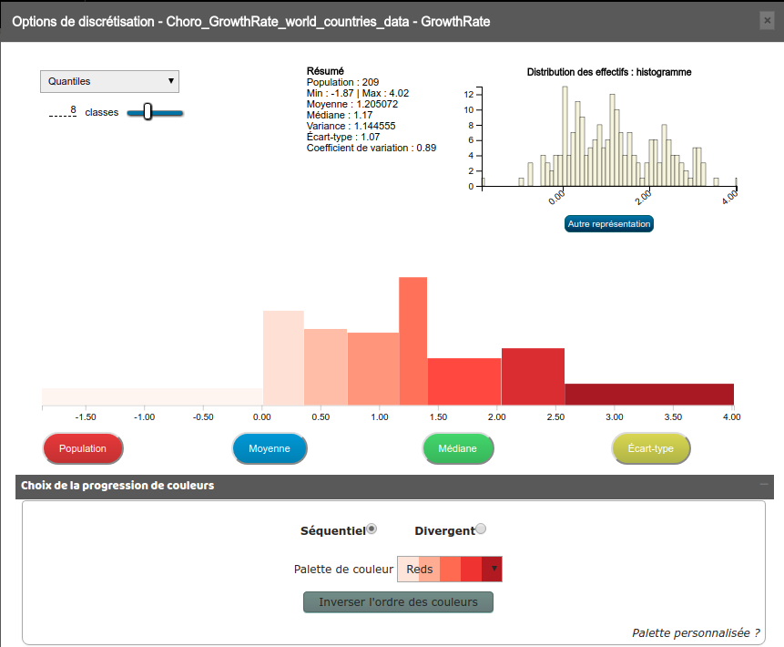]

.right-column[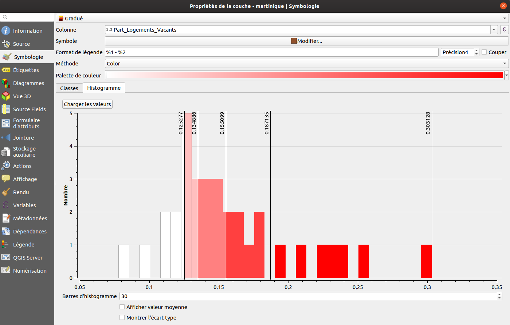]

.img50.center[]

---
### Discrétisation

 

**Transformer une série continue de valeurs en une série discrète, c'est à dire en un nombre fini de classes.**

**Le nombre de classes ainsi que les valeurs limites de ces classes doivent être justifiées sémantiquement et/ou statistiquement.**

**Les méthodes proposées par l'outil (QGIS, Magrit, R, ...) peuvent être utilisées telles quelles ou bien comme des guides de lecture et d'analyse préalables à la saisie manuelle des limites de classes souhaitées.**

_Intervalles égaux, Quantiles, Q6, Seuils naturels (algorithme de Jenks), Moyenne et écart-type ou saisies manuelles des limites de classes..._

.center[*Voir :* [http://magrit.cnrs.fr/docs/discretisation_fr.html](http://magrit.cnrs.fr/docs/discretisation_fr.html)]

---

### Combiner plusieurs variables / représentations...

.img80.center[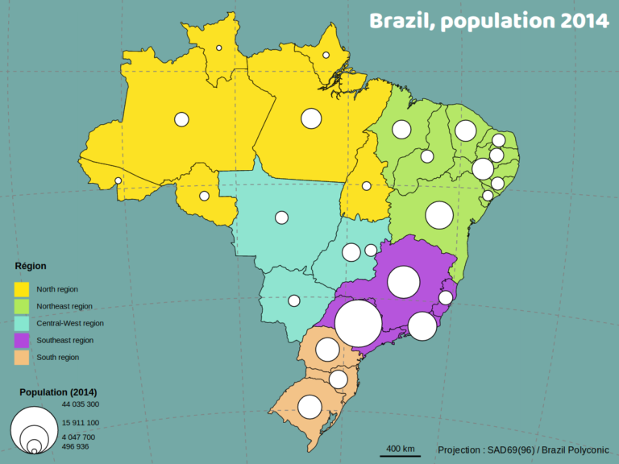]

---

### Combiner plusieurs variables / représentations...

.img80.center[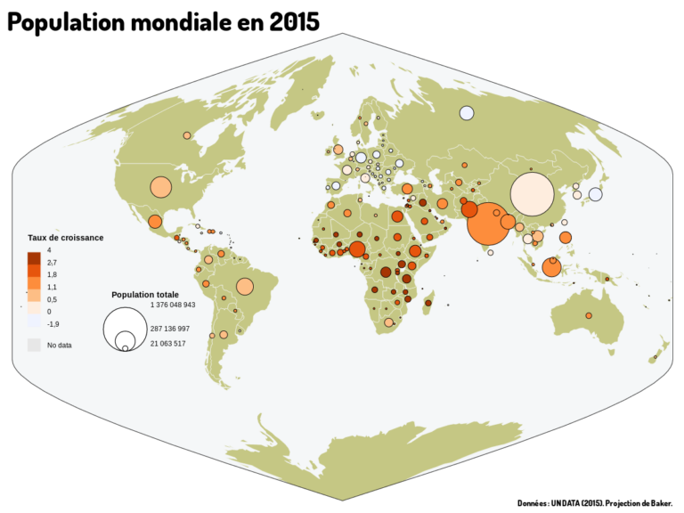]

---
### Combiner plusieurs variables / représentations...

.center.img60[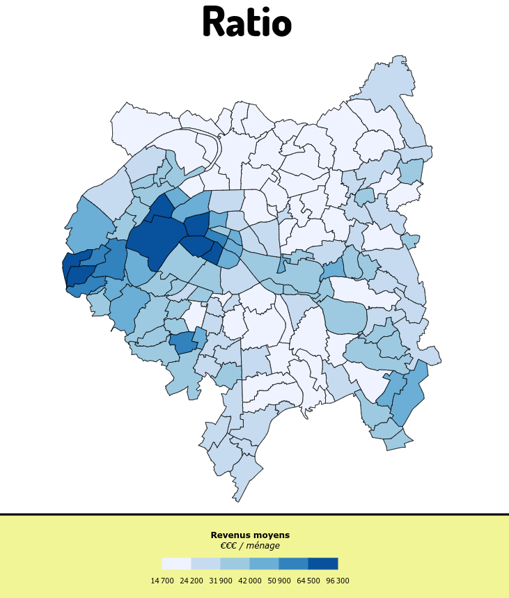]

---
### Combiner plusieurs variables / représentations...

.center.img60[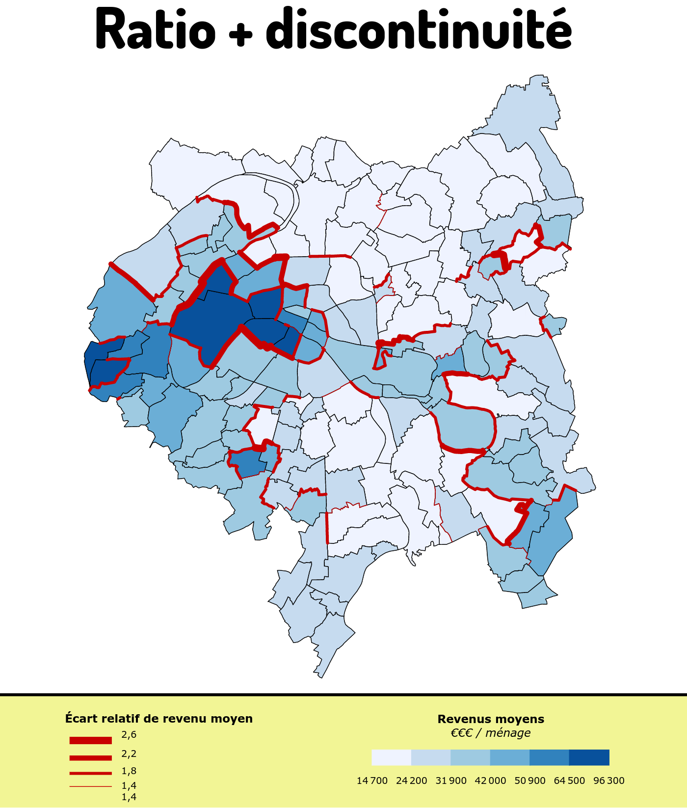]

???

Les cartes de discontinuités mettent en avant les limites (ou "frontières") entre les entités étudiées, en leur affectant une épaisseur relative au différentiel de valeur existant entre elles.

Deux méthodes permettent de calculer ce différentiel, on parlera ainsi soit de **discontinuité absolue** (écart absolu entre les valeurs de la variable étudiée c'est à dire max(A,B) - min(A,B)) ou de discontinuité relative (rapport max(A,B) / min(A,B)). La visualisation de lignes de discontinuités permet de mettre en exergue les ruptures spatiales des phénomènes socio-économiques étudiés, qui selon la formule de Brunet et Dolphus (1990) montre que « l’espace géographique est fondamentalement discontinu ».

Cette représentation est particulièrement pertinente lorsqu'elle peut être combinée à une représentation par aplats de couleurs (Cf. cartes de ratio).

---
### Combiner plusieurs variables / représentations...

---
class: section-change

# Partie 4

# Mise en scène cartographique

---
### _Mettre en scène une carte_
Le contenuLe contenu
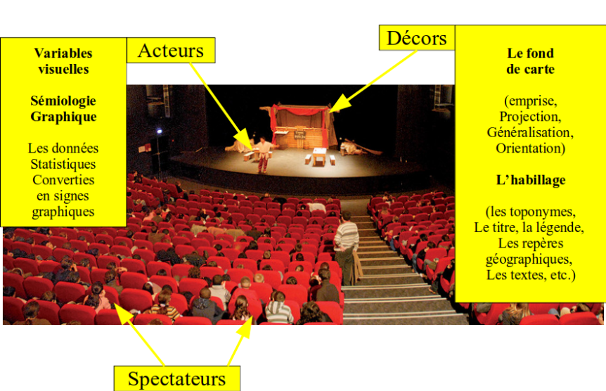

D'après Philippe Rekacewicz, 2014

---
### Le fond de carte : les projections

   

**Peuvent déformer les formes, les surfaces, les angles ..**

  

*La question se pose moins lors d'un travail de carto à l'échelle locale...*

---
### Le fond de carte : les projections

.img85.center[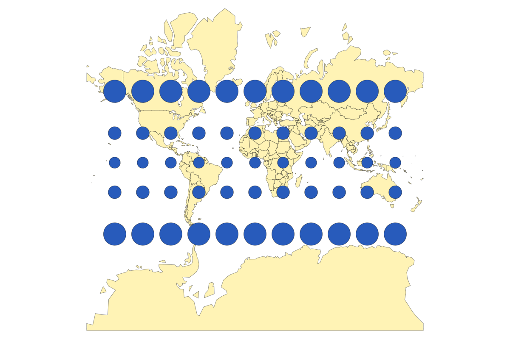]

.center[**Projection Mercator** *(projection utilisée par défaut pour le Web-mapping)*]

---
### Le fond de carte : les projections

.img85.center[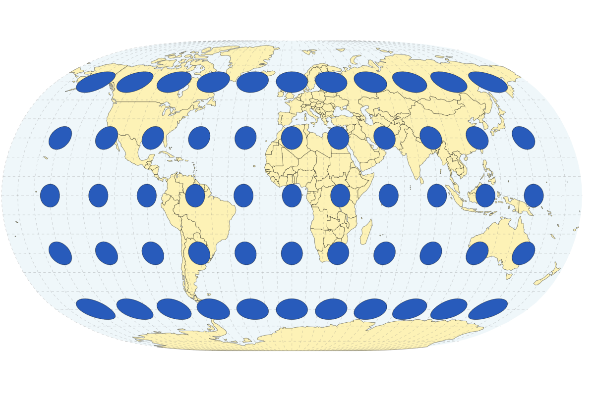]

.center[**Projection Natural Earth 2** *(une des projections qui tente de minimiser les déformations)*]

---
### Le fond de carte : les projections

.img85.center[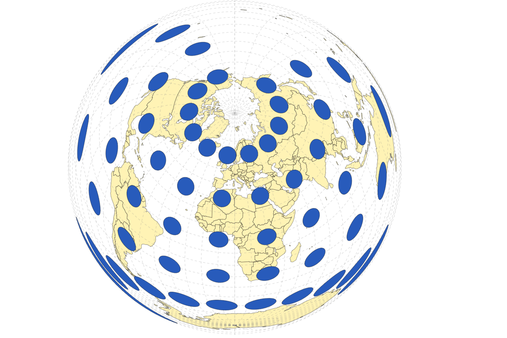]

---
### Le fond de carte : les projections

.img85.center[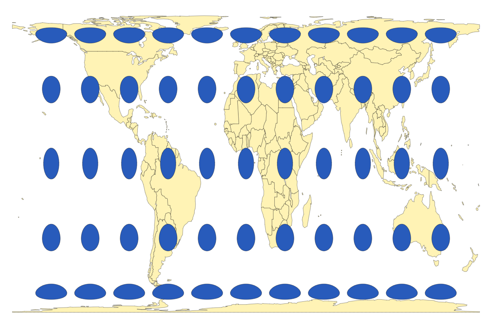]

.center[**Projection Gall-Peters** *(parfois utilisée pour ses propriétés "égalitaires")*]

???

La projection de Peters est une projection équivalente (qui conserve les aires) qui maintient la proportion entre les surfaces sur la carte et les surfaces réelles. Ainsi, les rapports entre les surfaces des pays sur la carte correspondent au rapport de leurs surfaces réelles (l'Afrique apparaît bien 14 à 15 fois plus grande que le Groenland). Mais, localement, cette projection ne conserve pas les angles, ce qui se traduit par la déformation des continents au contraire de la carte de Mercator.

---
### Le fond de carte : les projections

.center[]

---
### Le fond de carte : les projections

.center[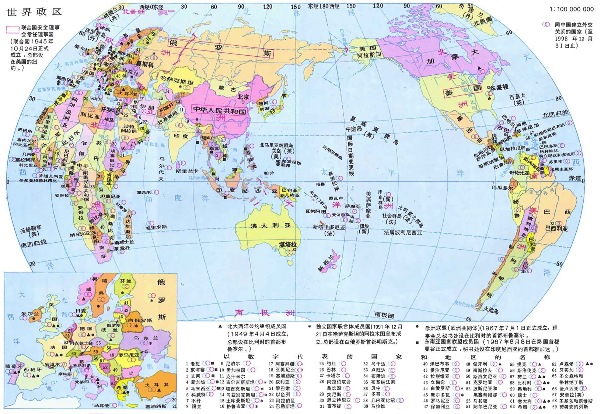]

---
### Le fond de carte : les projections

.center[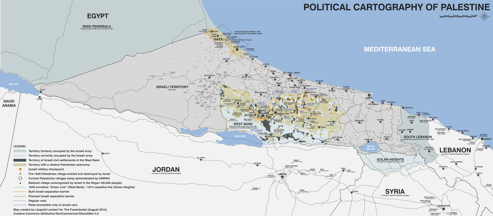]

---
### Le fond de carte : l'emprise spatiale

.center[]

---
### Le fond de carte : l'emprise spatiale

.center[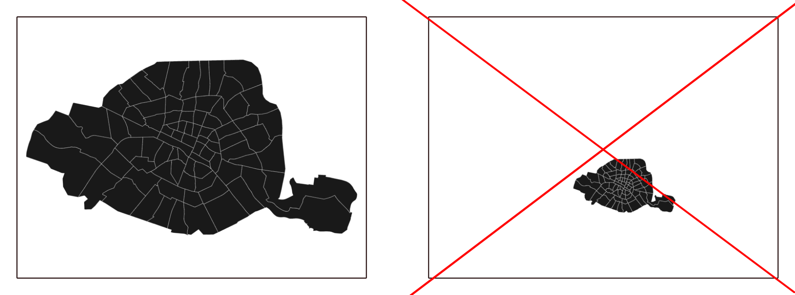]

.center[**→ _maximiser la taille de la carte et minimiser les blancs_**]

---
### Le fond de carte : l'emprise spatiale


---
### Le fond de carte : l'emprise spatiale


---
### Le fond de carte : l'emprise spatiale


---
### Le fond de carte : l'emprise spatiale


---
### Le fond de carte : l'emprise spatiale


---
### La mise en page et les éléments d'habillage

 


---
### La mise en page et les éléments d'habillage

  

Une carte se doit de comporter :

- Titre précis *(voir problématisé)*

- Légende précise et organisée

- Échelle graphique

- Orientation

- Sources des données

- Auteur et date de réalisation

---

### Le titre

 

→ C'est l'**identifiant premier du sujet de la carte**. 
Il est le plus souvent disposé en haut, sert d'entrée à la lecture du document, et assure son identification externe. 

→ **_Il peut être bref, net, technique, polémique ou séducteur, mais toujours clair_**

→ _Caractères suffisamment grands et épais mais pas disproportionnés par rapport à la carte._

---

### Le titre

.img65[]

<strong>Quel est le titre de cette carte ?</strong>

---

### Le titre

.img65[]

<strong>Les Roms, peuple européen</strong>  <em class="small">(source: Le monde diplomatique)</em>

---

### La légende

→ **La légende explique l’ensemble des modes de représentation utilisés sur la carte**.

→ C’est à la fois le **dictionnaire** et l’**index des symboles graphiques**, une aide pour la lecture et l’analyse du message présenté.

→ Elle sert à l’**identification interne du message cartographique**.

.withborder.center.img50[]

---

### La légende

.withborder.center[


]

---

### La légende

.center.img75[]

---

### La légende

.center.img75[]

---

### La légende

.center.img75[]

*__Les légendes aussi ont un titre__ :  il décrit précisément les indicateurs cartographiés.*

???

... et on évitera surtout l'écueil d'utiliser "Légende" comme titre de la légende !!

De la même manière qu'il ne faut pas utiliser "titre" comme titre de la carte :)

---

### L'échelle

.center.img85[]

.source.center[Source : [https://magrit.hypotheses.org/galerie](https://magrit.hypotheses.org/galerie) Auteur : Ronan YSEBAERT]

---
### Les sources, dates, notes

.center.img75[]

---
### L'orientation / la présence d'un graticule

.center.img45[]

.center.img45[]

---
### L'orientation / la présence d'un graticule

.center.img45[]

---
### Hiérarchisation de l'information

 


---
### Hiérarchisation de l'information

 

#### _"Mentir honnêtement ?"_

  

- .bb[Grossir] les éléments importants

- .small[Dissimuler] les éléments inutiles

???

« Une bonne carte énonce une multitude de petits mensonges. Elle déforme la vérité pour aider l'utilisateur à voir ce qu'il a besoin de voir » cf. Monmonnier

---
### De la carte à l'infographie...

.img75.center[]

.source.center[Source : [https://magrit.hypotheses.org/galerie](https://magrit.hypotheses.org/galerie)]

---

.source.center[Source : [https://twitter.com/E_Sigat/status/1200341526360023040](https://twitter.com/E_Sigat/status/1200341526360023040)]

---

.source.center[Source : [https://twitter.com/E_Sigat/status/1200341750562381824](https://twitter.com/E_Sigat/status/1200341750562381824)]

---

.source.center[Source : [https://twitter.com/E_Sigat/status/1205511500745584640](https://twitter.com/E_Sigat/status/1205511500745584640)]

---

   


.source.center[Source : [https://neocarto.github.io/ironcurtain/](https://neocarto.github.io/ironcurtain/)]

---
### De la carte à l'infographie...

 

- **Avoir les bons outils** (dessin vectoriel, etc.)

 

- **Soigner l'esthétique** (police d'écriture, emplacement des éléments, contours, bordures de l'image, etc.) **sans renoncer à la rigueur scientifique**

 

- **Problématiser la carte**

 

- **Donner des clés de lecture**

---
## Références (1)

- **Manuel de cartographie - Principes, méthodes, applications**. LAMBERT N., ZANIN C. (2016)

- **La représentation des données géographique - Statitique et cartographie**. 4ème édition. BÉGUIN M., PUMAIN D. (2017)

- **Cartography visualization of spatial data**. 3rd edition. KRAAK M.J., ORMELING F. (2011)

  

---
## Références (2)

- **Mad maps - l'atlas qui va changer votre vision du monde**. LAMBERT N., ZANIN C. (2019)

- **How to Lie with Maps**. 3rd edition. MONMONIER M. (2018)

- **[https://neocarto.hypotheses.org/](https://neocarto.hypotheses.org/)** - Carnet de recherche sur la cartographie, animé par N. LAMBERT et F. BAHOKEN
  

.center[ ]
---
class: section-change

# Synthèse !

---
class: section-change


---
class: section-change


---
class: section-change


---
class: section-change


---
class: section-change


---
class: section-change


---
class: section-change, white-color

### .center[6/6 Réflexion]

 

La carte est-elle efficace ?

 

Comment l'améliorer ?

---

## Quelques exemples à ne pas reproduire... (1)

.center.img95[]

---

## Quelques exemples à ne pas reproduire... (2)

.center.img95[]

---

## Quelques exemples à ne pas reproduire... (3)

.center.img95[]

---
class: section-change

# À vous de jouer !

# 🚀

  
