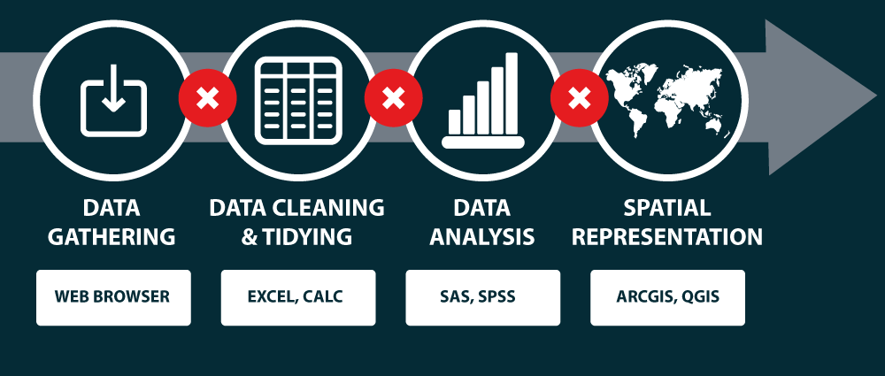

class: section-change

# Séance 3

<br>

## Mise en pratique avec R

<br><br><br><br><br>

---

## But du TP

<br><br>

- **Réaliser des cartes thématiques avec R**

- **Maitriser l'ensemble de la chaine de traitement**, de la récupération des données à l'export cartographique dans un seul environnement

- **S'inscrire dans une démarche de recherche reproductible**

---

## La recherche reproductible

<br>

- Les sciences se reposent sur le principe de reproductibilité

- La [reproductibilité](https://en.wikipedia.org/wiki/Reproducibility#Reproducible_research) est un élément permettant d'évaluer la validité des résultats

.center.img60[]

.center.source.small[Source : INRAE]

???

Les recherches empiriques en sciences humaines et sociales nécessitent la manipulation de nombreuses données, de multiples programmes pour leur gestion, leur analyse statistique, les estimations économétriques, les simulations…

Cette rigueur débouche sur une recherche reproductible, qui assure que l’ensemble des traitements et analyses réalisés depuis les données brutes jusqu’à la publication finale sont traçables et reproductibles. Elle amène une transparence dans les recherches, assurant fiabilité et confiance dans les résultats publiés.

Les cartes, comme les autres productions graphiques ou statistiques sont des éléments à parts entières des études scientifiques.


---

## La recherche reproductible

<br>

Plusieurs principes :

- **organisation des étapes du projet et leur documentation**

- **écriture de programmes compréhensibles**

- **nécessité de l’automatisation des étapes au sein des recherches**

.source.center.small[Source : INRAE]


.center.img85[]
.source.center.small[Source : Peng (2011)]

???


Le premier principe porte sur **l’organisation des étapes du projet et leur documentation**. Des outils peuvent aider les chercheurs à avoir une organisation plus structurée de la documentation des différentes tâches d’un projet. Des pratiques assez simples sont proposées pour organiser les dossiers et suivre les flux de travail, comme le partage des fichiers, la gestion des versions et l’écriture collaborative.

Le deuxième principe concerne **l’écriture de programmes compréhensibles**. Il faut veiller à ce que les codes écrits puissent être lus par d’autres ou retravaillés ultérieurement. Pour ce faire, il est intéressant d’adopter des conventions de mise en forme et de dénomination des variables. Le code doit être modularisé pour être clair, lisible et réutilisable.

Le troisième principe porte sur **la nécessité de l’automatisation des étapes au sein des recherches**. Et ce, afin d’éviter tout traitement manuel et de réduire les erreurs. Cela permet également d’augmenter la reproductibilité des résultats depuis les données originelles.


---

## La recherche reproductible - cartographie

<br><br>

Pourquoi ?

- Garder une trace des traitements effectués
- Partager ses méthodes
- Être transparent, s’exposer à la critique
- Faciliter les mises à jour
- Travailler collectivement
- Automatiser des taches
- Lier fortement l’analyse et la représentation

.source[D'après Timothée Giraud (2019)]

---

## La recherche reproductible - cartographie

<br>

Une reproductibilité rendue difficile ...

<br>

.center.img90[]

.center.source[Source : Timothée Giraud (2019)]

---

## La recherche reproductible - cartographie

<br><br>

.center.img90[]

.center.source[Source : Giraud et Lambert (2017)]
---

## La recherche reproductible - cartographie

<br>

Des solutions existent pour simplifier les chaines de traitements et couvrir les différentes étapes ...

<br>

.center.img90[]


.center.source[Source : Timothée Giraud (2019)]

---

## Le langage R

<br>

.center.img35[]

<br>

- un **langage** et un **environnement** permettant de réaliser des **traitements statistiques** et des **représentations graphiques**

- un **logiciel libre** (sous license GNU General Public License)

- **multiplateforme** (GNU/Linux, Windows, OS X, etc.)

---

## Les outils disponibles en R

<br><br>

- Un large écosystème de *packages*

- RStudio, un puissant IDE (environnement de développement intégré)

- Une solution de [*literate programming*](https://en.wikipedia.org/wiki/Literate_programming) basée sur le langage de balise `Markdown`

---

## Les outils disponibles en R pour le spatial

<br><br>

- `sf` : manipulation d'entité (*Simple Features*) avec des géométries vectorielles

- `osmdata` : récupération de données OSM (via l'API OverPass)

- `terra` : manipulation de données raster

- `mapsf` : cartographie

---

## Les outils disponibles en R pour le spatial

<br><br>

.center.img75[]

.center.source[Source : Pebesma and Bivand (2020)]

---

## Les outils disponibles en R pour le spatial

<br>

On va s'appuyer sur ces outils pour mettre en place une chaîne de traitement reproductible.

<br><br>

.center.img75[]

.center.source[Source : Timothée Giraud (2021)]

---

## Mapsf

<br>

- Implémente les **méthodes de cartographie thématique traditionnelles** vues jusqu'ici

- Carte **choroplèthe**, **symboles proportionnels**, etc.

- Permet de **personnaliser la carte** : couleurs, disposition des éléments, ajout d'éléments d'habillage (carton, graphique, logo, etc.)

- Permet un **affichage dans l'IDE** ou un **export en PNG ou SVG**

- Une **API simple et proche des besoins de l'utilisateur-cartographe**

- **Documenté**, avec de nombreuses ressources (vignettes, cheatsheet, etc.) : https://riatelab.github.io/mapsf/

---

## Mapsf - 9 types de cartes

<br>

.center.img55[]

---

## Mapsf - exemples (1)

.center[]

---

## Mapsf - exemples (1)

```R
library(mapsf)

mtq <- mf_get_mtq() # Données d'exemple

mf_map(x = mtq) # Fond de carte

# Symboles proportionnels
mf_map(x = mtq, var = "POP", type = "prop")

mf_inset_on(x = "worldmap", pos = "topright") # Start an inset map

mf_worldmap(mtq, col = "#0E3F5C") # Plot martinique position on it

mf_inset_off() # Close the inset

# Plot a map layout
mf_layout(title = "Population municipale en Martinique",
          credits = "M.V., 2022; Sources: INSEE & IGN, 2018")
```


---

## Mapsf - exemples (2)

.center[]

---

## Mapsf - exemples (2)

```R
library(mapsf)

mf_init(x = mtq, theme = "agolalight")
# Ombrage à la couche martinique
mf_shadow(mtq, col = "grey10", add = TRUE)
# Carte choroplèthe sur la variable "MED"
mf_map(x = mtq, var = "MED", type = "choro",
       pal = "Dark Mint",
       breaks = "quantile",
       nbreaks = 6,
       leg_title = "Median Income\n(euros)",
       leg_val_rnd = -2,
       add = TRUE)
# Start an inset map
mf_inset_on(x = "worldmap", pos = "right")
# Plot martinique position on it
mf_worldmap(mtq, col = "#0E3F5C")
# Close the inset
mf_inset_off()
# Plot a title
mf_title("Wealth in Martinique, 2015")
# Plot credits
mf_credits(
  "M.V., 2022\nSources: INSEE & IGN, 2018"
)
# Plot a scale bar
mf_scale(size = 5)
# Plot a north arrow
mf_arrow('topleft')
```

---

## L'exercice du jour !

<br>

- **Analyser les prix de l'immobilier à Grenoble, à travers le prix de vente au m² des appartements**

- Un jeu de données disponibles : [Demandes de valeurs foncières géolocalisées (DVF)](https://www.data.gouv.fr/fr/datasets/demandes-de-valeurs-foncieres-geolocalisees/)

---
## Attendus

<br>

.small[
- **Script commenté ou document `R Markdown` permettant de reproduire l'ensemble de la chaîne de traitement** (de la récupération des données jusqu'à l'obtention des cartes), permettant de restituer l'information concernant **le prix de vente au m² des appartements à Grenoble**, au travers des éléments suivants :

  - **Une carte présentant l'information de manière détaillée et ponctuelle** (point) - cette carte doit être correctement habillée et mise en scène (i.e. on doit y voir les éléments structurant du territoire grenoblois : cours d'eau, grands parcs, routes, etc.).

  - **Une carte, à échelle plus fine, présentant les prix au m² dans le voisinage** (rayon de 300m) **de la gare SNCF de Grenoble**.

  - **Une carte présentant l'information de manière plus synthétique et avec une représentation surfacique** (dans une maille d'analyse) - il est nécessaire que vous trouviez le maillage le plus pertinent pour aggréger l'information et pour la restituer.
]

---
## Lancement de l'exercice

<br><br>

- Quelles données ? (DVF, mais aussi ... ?)

- Comment télécharger / décompresser / charger les données en R ?

- Quels traitements sur les données ? (sélection, nettoyage, etc.)

- Quels modes de représentation ?

- Comment documenter les opérations ? (script commenté, document R Markdown, etc.)

---

### 1. Constitution des groupes

<br><br><br>

- **Constituer des groupes entre 2 et 4 personnes** (prérequis : minimum une personne par groupe qui fait déjà du R)

<br>

----

.center[**_Env. 5min_**]


---

### 2. Réflexion sur les données à utiliser et les représentations à mettre en oeuvre

<br>
.center[*Pas encore dans RStudio !*]
<br><br>

- Par groupe, réfléchir aux **données qui pourraient être utiles** (pour mener l'analyse et pour habiller les cartes) - **les lister** !

- Par groupe, réfléchir aux **représentations qui pourraient être mise en oeuvre**

- Par groupe, réfléchir au **mode de rendu choisi (R Markdown, script R commenté, etc.)**

<br>

----

.center[**_Réflexion : env. 20min_**]
.center[**_Débrief : env. 15min_**]

---

### 3. Téléchargement et import des données

<br><br>
.center[*On met enfin les mains dans le cambouis ...!*]
<br><br>

- Savez-vous **télécharger des données en R** ?

- Savez-vous **décompresser des données en R** (zip, 7z, etc.) ?

<br>

----

.center[**_Point de cours en R si besoin : env. 15min_**]

---

### 4. Préparation des données

<br><br><br>

- **Chargement des données** (`data.frame`, objets spatiaux `sf`, etc.)

- **Transformation** / **sélection** / **nettoyage des données**

<br>

----

.center[**_Point de cours en R si besoin : env. 15min_**]

---

### 5. Mise en oeuvre des représentations choisies

<br><br><br>

- Règles de **symbologie graphique**, **habillage de la carte**, etc.

- Affichage de la carte dans l'IDE vs. export PNG/SVG

- ... À vous de jouer !

<br>

----

.center[**_Point de cours en R si besoin : env. 15min_**]

---

### Exemple d'habillage et d'emprise pour la première carte ...

.center.img95[]


---

## Bibliographie, ressources - recherche reproductible

<br>

.small[
- [Peng, 2011. **Reproducible Research in Computational Science**, Science, Vol 334, Issue 6060, pp. 1226-1227](https://europepmc.org/backend/ptpmcrender.fcgi?accid=PMC3383002&blobtype=pdf)

- [INRAE, 2021. **Vers une recherche reproductible en sciences humaines et sociales**](https://www.inrae.fr/actualites/recherche-reproductible-sciences-humaines-sociales)

- [Rey-Coyrehourcq, Cura, Nuninger, Gravier, Nahassia, et al., 2017. **Vers une recherche reproductible dans un cadre interdisciplinaire : enjeux et propositions pour le transfert du cadre conceptuel et la réplication des modèles**. In Sanders L. (ed.), Peupler la terre. De la préhistoire à l'ère des métropoles, Presses universitaires François Rabelais, pp.409-434](https://hal.archives-ouvertes.fr/hal-01677950/document)

- [Giraud, Lambert, 2017. **Reproducible Cartography.** In Peterson M (ed.), Advances in Cartography and GIScience. ICACI 2017. Lecture Notes in Geoinformation and Cartography, pp. 173-183](https://link.springer.com/chapter/10.1007/978-3-319-57336-6_13)
]

---

## Bibliographie, ressources - cartographie avec R

<br>

.small[
- [Giraud, 2021. **Créer des cartes reproductibles avec mapsf**](https://rcarto.github.io/ined2021/)

- [Giraud, Pécout, 2022. **Géomatique avec R**](https://rcarto.github.io/geomatique_avec_r/)

- [Giraud, Pécout, 2022. **Cartographie avec R**](https://rcarto.github.io/cartographie_avec_r/)

- [Lambert, 2021. **Réaliser une carte de discontinuités en 2,5D**, Rzine](https://rzine.fr/publication_rzine/20191125_ironcurtain/)

- [Pécout, Giraud, 2022. **Introduction à R - Statistique descriptive univariée et bivariée**](https://huguespecout.github.io/Initiation_R_stats/)
]
