class: first

# Outils de Communication territoriale

 

## M1 IDT2

 

### Partie 1 : Cartographie thématique / statistique
### et mise en scène de la carte

Matthieu Viry - LIG <em>(Laboratoire d'Informatique de Grenoble)</em>

🖂 <a href="maito:matthieu.viry@univ-grenoble-alpes.fr">matthieu.viry@univ-grenoble-alpes.fr</a>

---
class: section-change

# Séance 2

 

## Exercices & rappels

     

---

## Quelques autres exemples à ne pas reproduire... (1)

.center.img95[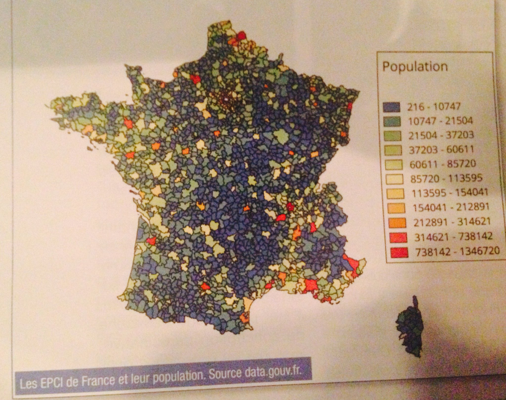]

---

## Quelques autres exemples à ne pas reproduire... (2)

.center.img95[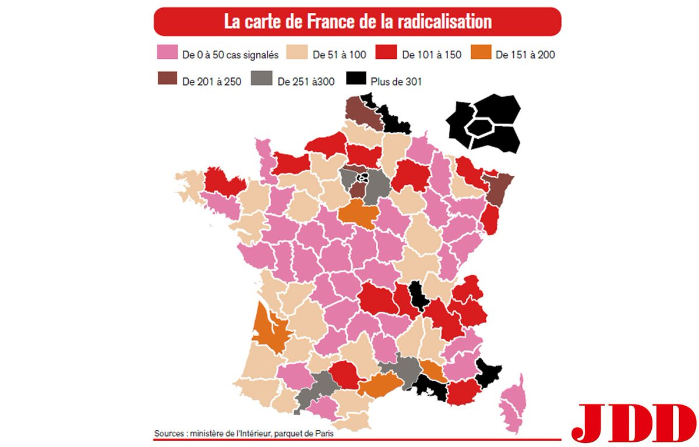]

---

## Quelques autres exemples à ne pas reproduire... (3)

.center.img95[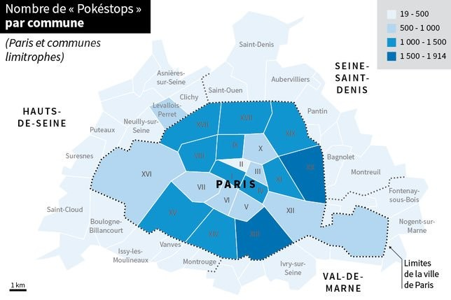]

---
## Exercice 2

  

**Objectif thématique** :

- Faire une carte statistique sur le thème des **logements vacants** sur le territoire de la région **Bretagne**.

 

**Objectifs techniques** :

- Sélectionner les variables d'intérêt et l'emprise de représentation des données
- Proposer **une ou plusieurs représentations adaptées**
- **Mettre en page la carte pour en faciliter sa lecture**

---
class: align-left
## Exercice 2

 

**Données sur les logements**

.small[➜ INSEE : [https://www.insee.fr/fr/statistiques/4171415?sommaire=4171436](https://www.insee.fr/fr/statistiques/4171415?sommaire=4171436)]

➜ **Fond de carte Bretagne + données jointes + méta-données** :  
[https://mthh.github.io/carto-magrit/data_logement_bretagne.zip](https://mthh.github.io/carto-magrit/data_logement_bretagne.zip)

.center.img75[]

---
class: align-left

## Exercice 2

 

.small[**Données** : [https://mthh.github.io/carto-magrit/data_logement_bretagne.zip](https://mthh.github.io/carto-magrit/data_logement_bretagne.zip)]

 

----

[1] **Télécharger les données**  
[2] **Lire les méta-données**  
[3] **Sélectionner les indicateurs à représenter**  
[4] **Importer les données dans Magrit ou QGIS**  
[5] **Ajuster l’étendue géographique**  
[6] <strong>Choisir <u>une ou plusieurs représentations</u></strong>  
[7] **Habiller la carte (territoires voisins, labels utiles, etc.)**  
[8] **Mise en page avec Magrit/QGIS et finalisation avec Inkscape**  

----

 

.center[Temps de réalisation : **🚀 50 min 🚀**]

---

.center[]

.source.small.center[_Note: C'est (surement) faux pour la Normandie_]
---

.center[]

.source.small.center[_Note: C'est (surement) faux pour la Normandie_]

---
class: center, middle

## Rendre comparables deux cartes

---

.center.img65[]

---

.center.img65[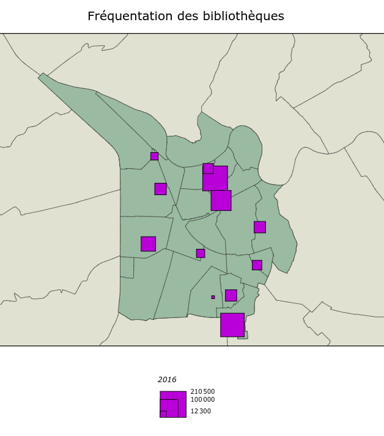]

---
class: center, middle

---
class: center, middle
## Analyse spatiale et cartographie...

---
### Cartographier des densités ... à partir d'une implantation zonale

 

- **Densité = Rapport entre un nombre d'_items_ et une surface**  
Densité de population (hb / km²), densité de bancs, etc.

 

- **Variable quantitative relative / Ratio**  
**➜ À-plat de couleur / Carte choroplèthe avec progression colorée**

---
#### Cartographie "directe"

.center[]

---
#### Carroyage

.center[]

---
#### Carroyage

.center.img50[]

**➜ Méthode du _carroyage_ permet d'essayer de s'affranchir de l'arbitraire et de l'irrégularité d'un découpage administratif.**

**➜** Met en évidence les **grandes tendances de la répartition spatiale d'un phénomène** et permet de traiter la donnée en découpant le territoire en **unités régulières**.

**➜ Les carreaux créés se voient affecté de la valeur de la variable observée pour les entités intersectées, au prorata des surfaces concernées.**

---
#### Lissage spatial

.center[]

---
#### Lissage spatial

.center.img35[]

**➜** Méthode d'analyse spatiale et de représentation basée sur le calcul de potentiels _(dit "de Stewart")_ et qui n’a pas vocation à annuler ou atténuer le bruit (information parasite qui tend à brouiller la lecture) mais **s’affranchit complètement du maillage administratif de départ**.

**➜** Permet d’**observer la répartition spatiale du phénomène étudié, quelque soit l’hétérogénéité du maillage affecté en tout point de la carte**.

**➜ Selon les paramètres d'entrée du calcul, cette méthode permet _"de voir aussi bien les spécificités locales d'un phénomène que ses tendances générales"_ (Lambert & Zanin, 2016)**.

---
#### Lissage spatial

 

**➜** Pour effectuer cette représentation, une **grille régulière** de points est créée. La valeur du potentiel est calculée pour chacun de ces points.

 

**➜** Des **contours** _(ou lignes de niveaux)_ sont ensuite créées afin de regrouper des sous-ensembles de ces points en fonctions de leurs valeurs.

---

.img55.center[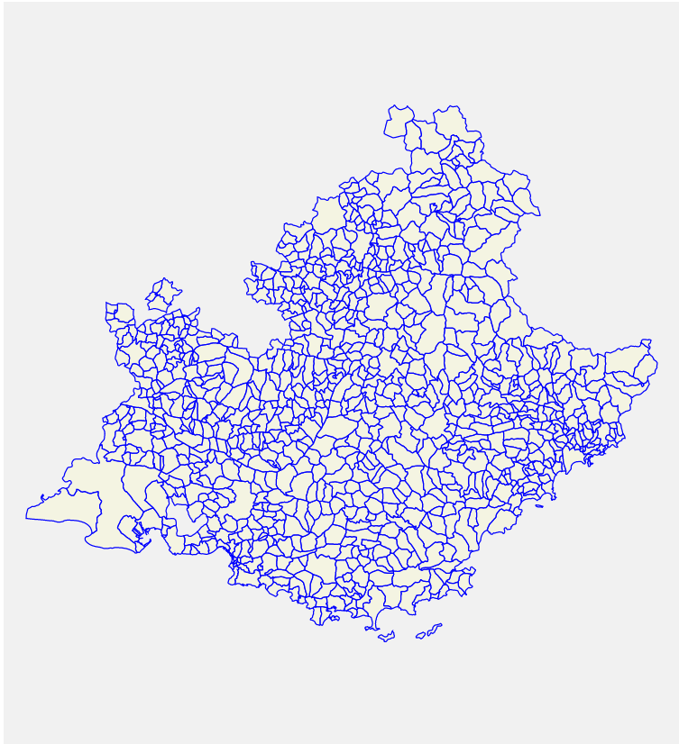]

---

.img55.center[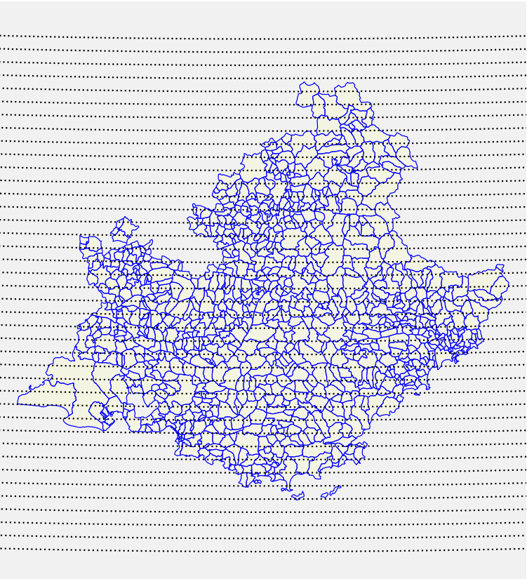]

---

.img55.center[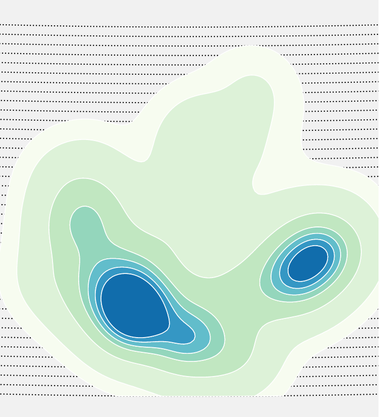]

---
#### Lissage spatial

.center.img35[]

**➜** Il s'agit bien d'un modèle d'**interaction** et non pas simplement d'une simple interpolation (comme _IDW_).

**➜** Ce qui est calculé correspond au **potentiel d'accès** au stock (population, équipement, etc.) pour lequel il est calculé. On parle également de **somme pondérée d'accès à un stock**.

**➜** Les paramètres de cette fonctionnalités (_span_, _beta_ et type de _fonction d'interaction_) permettent de modéliser la manière ce potentiel d'accès décroit avec la distance.

---
#### Lissage spatial

.center[]

 

_Accès à un stock de population **bretonne**_

---
#### Lissage spatial

.center.img35[]

 

**⚠ Attention également à la taille des entités utilisées - Lors de l'utilisation d'une couche de Polygone, Magrit utilise leurs _centroides_**.

**⚠ Il faut distinguer la méthode qui permet de calculer les valeurs en tout point de l'espace _(ici la méthode des potentiels de Stewart)_ de la méthode qui consiste à créer des contours _(ligne de niveau)*_, cette dernière pouvant être appliquée à d'autres méthodes _(IDW, Kriging, etc.)_**.

---
### Cartographier des densités ... à partir d'une implantation ponctuelle

### Implantation ponctuelle

.center.withborderdb[]

.center[_**Fontaines dans l'espace public à Paris**_]

---
### Implantation ponctuelle

.center.img65[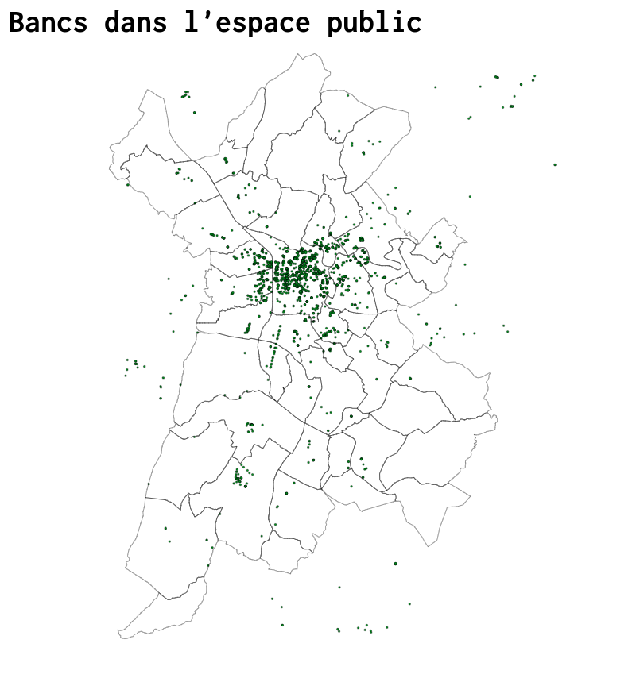]

.center[_**Bancs `(amenity=bench dans OSM) dans la Métropole de Grenoble`**_]

---
### Implantation ponctuelle

   

Parfois la représentation directe de l'information ponctuelle peut s'avérer difficile à lire ET ne pas rendre directement visible le phénomène spatial étudié.

 

Il peut être nécessaire d'aggréger l'information en utilisant un maillage, qu'il soit existant (maillage territorial par exemple) ou qu'il s'agisse d'un carroyage (une grille) créé pour l'occasion.

---
### "Analyse d'un semi de points"

.center.img65[]

---
### "Analyse d'un semi de points"

.center.img35[]

**➜ Aggrégation de l'information ponctuelle de localisation des bancs en comptant chacune des entités**

**➜ Utilisation du fond d'une grille régulière _(ici hexagonale)_**

**➜ Réalisation d'une carte choroplèthe _(bancs / km² : ratio)_**

---
### "Analyse d'un semi de points"

.center[]

---
### "Analyse d'un semi de points"

.center.img65[]

**➜ Aggrégation de l'information ponctuelle _"date de construction"_ en faisant la moyenne des valeurs**

**➜ Utilisation du fond de carte des _quartiers_ comme maille d'analyse**

**➜ Réalisation d'une carte choroplèthe _(ratio)_**

---
### "Analyse d'un semi de points"

.center.withborderdb[]

---
### "Analyse d'un semi de points"

.center.withborderdb[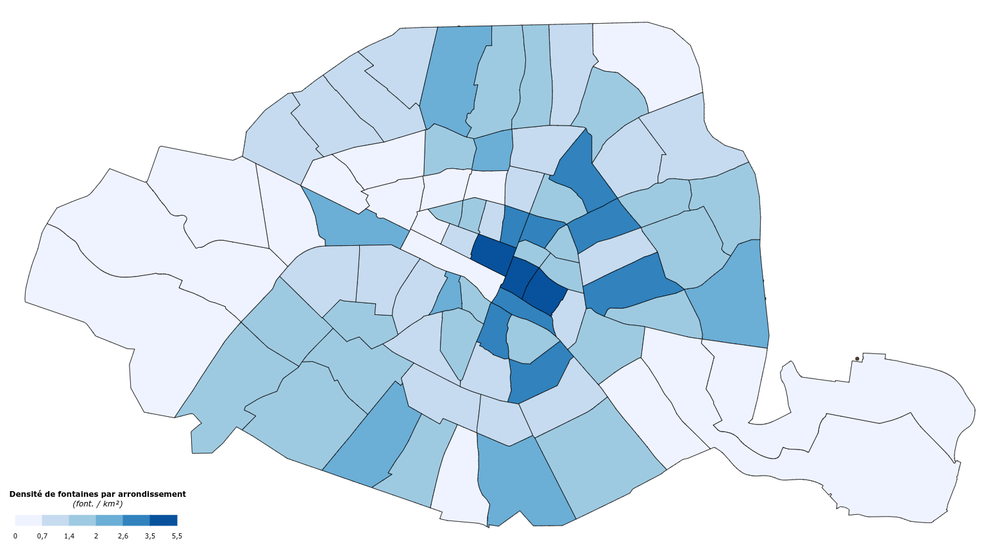]

---
### "Analyse d'un semi de points"

.center.withborderdb[]

---
### "Analyse d'un semi de points"

.center.withborderdb[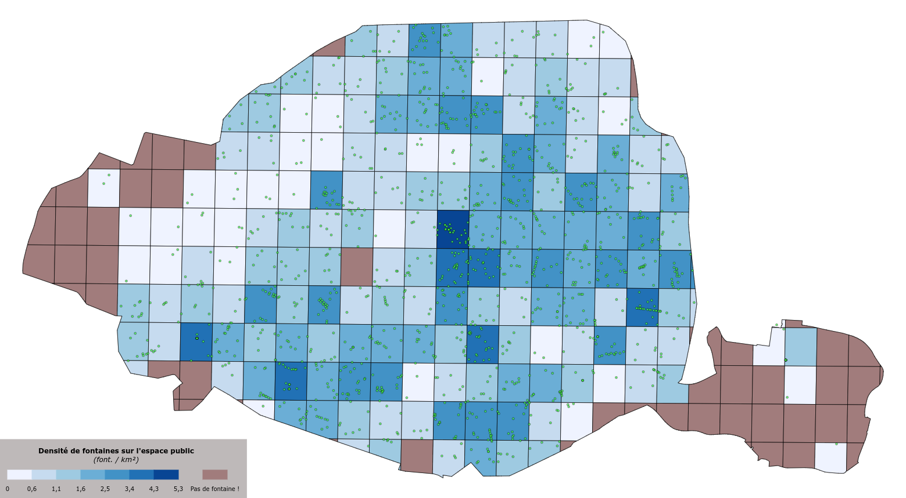]

---
### Lissage spatial

.center.withborderdb[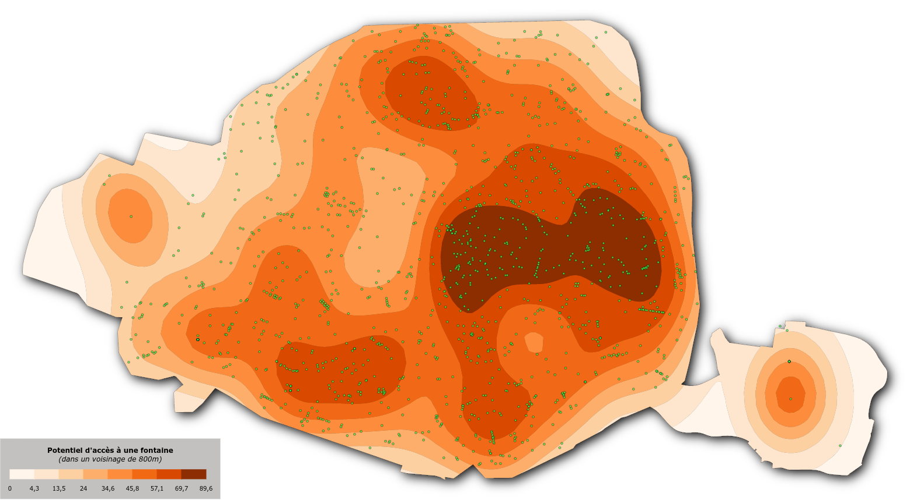]

---
class: middle, center

# Discussion autour de l'habillage et de la mise en page...

<!--
.source.center[Source: [https://visual.ly/community/infographic/how/what-makes-good-infographic](https://visual.ly/community/infographic/how/what-makes-good-infographic)]
.center.img90[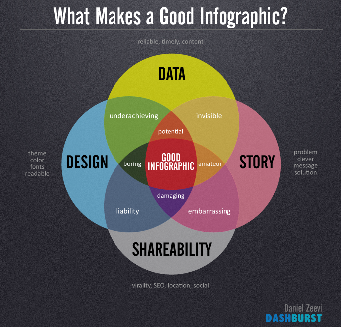]
.source.center[Source: [http://www.infographicsshowcase.com/](http://www.infographicsshowcase.com/)]
.center[] -->

---

.center[]
.center.source[Source: Typologie socio-économique des régions frontalières de l’Union Européenne (2000-2012), [http://riate.cnrs.fr/?p=4692](http://riate.cnrs.fr/?p=4692)]

---

.center[]
.center.source[Source: [https://twitter.com/E_Sigat/status/1200341526360023040](https://twitter.com/E_Sigat/status/1200341526360023040)]

---

.center[]

.source.small.center[_Note: C'est (surement) faux pour la Normandie_]

---

### Harmonisation et identité visuelle  (1)

.center.img70[]
.center.small.source[Source: [Zanin, C., Ysebaert, R., Mise en place d'un modèle cartographique - Trouver le bon compromis entre homogénéisation et innovation cartographique](http://lecfc.fr/new/articles/233-article-5.pdf). Cartes et Géomatique, 2017, pp.33-44]

---

### Harmonisation et identité visuelle  (2)

.center.img80[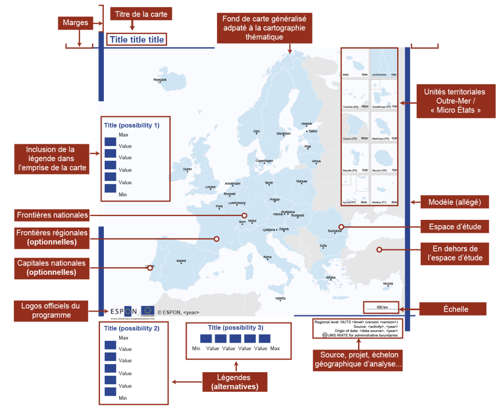]
.center.small.source[Source: [Zanin, C., Ysebaert, R., Mise en place d'un modèle cartographique - Trouver le bon compromis entre homogénéisation et innovation cartographique](http://lecfc.fr/new/articles/233-article-5.pdf). Cartes et Géomatique, 2017, pp.33-44]

---
### Concrètement avec Inkscape (ou Adobe Illustrator)

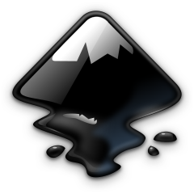

 

**➜ Un logiciel libre de dessin vectoriel**

 

**➜ Permet de modifier des fichiers SVG _(Scalable Vector Graphics)_**

---
#### Ajout d'un effet de lumière diffuse...

.center.img65[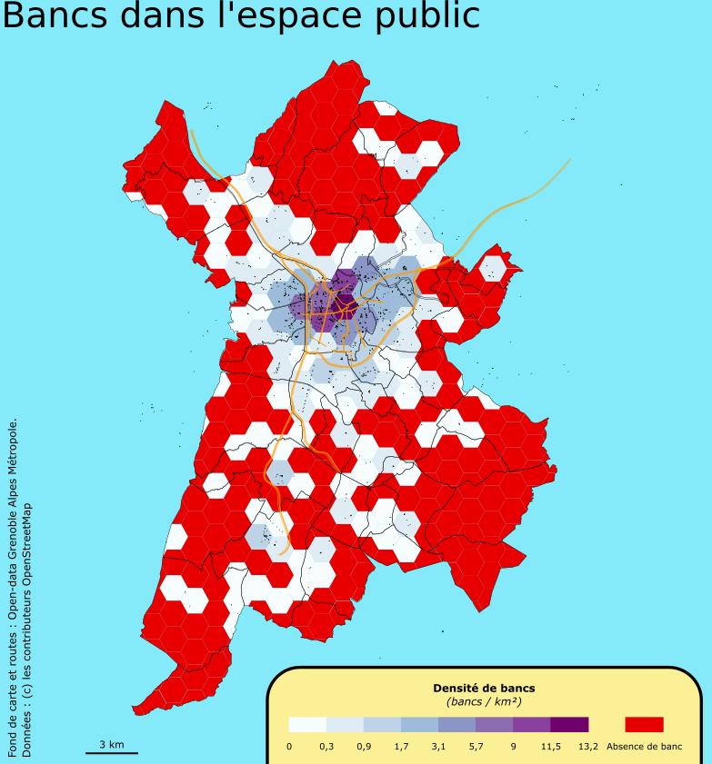]

---
#### Ajout d'un effet de lumière diffuse...

.center.img65[]

---
#### ... puis continuer l'habillage de la carte

.center.img65[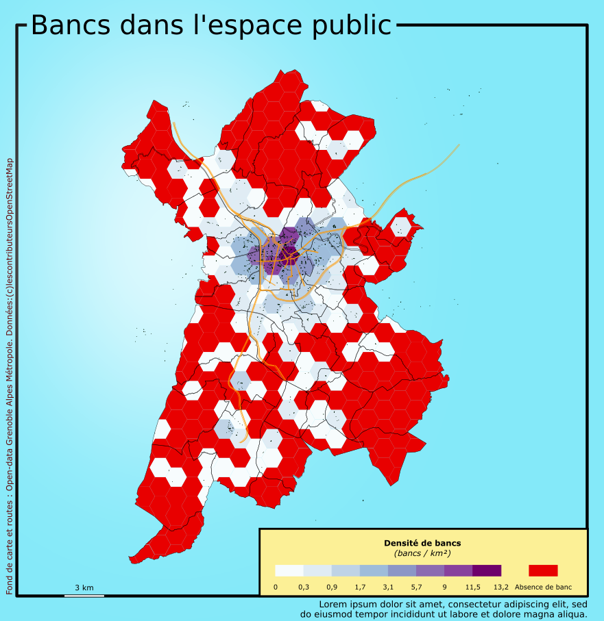]

---
#### Intégration de texture à la carte...

.center.img65[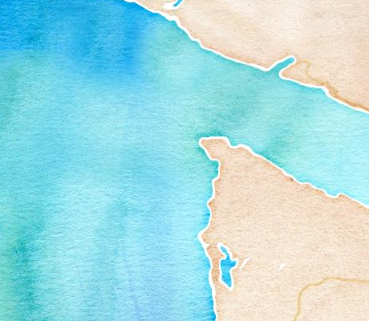]

---
#### Intégration de motifs pour représenter la mer et les océans...

.center.img95[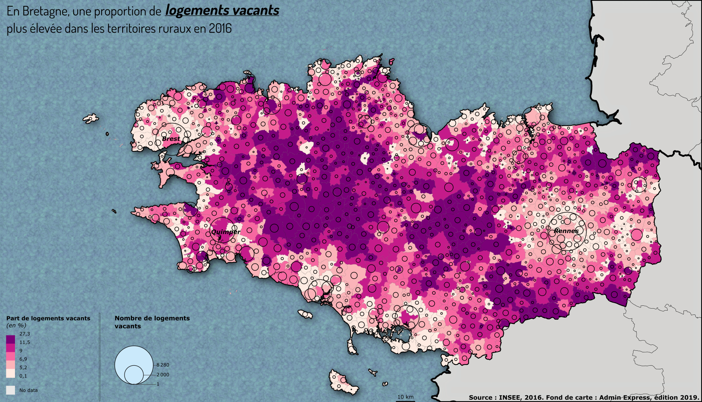]
---
#### De nombreux "effets" possibles

.center.img95[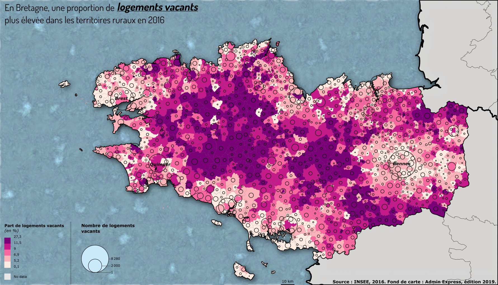]

---
#### Organisation du documents sous forme d'une arborescence contenant notamment avec des _groupes_

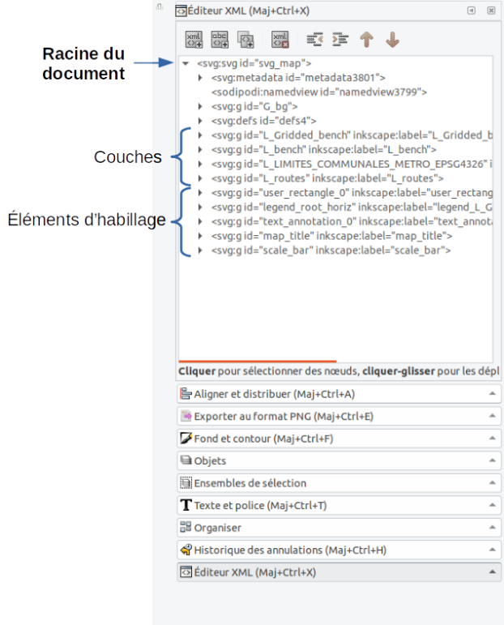

???
Comme dans tout document XML, les objets sont organisés sous forme d’arbre

---
#### Sélections d'éléments possédant les mêmes propriétés

  
**Permet de sélectionner des objets du même type, ou tous les objets ayant la même couleur de fond ou de contour.**

**`Édition`** > **`Sélectionner même`** > ...

---
## Exercice 3

  

**Consigne** :

- Améliorez l'habillage et la mise en page de l'une de vos cartes précédentes (exercice 1 ou 2) dans un logiciel d'édition vectorielle.

**Objectifs techniques** :

- Identifier les différents groupes dans le document SVG
- Identifier les éléments de la carte sur lesquels il est possible de travailler
- Connaitre quelques-uns des outils offerts par Inkscape

.center[Temps de réalisation : **🚀 50 min 🚀**]
