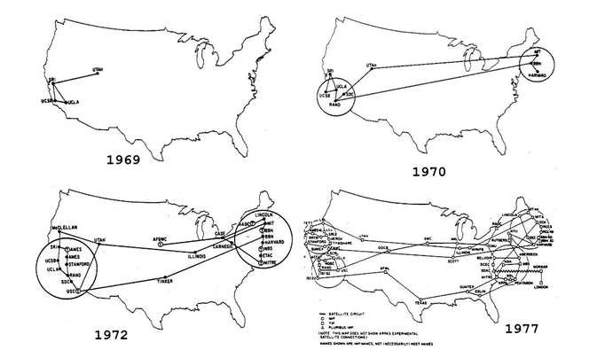
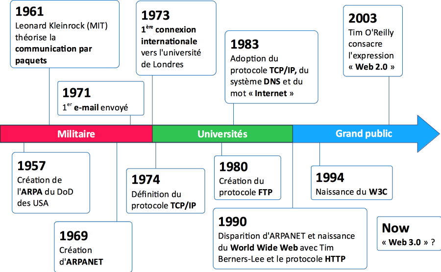
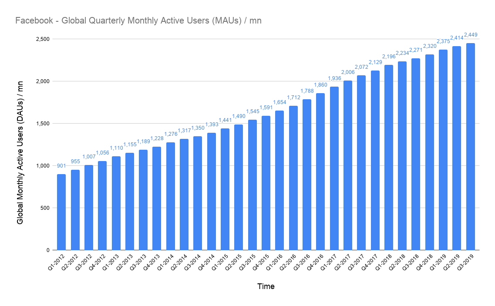
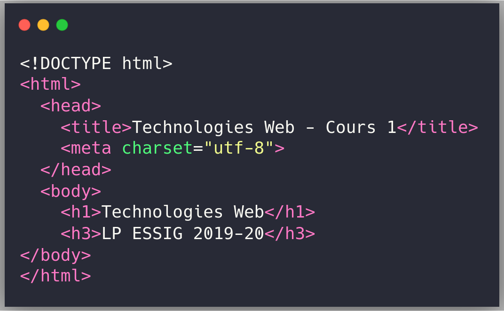
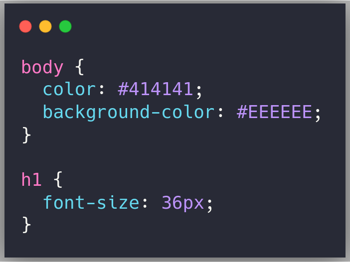
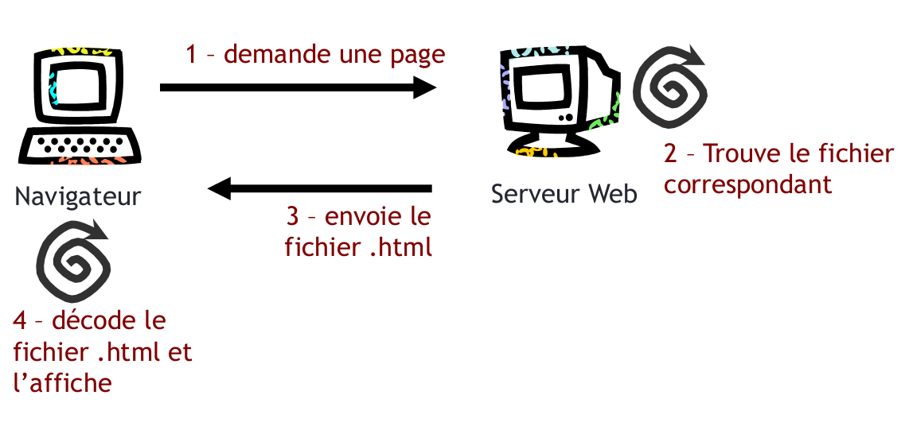
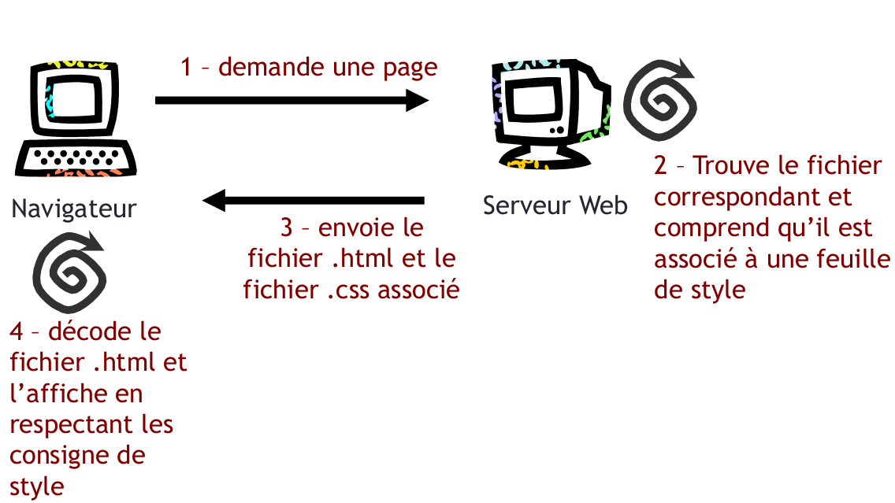
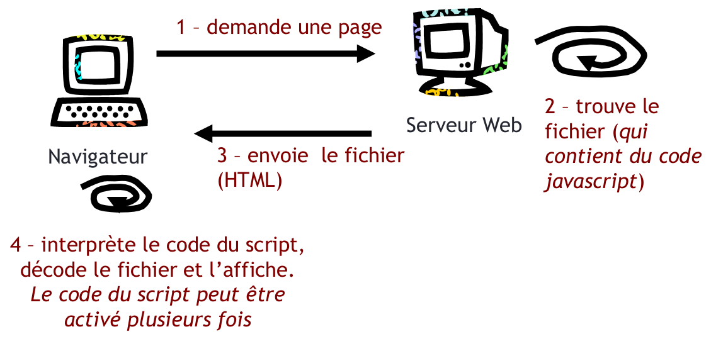
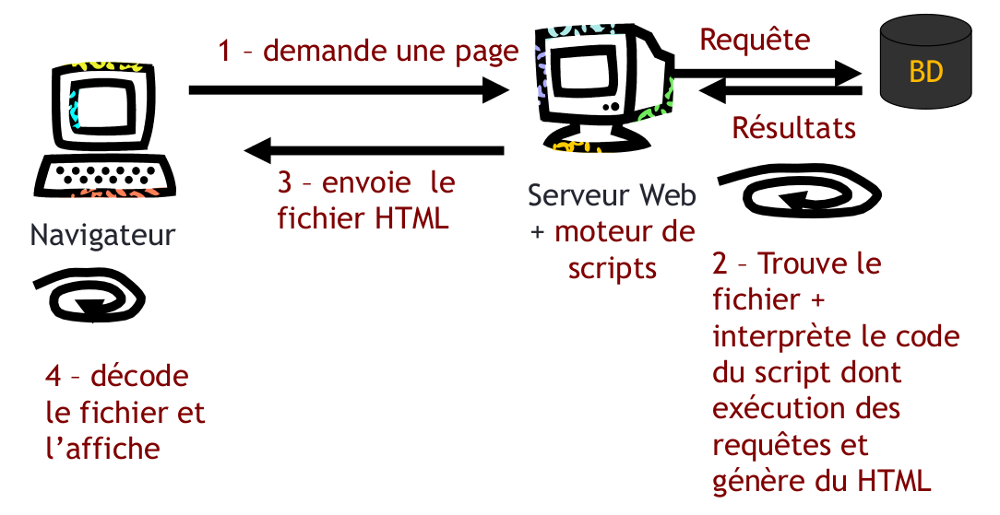

# Technologies Web
### LP ESSIG 2022-2023

  

<h2>Cours 1 : Éléments théoriques</h2>

Matthieu Viry - UAR RIATE <em>(CNRS)</em>

🖂 <a href="maito:matthieu.viry@cnrs.fr">matthieu.viry@cnrs.fr</a>

---
class: t1

## Contenu du cours

 

- .bb[Introduction : Internet et le Web]

  * Un peu d'histoire pour la culture générale

- .bb[Internet et le Web : comment ça marche ?]

  * Les principaux concepts pour en expliquer le fonctionnement

- .bb[Langages du Web]

  * Intro. aux principes et langages permettant de créer des pages web
  * Pratique en TP

.center.source[*(document élaboré à partir de supports produits par M. Villanova - UGA)*]

---
class: section-change

# Partie 1

# Introduction : Internet et le Web

---
## Qu'est-ce qu'Internet ?

 
- Étymologie
  * .red[Inter]connected &nbsp; ➡️ une interconnexion
  * .red[Net]works &nbsp; &nbsp;&nbsp;&nbsp;&nbsp;&nbsp;&nbsp;&nbsp;&nbsp; ➡️ de réseaux d'ordinateurs

- Internet est donc
  * une .red[infrastructure matérielle]
  * composée de .red[dispositifs] (ordinateurs, téléphones, tablettes, etc.) .red[reliés] les uns aux autres
      - connexions filaires - réseau téléphonique, fibre optique, etc.
      - sans fil - hertzienne, satellitaire, etc.
  * permettant la .red[communication] entre eux grâce à des .red[protocoles] (ou langages de communication)

???

Particularité d’Internet : il ne s’agit pas exactement d’un réseau unique, mais d’un réseau de réseaux (network of networks). C’est d’ailleurs un surnom que l’on croise de temps en temps, parce qu’il s’agit en fait de relier entre eux différents réseaux informatiques, de toutes tailles, avec leurs propres règles, qui se trouvent sur tous les continents.

Internet est un réseau informatique mondial accessible au public. Il s'agit d'un réseau de réseaux sans centre névralgique composé de millions de réseaux aussi bien publics que privés, universitaires, commerciaux et gouvernementaux, eux-mêmes regroupés en réseaux autonomes.

Un protocole (informatique) est un ensemble de règles qui régissent les échanges de données ou le comportement collectif d'ordinateurs en réseaux ou d'objets connectés. Un protocole a pour but de réaliser une ou plusieurs tâches concourant à un fonctionnement harmonieux d'une entité générale.

---

## Qu'est-ce que le Web ?

 
- Signification
  * au niveau mondial &nbsp;&nbsp;&nbsp;&nbsp;➡️ .red[**W**]**orld**
  * une large &nbsp;&nbsp;&nbsp;&nbsp;&nbsp;&nbsp;&nbsp;&nbsp;&nbsp;&nbsp;&nbsp; &nbsp;&nbsp;&nbsp;&nbsp;&nbsp;&nbsp; ➡️ .red[**W**]**ide**
  * toile d'araignée &nbsp;&nbsp;&nbsp;&nbsp;&nbsp;&nbsp;&nbsp; ➡️ .red[**W**]**eb**

- Le Web est
  * un très grand ensemble de ressources (des pages web, images, vidéos, sons, etc. – des fichiers informatiques)
  * reliées les unes aux autres par des .red[liens]
  * permettant de .red[naviguer] entre ces ressources et d'y .red[accéder]
  * en .red[utilisant l'infrastructure Internet]

???

Littéralement la « toile (d’araignée) mondiale »

Le Web est un système hypertexte public fonctionnant sur Internet. Le Web permet de consulter, notamment avec un navigateur, un très grand ensemble de ressources (et notamment des pages web).

L’image de la toile d’araignée vient des hyperliens qui lient ces différentes ressources entre elles.

---

## Internet *versus* Web ?

   
.red[Internet] a réellement été popularisé par l'apparition du .red[World Wide Web] ce qui explique que les deux sont parfois confondus.

 
En réalité, le .red[*web est une des applications d'Internet*], comme le sont :
  - le .red[courrier électronique]
  - la .red[messagerie instantanée] et
  - les .red[systèmes de partage de fichiers poste à poste]

---

## Historique

  

- États-Unis, 1969 : Création d'un réseau informatique militaire appelé .red[ARPANET] (*Advanced Research Project Administration Network*)

Objectifs :  
<li>interconnecter les sites de recherches militaires</li>
<li>permettre la communication entre n’importe quels points du réseau</li>
<li>ne pas avoir à se préoccuper des différents types d’ordinateurs et de systèmes d’exploitation, etc.</li>

???

Arpanet : Ancêtre d'internet - premier "réseau à transfert de paquets", développé par l'Agence pour les projets de recherche avancée de défense américaine (la DARPA),
 En 1969 des paquets de donnée ont transité avec succès entre l'université de Californie à Los Angeles (UCLA) et l'Institut de recherche de Stanford !!

---
class: center, middle

???

Arpanet se raccorde rapidement à de nouvelles universités : on compte 23 "nœuds" en 1971, puis 111 en 1977. Au vu de la démocratisation du réseau Arpanet, la DARPA se sépare de sa gestion en créant un réseau propre aux forces armées américaines, le Military network, MILNet.

---
class: center, middle

---

## Historique

- Années 70 - 80
  * Ouverture au domaine public (centres de recherche et universités)
        * Réseau NSFNET (*[National Science Foundation Network](https://en.wikipedia.org/wiki/National_Science_Foundation_Network)*)
  * Création de protocoles d'échange pour le transfert des informations
        * TCP/IP, telnet, FTP, etc.
        * introduits dans les 70's puis affinés
  * Création du système d'adressage .red[DNS] (.red[D]omain .red[N]ame .red[S]ystem) en 1984 avec 6 domaines:

.left-column[.edu *(education)*   .gov *(government)*   .org *(organization)*]
.right-column[.mil *(military)*   .com *(commercial)*   .net *(network resources)*]

???

- C'est la National Science Foundation qui prend en charge la transition vers une utilisation tout public : l'adoption d'un nouveau protocole, TCP/IP, a permis de faciliter le transfert des données et peu à peu "internet" se substitue à "Arpanet".

---

## Historique

- CERN Genève, 1989-1990
  * À l'origine, l'acronyme correspondait à « Conseil Européen pour la Recherche Nucléaire », désormais « Organisation Européenne pour la Recherche Nucléaire »
  * Apparition du web que l'on doit à Tim Berners-Lee
  * Le projet, baptisé « World Wide Web », a été conçu et développé pour que des scientifiques travaillant dans les universités et les instituts du monde entier puissent s'échanger des informations instantanément
      - https://timeline.web.cern.ch/timeline-header/90
      - http://info.cern.ch/hypertext/WWW/TheProject.html   (1er site web)
- Avril 2017 : Tim Berners-Lee reçoit le prix Alan Turing de l'ACM (*Association for Computing Machinery*). Ce prestigieux prix est pour les informaticiens l'équivalent du Nobel

???

- Mais ce qui n'existait pas à l'époque (et représente probablement l'une des principales différences entre Arpanet et Internet), c’est le World Wide Web. Ce système hypertexte a été développé par Tim Berners-Lee en 1989, peu avant que le projet Arpanet ne soit abandonné.

- Auparavant, l'information n'était pas accessible dans le réseau des serveurs disponibles et devait être demandée individuellement aux hôtes. Aussi, en 1969, les premiers navigateurs Web étaient bien loin de voir le jour.

---

## Historique

- CERN Genève, 1989-1990
  * Idée sous-jacente : appliquer les principes de l'hypertexte
      - Un concept introduit en 1945 (Vannevar Bush, [Memex](https://en.wikipedia.org/wiki/Memex))
      - Terme inventé en 1965 par Ted Nelson : *« Let me introduce the word 'hypertext' to mean a body of written or pictorial material interconnected in such a complex way that it could not conveniently be presented or represented on paper »*

  * Principe :
      - un réseau constitué par un ensemble de documents informatiques liés entre eux
      - dont la principale propriété est de ne pas imposer un parcours séquentiel (ou linéaire), par opposition à un discours ou aux pages d'un livre.

???

- **Memex** ordinateur analogique fictif, relié à une bibliothèque capable d'afficher des livres et de projeter des films. Cet outil est aussi capable de créer automatiquement des références entre les différents médias.

- **Nelson** "... le mot "hypertexte" pour désigner un ensemble de documents écrits ou d'images interconnectés d'une manière si complexe qu'il ne peut être présenté ou représenté sur papier"

- le parcours de ces liens n'impose pas un parcours séquentiel / linéaire (par opposition aux page d'un livre)
---

## Historique

  
- Années 90
  * Développement des utilisations privées d'Internet
- 1993 : apparition de `Mosaic` puis de `Netscape`
- 1994 : accès au courrier électronique (AOL)
- 1994 : création du W3C *(.red[W]orld .red[W]ide .red[W]eb .red[C]onsortium)*
  * http://www.w3.org - Développement et standardisation des langages et technologies associées au web

---
## Historique

  
- Depuis les années 2000 :
  * Nouveaux usages, nouveaux dispositifs, nouveaux langages, nouveaux
protocoles, ...
  * le Web 2.0 :
      - vers plus de simplicité : pas de connaissances techniques ni informatiques pour les utilisateurs du web
      - plus d'interactivité : permettre à chacun, de façon individuelle ou collective, de contribuer, d'échanger et de collaborer sous différentes formes

---

## Historique

- Depuis les années 2000 suite
  * Le Web Sémantique
  > *« I have a dream for the Web [in which computers] become capable of analyzing all the data on the Web — the content, links, and transactions between people and computers. A “Semantic Web”, which should make this possible, has yet to emerge, but when it does, the day-to-day mechanisms of trade, bureaucracy and our daily lives will be handled by machines talking to machines. The “intelligent agents” people have touted for ages will finally materialize. »* &nbsp;&nbsp;&nbsp;&nbsp;&nbsp;&nbsp; &nbsp; &  nbsp; — Tim Berners-Lee, Weaving the Web

  * Le Web des Données (ou *Linked data*)
      - lier et structurer l'information du Web pour accéder simplement à la connaissance

  * Le courant Open Data
      - [Le web des données ouvertes et liées. Qu'est-ce que c'est ?](https://www.youtube.com/watch?v=oEuDaJjEFos) .source[(EuropeanaEU collections)]

???

« J'ai un rêve pour le Web [dans lequel les ordinateurs] deviennent capables d'analyser toutes les données sur le Web - le contenu, les liens et les transactions entre les personnes et les ordinateurs. Un "Web sémantique", qui devrait rendre cela possible, n'a pas encore vu le jour, mais lorsqu'il le fera, les mécanismes quotidiens du commerce, de la bureaucratie et de notre vie quotidienne seront gérés par des machines qui parlent à des machines. Les "agents intelligents" dont les gens parlent depuis des lustres se matérialiseront enfin. »

Le Web sémantique (parfois qualifiée de Web 3.0) est une extension du Web standardisée par le World Wide Web Consortium (W3C) via des standards qui encouragent l'utilisation de formats de données et de protocoles d'échange normés sur le Web, en s'appuyant sur le modèle Resource Description Framework (RDF)..

Selon le W3C, « le Web sémantique fournit un modèle qui permet aux données d'être partagées et réutilisées entre plusieurs applications, entreprises et groupes d'utilisateurs ». L'expression a été inventée par Tim Berners-Lee qui le définit comme « une toile de données qui peuvent être traitées directement et indirectement par des machines pour aider leurs utilisateurs à créer de nouvelles connaissances ». Pour y parvenir, le Web sémantique met en œuvre le Web des données qui consiste à lier et structurer l'information sur Internet pour accéder simplement à la connaissance qu'elle contient déjà.

Open data = données numériques dont l'accès et l'usage sont laissés libres aux usagers, qui peuvent être d'origine privée mais surtout publique, produites notamment par une collectivité ou un établissement public. Elles sont diffusées de manière structurée selon une méthode et une licence ouverte garantissant leur libre accès et leur réutilisation par tous, sans restriction technique, juridique ou financière.

Open data qui vise à partager de manière massive les données publiques pour accélérer la recherche et le commerce.

---

## Historique

---

## Quelques chiffres (1)

<iframe src="https://e.infogram.com/859bb0b7-e61c-4703-8e7e-8a09e9ba6115?src=embed" title="Nombre d&amp;amp;#39;internautes en France" width="600" height="759" scrolling="no" frameborder="0" style="transform: scale(0.8);position: absolute;top: 57px;left:135px;border:none;" allowfullscreen="allowfullscreen"></iframe>

.source.center[Source :https://www.journaldunet.com/ebusiness/le-net/1071394-nombre-d-internautes-en-france/]

---

## Quelques chiffres (2)

<iframe src="https://e.infogram.com/b7d53967-6911-4078-ace6-463291ef31e8?src=embed" title="Internautes dans le monde" width="600" height="715" scrolling="no" frameborder="0" style="transform: scale(0.8);position: absolute;top: 57px;left:135px;border:none;" allowfullscreen="allowfullscreen"></iframe>

.source.center[Source: https://www.journaldunet.com/ebusiness/le-net/1071539-nombre-d-internautes-dans-le-monde/]

---

## Quelques chiffres (3)

  

.source.center[Source: [The Good State - Proprietary Representation](https://www.thegoodestate.com/facebook-monthly-active-users/)]

---

## Quelques chiffres (4)

<iframe src="https://e.infogram.com/e70e48d4-355d-4c1d-ac29-6d0244e230d5?src=embed" title="Répartition du trafic Internet en France " width="600" height="715" scrolling="no" frameborder="0" style="transform: scale(0.8);position: absolute;top: 57px;left:135px;border:none;" allowfullscreen="allowfullscreen"></iframe>

.source.center[Source: https://www.journaldunet.com/ebusiness/le-net/1071414-le-profil-des-internautes-francais/]

---

class: section-change

## Partie 2

## Internet et le Web : comment ça marche ?

???

- Le but de la partie est de voir les principaux concepts d'Internet et du Web pour en comprendre le fonctionnement.

- On va donc commencer par voir quels sont les protocoles utilisés pour le transfert des données sur Internet et comment ils s'organisent entre eux.

---
## Fonctionnement d'Internet
### Un modèle en "couches"

  

<table cellpadding="5" cellspacing="1">
<tbody>
  <tr>
    <td style="border:1px solid black;"><b>Application layer</b></td>
    <td style="text-align:left;">HTTP, FTP, SMTP, Telnet, etc.</td>
  </tr>
  <tr>
    <td style="border:1px solid black;"><b>Transport layer</b></td>
    <td style="text-align:left;">TCP, UDP, ...</td>
  </tr>
  <tr>
    <td style="border:1px solid black;"><b>Internet layer</b></td>
    <td style="text-align:left;">IP <em>(Internet Protocol)</em></td>
  </tr>
  <tr>
    <td style="border:1px solid black;"><b>Link layer</b></td>
    <td style="text-align:left;">Transmission des info. sur les réseaux physiques</td>
  </tr>
</tbody>
</table>

 

.center[Appelé la .bb[*"pile TCP/IP"*] ou la .bb[*[suite des protocoles Internet](https://fr.wikipedia.org/wiki/Suite_des_protocoles_Internet)*]]

---

class: center, middle

Source: <a href="https://commons.wikimedia.org/wiki/File:Data_Flow_of_the_Internet_Protocol_Suite.PNG">Wikimedia Commons - user: renepick</a> / <a href="https://creativecommons.org/licenses/by-sa/3.0/">CC-BY-SA-3.0</a>

???

- La couche **Lien** décrit les caractéristiques physiques de la communication, comme les conventions à propos de la nature du média utilisé pour les communications (les câbles, les liens par fibre optique ou par radio), et tous les détails associés comme les connecteurs, les types de codage ou de modulation, le niveau des signaux, les longueurs d'onde, la synchronisation et les distances maximales. Elle décrit également comment les paquets sont transportés.

- Dans la suite de protocoles Internet, couche **réseau** / **internet**,  IP assure l'acheminement des paquets depuis une source vers une destination, et supporte aussi d'autres protocoles, comme ICMP (utilisé pour transférer des messages de diagnostic liés aux transmissions IP) et IGMP (utilisé pour gérer les données multicast).

- Les protocoles de la couche de **transport** peuvent résoudre des problèmes comme la fiabilité des échanges (« est-ce que les données sont arrivées à destination ? ») et assurer que les données arrivent dans l'ordre correct. Dans la suite de protocoles TCP/IP, les protocoles de transport déterminent aussi à quelle application chaque paquet de données doit être délivré. Deux principaux protocole de transport à connaître TCP et UDP.

- C'est dans la couche **application** que se situent la plupart des programmes réseau.
Ces programmes et les protocoles qu'ils utilisent incluent HTTP (World Wide Web), FTP (transfert de fichiers), SMTP (messagerie), SSH (connexion à distance sécurisée), DNS (recherche de correspondance entre noms et adresses IP) et beaucoup d'autres.

Le Web est donc une des applications d'Internet...

---
## Fonctionnement d'Internet
### Les adresses IP (*Internet Protocol*) (1/3)

 
- .red[Adresses IPv4] – Structure
    * adresse numérique composée de 4 entiers entre 0 et 255
    * exemple : `129.88.38.11`
- Rôle
    * permettre la communication entre ordinateurs d'un réseau
    * chaque ordinateur d'un réseau possède une adresse IP unique sur ce réseau
    * c'est la base du système d'acheminement (routage) des paquets de données sur Internet

???

IPv4 (Internet Protocol version 4) est la première version d'Internet Protocol (IP) à avoir été largement déployée, et qui forme encore en 2023 la base de la majorité des communications sur Internet, par rapport à l'IPv6.

Une adresse IPv4 est représentée sous la forme de quatre nombres entiers séparés par des points comme 129.88.38.11 Chacun des nombres représente un octet (8 bits).

La plage d'attribution s'étend de 0.0.0.0 à 255.255.255.255, Une adresse IPv4 est ainsi codées sur 32 bits, permettant d'attribuer 2^^32 adresses peuvent donc être simultanément en théorie. Mais il existe des contraintes empêchant l'utilisation de certaines adresses.

Ainsi le protocole IP, via ces adresses IP, assure l'acheminement des paquets.
Ils ne se préoccupent pas du contenu des paquets, mais fournis une méthode pour les mener à destination.

---

## Fonctionnement d'Internet
### Les adresses IP (*Internet Protocol*) (2/3)

- Déchiffrement d'une adresse IP : deux parties
  * Une partie des nombres à gauche désigne le réseau
      - Elle est appelée ID de réseau (*netID*),

  * Les nombres de droite désignent les ordinateurs de ce réseau
      - On parle d' ID d'hôte (*host-ID*).
- Plus le nombre de bits réservés à la partie gauche (donc au réseau) est petit, plus le réseau peut contenir d'ordinateurs:
  * .light[Le réseau `102.0.0.0` peut contenir des ordinateurs d'adresses IP variant de `102.0.0.1` à `102.255.255.254` (soit 16 777 214 possibilités)]
  * .light[le réseau `194.26.0.0` ne peut contenir "que" des ordinateurs d'adresses IP comprises entre `194.26.0.1` et `194.26.255.254` (soit 65 534 possibilités)]

---

## Fonctionnement d'Internet
### Les adresses IP (*Internet Protocol*) (3/3)

- Remarque (1)
  * ICANN *(Internet Corporation for Assigned Names and Numbers)*
      * organisme chargé d'attribuer des adresses IP publiques
      * c'est-à-dire les adresses IP des ordinateurs directement connectés sur le réseau public internet
      * gestion par les USA jusqu'en 2016

- Remarque (2)
  * IPv4 permet d'adresser environ 4 milliards de machines (232 car stockage sur 32 bits).
  * IPv6 permet de décrire environ 3.4×1038 machines
  * Adresses de la forme `0123:0078:9ABC:DEF0:1234:5678:9ABC:DEF0`

???

En fr : Société pour l'attribution des noms de domaine et des numéros sur Internet

C'est est une autorité de régulation d'Internet, qui est chargé d'attribuer des adresses IP publiques et de gérer le système de noms de domaine de premier niveau.

Elle délègue la vente des noms de domaines à différentes organisations comme Verisign pour les .net / .com ou l'AFNIC (Association française pour le nommage Internet en coopération) pour les Internet nationaux de premier niveau de la France (.fr), La Réunion (.re), des Terres australes et antarctiques françaises (.tf), Mayotte (.yt), Saint-Pierre-et-Miquelon (.pm) et Wallis-et-Futuna (.wf)

Le système d'adressage IPv6 est déjà déployé lui aussi. Il semble toujours moins utilisé que IPv4 même si on voit une augmentation ces dernières années.

https://www.google.com/intl/en/ipv6/statistics.html

Comme vous pouvez le constater avec l'exemple ici, La notation décimale pointée employée pour les adresses IPv4 (par exemple 172.31.128.1) est abandonnée au profit d'une écriture hexadécimale, où les 8 groupes de 2 octets (soit 16 bits par groupe) sont séparés par un signe deux-points.

On obtient ainsi une adresse longue de 128 bits, soit 16 octets, permettant la création  3,4 × 10^^38 adresses.

Je ne vais pas rentrer dans les détails mais IPv6 n'apporte pas seulement un changement dans le système d'adressage, mais aussi différentes améliorations dans le fonctionnement du protocole IP.

---

## Fonctionnement d'Internet
### Protocoles de transport

 
- .red[TCP] &nbsp; *(Transmission Control Protocol)*
  * protocole de transport en mode connecté
  * connexion *point-à-point* (entre deux hôtes)
  * protocole dit *fiable*

- .red[UDP] &nbsp; *(User Datagram Protocol)*
  * protocole de transport dit *non fiable* (i.e. pas de garantie concernant la livraison du message)
  * permet émission simultanée vers plusieurs récepteurs (*multicast*, *broadcast*)
  * très utilisé (*streaming*, jeux en réseau, etc.)

- Utilisent tous 2 le système d'adressage IP

??? 

Après avoir parlé de la couche "réseau" avec le protocole IP et son système d'adresse, regardons des protocoles de la couche "transport".

Transmission Control Protocol (littéralement, « protocole de contrôle de transmissions »), abrégé TCP, est un protocole de transport fiable (c'est à dire qu'il assure le transfert des données sans perte et dans l'ordre), en mode connecté.

On va parler de "session TCP" avec l'établissement de la connexion ; les transferts de données ; la fin de la connexion.

UDP
Le rôle de ce protocole est de permettre la transmission de données (sous forme de datagrammes) de manière très simple entre deux entités, chacune étant définie par une adresse IP et un numéro de port. Aucune communication préalable n'est requise pour établir la connexion, au contraire de TCP (qui utilise le procédé de handshaking). UDP utilise un mode de transmission sans connexion.

---

## Fonctionnement d'Internet
### Le DNS (*Domain Name System*) (1/2)

- .red[Domaine] = un ensemble d'ordinateurs reliés à Internet ayant une caractéristique commune.
  * le domaine .fr est l'ensemble des ordinateurs hébergeant des activités pour des personnes ou des organisations qui se sont enregistrées auprès de l'AFNIC (registre responsable du domaine de premier niveau .fr)
  * le domaine univ-grenoble-alpes.fr est l'ensemble des ordinateurs hébergeant des activités pour l'UGA
- .red[Nom de domaine]
  * alternative à une adresse IP qui en offre une représentation plus explicite comme iut2.univ-grenoble-alpes.fr plutôt que 125.86.56.2 (adresse factice)
  * Le but : retenir et communiquer facilement l'adresse d'un ensemble de serveurs (site web, courrier électronique, FTP...)

---

## Fonctionnement d'Internet
### Le DNS (*Domain Name System*) (2/2)

- Principe : associer des noms en langage courant aux adresses numériques grâce à un système appelé DNS constitué :
  * D'un espace de noms hiérarchique permettant de garantir l'unicité d'un nom dans une structure arborescente
  * D'un système de serveurs distribués qui collaborent pour rendre disponible l'espace de noms
  * D'un système de clients chargés d'interroger les serveurs afin de connaître l'adresse IP correspondant à un nom

 

Résoudre un nom de domaine consiste donc à trouver l'adresse IP qui lui est associée

---

## Fonctionnement d'Internet
### Protocoles d'application (1/2)

 
- .red[DHCP] *(Dynamic Host Configuration Protocol)* : Attribution dynamique d'une adresse IP par un « serveur DHCP »
  * utilisation de l'adresse physique MAC *(Media Access Control)* de l'ordinateur demandeur
  * seuls les ordinateurs en service utilisent une adresse IP disponible (un ordinateur n'est plus associé à une et une seule adresse IP)

---

## Fonctionnement d'Internet
### Protocoles d'application (2/2)

 
- .bb[SMTP] *(Simple Mail Transfer Protocol)*, .bb[POP ]*(Post Office Protocol)* et .bb[IMAP] *(Internet Mail Access Protocol)*
    - échange de courriers électroniques
- .bb[FTP] *(File Transfert Protocol)*
    - transfert de fichiers entre ordinateurs
- HTTP *(Hypertext Transfer Protocol)* + HTTPS (sécurisé)
    - transfert de documents (HTML, image, feuille de style, etc.) entre le serveur HTTP et le navigateur Web
- IRC *(Internet Relay Chat)*
    - communication instantanée (en groupe ou un à un)

---

## Fonctionnement du Web
### Communication client/serveur (1/2)

Source: <a href="https://developer.mozilla.org/files/4291/client-server.png">Mozilla Developpers Network</a>

- .red[Hôte] : ordinateur en ligne, identifié sur Internet par une adresse IP.

- Dans un mode de communication client-serveur :
  * un serveur est un hôte sur lequel fonctionne un *logiciel serveur* auquel peuvent se connecter des *logiciels clients* fonctionnant sur des *hôtes clients*
  * la communication prend généralement la forme d'envoi de requêtes par le
client à destination d'un serveur qui répond par l'envoi de ressources
  * le traitement effectué par le serveur est plus ou moins complexe

---

## Fonctionnement du Web
### Communication client/serveur (2/2)

.red[**Serveur**] = logiciel (et la machine qui l'héberge par abus de langage)
  * permet à des clients d'accéder à des ressources (serveur http)
      - Reconnaît et traite une requête
      - Retourne la réponse au client
  * Exemple : Apache HTTP Server, Nginx, Microsoft IIS, Apache Tomcat,..

 
.red[**Client**] = logiciel (et la machine qui l'héberge par abus de langage)
  * Affiche le résultat retourné par le serveur
  * Il s'agit en général d'un « navigateur » (*browser*) : Firefox, Edge, Chrome, Safari, etc.

---

class: center, middle

Source: <a href="https://commons.wikimedia.org/wiki/File:Data_Flow_of_the_Internet_Protocol_Suite.PNG">Wikimedia Commons - user: renepick</a> / <a href="https://creativecommons.org/licenses/by-sa/3.0/">CC-BY-SA-3.0</a>

---

## Fonctionnement du Web
### Ports

- Plusieurs services sont disponibles sur un serveur (donc à une même adresse)

- De façon à pouvoir accéder à chaque service indépendamment, un numéro de port est attribué à chacun

- Lorsque le serveur reçoit une requête sur un port (on dit qu'il *écoute* et/ou qu'il *émet* sur ce port), les données sont envoyées vers l'application correspondante.

- Maximum de 65 536 ports par machine - ceux compris entre 0 et 1023 correspondent à des *services bien connus* ("*[Well-Known Services](https://fr.wikipedia.org/wiki/Liste_de_ports_logiciels)*")

<code><pre>
    HTTP : port 80
    SSH : port 22
    DNS: port 53
    POP : port 100
    IMAP : port 143
</pre></code>

---

## Fonctionnement du Web
### Les ressources du Web

- Le concept de ressource du Web a évolué :
  * de la notion primitive de document ou fichier informatique statique et adressable ...
  * vers une définition plus générale et abstraite, recouvrant aujourd’hui toute chose ou entité susceptible d'être identifiée (par un URI), nommée, manipulée à travers ses représentations sur le web

- Remarque
  * Ressource locale : stockée sur l'ordinateur utilisé et accessible hors-ligne,
  * Ressource distante ou en ligne : stockée sur un autre ordinateur accessible à travers un réseau, selon un protocole de communication

---

## Fonctionnement du Web
### URL *(Uniform Resource Locator)*

- Format de nommage universel pour .red[désigner une ressource du web]

- Un URL est un URI avec I pour Identifier

- Une chaîne de caractères en 4 parties:
  * Le .red[nom du protocole]
  * Le .red[nom du serveur et de domaine] de l'ordinateur hébergeant la ressource demandée
  * Le .red[numéro de port] sur lequel le serveur écoute (facultatif)
  * Le .red[chemin d'accès à la ressource] : emplacement auquel la ressource est située, i.e. de manière générale l'emplacement et le nom du fichier demandé

.center[http://www.iut2.univ-grenoble-alpes.fr/index.html]

---
class: section-change

# Partie 3

# Langages du Web

---
## Sites Web
### Avant-propos

- Objectifs :
  * Diffuser des informations et/ou
  * Permettre le traitement de ces informations
  * En fonction de la complexité, on distingue:
      - Sites ‘statiques’, ‘interactifs’ (formulaires, menus, etc.)
      - Sites ‘dynamiques’ plus élaborés, souvent couplés à une BD
- Concrètement
  * Un site Web est ensemble de pages et autres ressources (images, fichiers, etc.) liées les unes aux autres dans une structure cohérente (souvent par des hyperliens)
  * Publiées par un propriétaire
  * Les pages sont hébergées sur un serveur web
  * Et sont donc accessibles en ligne (URL associé)

???

- Une **page web statique** est une page web dont le contenu ne varie pas en fonction des caractéristiques de la demande, c'est-à-dire qu'à un moment donné tous les internautes qui demandent la page reçoivent le même contenu.

- À l'inverse, une page **web dynamique** est générée à la demande et son contenu varie en fonction des caractéristiques de la demande (heure, adresse IP de l'ordinateur du demandeur, formulaire rempli par le demandeur, etc.) qui ne sont connues qu'au moment de sa consultation.

---
## Sites Web
### Cadrer le projet

- Pourquoi ?
  * Quels sont les objectifs du site ?
- Pour qui ?
  * Quel est le public visé ?
- Comment ?
  * Choix des technologies
  * Choix d'une solution d'hébergement
  * Choix d'une charte graphique
  * Choix des licences du contenu
  * Choix de la politique de confidentialité

---
## Sites Web
### Contraintes techniques

- Poids des ressources appelées dans les pages
  * Taille et format des images
  * Hébergement des vidéos sur des plate-formes dédiées

- Résolution de l'écran : 2 possibilités pour gérer la largeur
  * absolue avec bandes de chaque côté : précis et facile à mettre en œuvre (*fixed-width layout*)
  * relative : prend tout l'espace mais plus complexe à organiser (*fluid layout*)

- Contraintes propres à l'hébergeur
  * Espace de stockage
  * Nom de domaine
  * Technologies acceptées

---
class: center, middle

Voir illustrations sur   <a href="https://internetingishard.com/html-and-css/responsive-design/#a-few-notes-on-design">https://internetingishard.com/html-and-css/responsive-design/</a>

---
## Sites Web
### Règles élémentaires d'Interface-Homme-Machine *(IHM)*

- Informer l'utilisateur
  * Boîtes de dialogue ou messages simples pour le succès, l'échec ou le
chargement
  * Utiliser des messages compréhensibles pour un humain !
  * Changement d'état du curseur au survol des éléments, <em>tooltips</em>, etc.
- Situer l'utilisateur dans le site
  * Plan de site
  * Fil d’Ariane
- Familiariser l'utilisateur avec des codes
  * Réutiliser les mêmes icônes pour les opérations redondantes
  * Utiliser des codes couleurs pour contextualiser .center[*.bulma-success[success]&nbsp;&nbsp;&nbsp;.bulma-info[info]&nbsp;&nbsp;&nbsp;.bulma-warning[warning]&nbsp;&nbsp;&nbsp;.bulma-danger[error]*]

---
## Sites Web
### Règles élémentaires d'Interface-Homme-Machine *(IHM)*

- Faciliter la lecture
  * Pas trop d'informations à l'écran
  * Hiérarchiser l'information avec des titres courts
  * 10 à 15 mots par lignes
  * Polices de caractères simples avec empattements pour des textes longs
- Viser l’adaptation au dispositif
  * *«Responsive Design»* : se dit d’un site web dont la conception vise, grâce à différents principes et techniques, à offrir une consultation confortable même pour des supports différents
  * cf. Bootstrap, kit CSS créé par les développeurs de Twitter, devenu en peu
de temps un framework CSS de référence

---
## Sites Web
### Vers la création d'une page HTML...

- Deux langages pour la publication de pages Web
  * HTML (1991) *HyperText Markup Language*
      - Créé par Tim Berners Lee
      - sert à écrire ce qui doit être affiché sur la page : texte, images, liens,... et permet de structurer ce contenu
      - Langage de balises : "marquage" de l'information avec des balises qui sont reconnues et interprétées par le navigateur
      - Version actuelle : **HTML5**

---
## Sites Web
### Vers la création d'une page HTML...

- Deux langages pour la publication de pages Web
  * CSS (1996) *Cascading Style Sheets* (ou feuilles de style)
      - langage complémentaire de HTML depuis HTML4
      - gérer l'apparence de la page web : couleurs, taille du texte, positionnement, décoration, ... et d’avoir une charte graphique uniforme
      - Version actuelle : **CSS3**
      - Feuilles de styles ad hoc (souvent associées à un framework comme `Bootstrap`)

---
## Sites Web
### Traitement d'une page HTML simple

.source.center[Image : Marlène Villanova]

---
## Sites Web
### Traitement d'une page HTML avec feuille de style

.source.center[Image : Marlène Villanova]

---
## Sites Web
### Vers la création d'une page HTML interactive

 
- Un langage pour l'exécution de scripts dans la navigateur
  * Javascript
      - trouve ses origines chez `Netscape` en 1995
      - standardisé sous le nom d'`ECMAScript`
      - très utilisé depuis que tous les navigateurs le supportent de manière quasi-similaire

---
## Sites Web
### Traitement d'une page HTML interactive (1/2)

 

.source.center[Image : Marlène Villanova]

---
## Sites Web
### Traitement d'une page HTML interactive (2/2)

 
- Le traitement coté client :
  * le navigateur récupère le fichier html et doit l'interpréter
- Concrètement
  * le fichier est lu de manière séquentielle, de haut en bas
  * le navigateur transforme le code HTML en une arborescence d'objets portant le nom de DOM *(Document Object Model)*
- Après son chargement, on ne peut plus agir sur la page en manipulant le code html. Il faut aller directement modifier les propriétés du DOM.

 
.center[➡️ Le javascript agit sur les propriétés du DOM]

---
## Sites Web
### Scripts coté serveur

 
- Page Web dynamique
  * intégrant du contenu issu d'une BD
  * page construite à l'aide d'un langage exécuté côté serveur
- Langages permettant de créer des pages dynamiques
  * ASP.net
  * JSP/Servlet
  * PHP
  * Python
  * ...
- Nécessite une architecture spécifique (serveur, moteur de scripts, BD)

---
## Sites Web
### Traitement d’une page HTML incluant des scripts côté serveur

 

.source.center[Image : Marlène Villanova]

---
## Sites Web
### Que faut-il pour créer une page Web (1/2)

 
- Un éditeur de texte adapté
  * Un .red[éditeur de code] (NotePad++, Brackets, Atom, Sublime Text, ...)
  * <del>LibreOffice Writer, MS Word, Notepad, etc.</del>

- Un navigateur pour voir le résultat...
  * ou plusieurs car tous ne produisent pas exactement le même résultat
  (mises à jour par rapport aux évolutions HTML et CSS, versions précédentes et/ou versions mobiles)
- Suffisant pour créer et visualiser des pages web... en local
  * Un serveur est ensuite nécessaire pour héberger les ressources et les publier sur le web

---
## Sites Web
### Que faut-il pour créer une page Web (2/2)

 
- Pensez également aux éditeurs de code en ligne
  * Utile pour partager de manière reproductible un morceau de code
  * Génèrent un lien permanent
  * Presque comme un vrai éditeur : indentation automatique, etc.
  * Ex: question sur un forum ou à un collègue / enseignant

- Les plus connus
  * [codepen.io](https://codepen.io/)
  * [JSFiddle](https://jsfiddle.net/)
  * [Liveweave](https://liveweave.com/)

---
## Ressources en vrac ...

  
[Mozilla Developer Network](https://developer.mozilla.org/fr/) - *"Des ressources pour les développeurs, par les développeurs"* :  Tutoriels en français + documentation de référence des fonctionnalités HTML / CSS et JS utilisées dans les navigateurs Web

[Le Web démystifié](https://www.youtube.com/playlist?list=PLo3w8EB99pqLEopnunz-dOOBJ8t-Wgt2g) : Série de vidéos expliquant les fondamentaux du Web, visant à parfaire des débutants dans le développement Web. Créée par Jérémie Patonnier.

 

*[W3Schools.com](https://www.w3schools.com/) : Ressources variées et détaillées sur HTML, CSS, JS, différents frameworks pour le Web et sur la programmation en générale*

---
class: section-change

# À vous de jouer !
